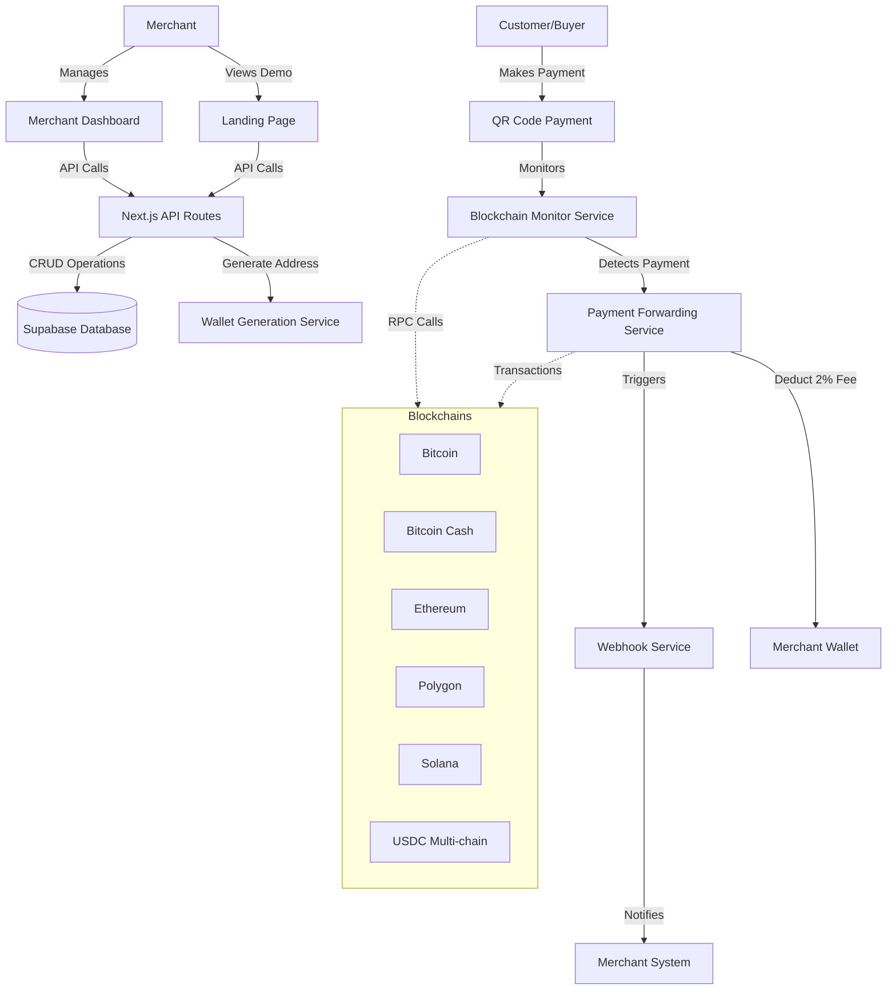
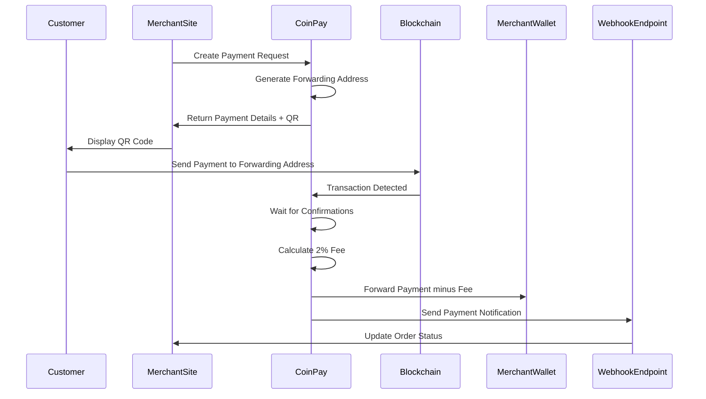
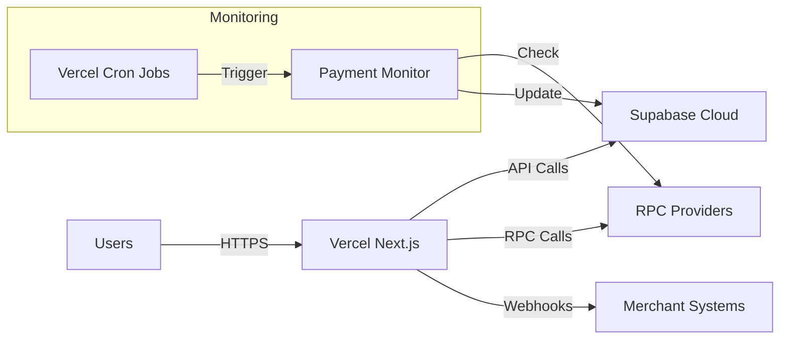

# CoinPay Architecture

## System Overview

CoinPay is a non-custodial cryptocurrency payment gateway that enables e-commerce merchants to accept crypto payments with automatic fee handling and real-time transaction monitoring.

## High-Level Architecture

## Core Components

### 1. Frontend Layer

#### Landing Page
- Demo payment integration
- Feature showcase
- Quick start guide
- Live payment example

#### Merchant Dashboard
- Business management
- Payment history
- Wallet connection (MetaMask, WalletConnect, Phantom)
- Webhook configuration
- Analytics and reporting

### 2. API Layer (Next.js API Routes)

All Supabase interactions go through server-side API routes for security.

#### Authentication Routes
- `/api/auth/register` - Merchant registration
- `/api/auth/login` - Merchant login
- `/api/auth/logout` - Session termination

#### Business Management Routes
- `/api/businesses` - List merchant businesses
- `/api/businesses/create` - Create new business
- `/api/businesses/[id]` - Get/Update/Delete business

#### Payment Routes
- `/api/payments/create` - Generate payment request
- `/api/payments/[id]` - Get payment status
- `/api/payments/[id]/qr` - Generate QR code
- `/api/payments/webhook` - Receive blockchain events

#### Webhook Routes
- `/api/webhooks` - Manage webhook endpoints
- `/api/webhooks/test` - Test webhook delivery

### 3. Blockchain Services

#### Wallet Generation Service
- HD wallet derivation for each payment
- Support for multiple blockchain standards:
  - BIP44 for Bitcoin/Bitcoin Cash
  - BIP44 for Ethereum/Polygon
  - Ed25519 for Solana
- Encrypted key storage in Supabase

#### Blockchain Monitor Service
- Real-time transaction monitoring via RPC providers:
  - Bitcoin/BCH: Public RPC nodes or BlockCypher
  - Ethereum/Polygon: Alchemy or Infura
  - Solana: Public RPC or QuickNode
- Webhook-based event system
- Confirmation tracking (3+ confirmations)

#### Payment Forwarding Service
- Automatic forwarding after confirmations
- 2% fee calculation and deduction
- Gas fee optimization
- Transaction retry logic
- Multi-signature support for security

### 4. Database Layer (Supabase)

#### Tables Schema

**merchants**
- id (uuid, primary key)
- email (text, unique)
- created_at (timestamp)
- updated_at (timestamp)

**businesses**
- id (uuid, primary key)
- merchant_id (uuid, foreign key)
- name (text)
- description (text)
- webhook_url (text, nullable)
- webhook_secret (text, nullable)
- created_at (timestamp)
- updated_at (timestamp)

**payment_addresses**
- id (uuid, primary key)
- business_id (uuid, foreign key)
- blockchain (text) - btc, bch, eth, matic, sol, usdc_eth, usdc_matic, usdc_sol
- address (text, unique)
- private_key_encrypted (text)
- derivation_path (text)
- created_at (timestamp)
- used (boolean)

**payments**
- id (uuid, primary key)
- business_id (uuid, foreign key)
- payment_address_id (uuid, foreign key)
- amount (numeric)
- currency (text)
- blockchain (text)
- status (text) - pending, confirmed, forwarded, failed
- customer_paid_amount (numeric, nullable)
- merchant_received_amount (numeric, nullable)
- fee_amount (numeric, nullable)
- tx_hash (text, nullable)
- forward_tx_hash (text, nullable)
- confirmations (integer)
- merchant_wallet_address (text)
- metadata (jsonb)
- created_at (timestamp)
- updated_at (timestamp)

**webhook_logs**
- id (uuid, primary key)
- business_id (uuid, foreign key)
- payment_id (uuid, foreign key)
- url (text)
- payload (jsonb)
- response_status (integer, nullable)
- response_body (text, nullable)
- attempt (integer)
- created_at (timestamp)

## Payment Flow

## Security Considerations

### Key Management
- Private keys encrypted at rest using AES-256
- Encryption keys stored in environment variables
- Never expose private keys in API responses
- Consider HSM or KMS for production

### API Security
- JWT-based authentication
- Rate limiting on all endpoints
- CORS configuration
- Input validation and sanitization
- SQL injection prevention via Supabase RLS

### Blockchain Security
- Multi-confirmation requirements
- Transaction replay protection
- Gas price limits
- Nonce management

## Technology Stack

### Frontend
- Next.js 14+ (App Router)
- TypeScript
- TailwindCSS
- Wagmi (Ethereum wallet connection)
- WalletConnect
- Phantom Wallet SDK

### Backend
- Next.js API Routes
- Supabase (PostgreSQL)
- Node.js crypto libraries

### Blockchain Libraries
- bitcoinjs-lib (Bitcoin/BCH)
- ethers.js (Ethereum/Polygon)
- @solana/web3.js (Solana)

### Testing
- Vitest
- Testing Library
- Playwright (E2E)

### CLI/Module
- Commander.js (CLI)
- ESM exports for programmatic use

## Environment Configuration

Required environment variables:
- `NEXT_PUBLIC_SUPABASE_URL`
- `NEXT_PUBLIC_SUPABASE_ANON_KEY`
- `SUPABASE_SERVICE_ROLE_KEY`
- `ENCRYPTION_KEY`
- `BITCOIN_RPC_URL`
- `ETHEREUM_RPC_URL`
- `POLYGON_RPC_URL`
- `SOLANA_RPC_URL`
- `PLATFORM_FEE_WALLET_BTC`
- `PLATFORM_FEE_WALLET_ETH`
- `PLATFORM_FEE_WALLET_MATIC`
- `PLATFORM_FEE_WALLET_SOL`
- `WEBHOOK_SIGNING_SECRET`

## Deployment Architecture

## Scalability Considerations

1. **Database**: Supabase auto-scaling with connection pooling
2. **API Routes**: Serverless functions scale automatically
3. **Blockchain Monitoring**: Queue-based processing for high volume
4. **Caching**: Redis for frequently accessed data
5. **CDN**: Static assets via Vercel Edge Network

## Future Enhancements

1. Support for additional blockchains (Avalanche, BSC, etc.)
2. Fiat off-ramp integration
3. Recurring payment subscriptions
4. Multi-currency invoicing
5. Advanced analytics dashboard
6. Mobile SDK
7. Plugin marketplace (WooCommerce, Shopify, etc.)