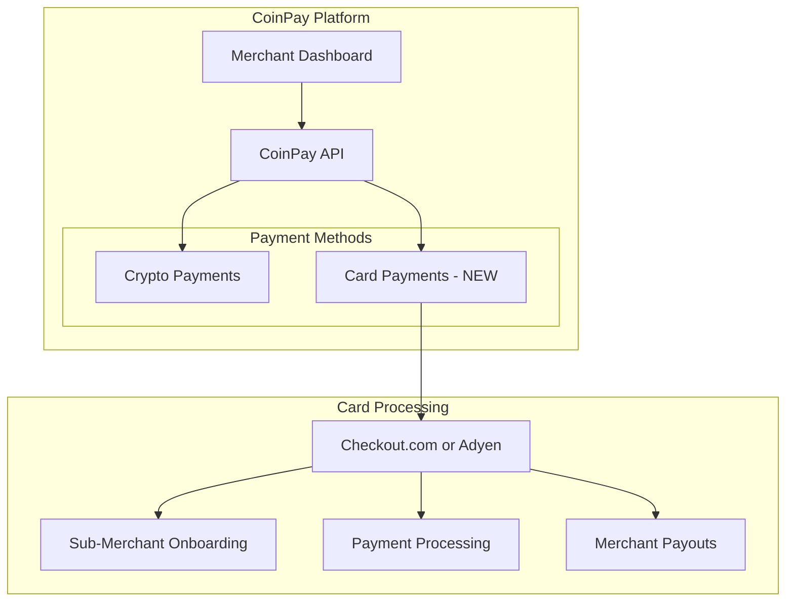

# Credit Card Processing Decision Document

**Date**: January 22, 2025
**Status**: Pending Checkout.com Approval
**Decision Makers**: CoinPay Team

> **Update (Jan 22, 2025)**: Adyen rejected our application. Checkout.com is now our only option for the marketplace/PayFac model.

---

## Executive Summary

After comprehensive research into credit card processing options for CoinPay, we have decided to pursue **Checkout.com Marketplaces** as our primary provider, with **Adyen for Platforms** as a backup option. Both providers require a sales conversation before sandbox access can be granted.

---

## Business Requirements

| Requirement | Priority | Notes |
|-------------|----------|-------|
| One account managing multiple businesses | Must Have | Similar to current crypto model |
| 1% commission on all payments | Must Have | Platform fee sent to house account |
| Lower fees than Stripe | Must Have | Stripe charges 2.9% + $0.30 |
| Faster settlements | Should Have | Daily or instant payouts preferred |
| International support - US and EU | Must Have | Global merchant base |
| Each business as their own merchant | Must Have | Sub-merchant/PayFac model |
| Better support than Stripe | Should Have | Dedicated account management |
| Flexible account structures | Must Have | Multi-business from single account |
| Self-service signup | Nice to Have | Not available for marketplace solutions |
| Fraud detection included | Must Have | No additional integration required |

---

## Options Evaluated

### Option 1: Become a Full Payment Facilitator

**Description**: Register directly with Visa/Mastercard, partner with sponsor bank, handle all compliance.

**Verdict**: ❌ **REJECTED**

**Reasons**:
- $500K-$2M+ upfront investment
- 6-18 months to go live
- Full PCI-DSS Level 1 compliance burden
- Requires dedicated compliance team
- Overkill for our current scale

---

### Option 2: PayFac-as-a-Service

**Description**: Partner with a provider that handles PayFac infrastructure while we control merchant experience.

**Verdict**: ✅ **SELECTED**

**Providers Evaluated**:

| Provider | Marketplace Support | Self-Service | International | Fraud Included | Decision |
|----------|---------------------|--------------|---------------|----------------|----------|
| **Checkout.com** | ✅ Excellent | ❌ Sales call | ✅ 150+ countries | ✅ Yes | **ONLY OPTION** |
| ~~Adyen~~ | ~~✅ Excellent~~ | ~~❌ Sales call~~ | ~~✅ Global~~ | ~~✅ Yes~~ | ❌ **REJECTED US** |
| Finix | ✅ Good | ❌ Sales call | ⚠️ US/Canada/EU | ✅ Yes | Considered |
| Payrix | ✅ Good | ❌ Sales call | ⚠️ Limited | ✅ Yes | Considered |
| Braintree | ✅ Good | ✅ Yes | ✅ 45+ countries | ✅ Yes | Rejected - PayPal owned |
| Square | ⚠️ Limited | ✅ Yes | ❌ US only | ✅ Yes | Rejected - US only |
| Stripe Connect | ✅ Good | ✅ Yes | ✅ Global | ✅ Yes | Rejected - Poor multi-business UX |

---

### Option 3: Direct Acquirer Integration

**Description**: Work directly with acquiring banks like Worldpay, Fiserv, or Global Payments.

**Verdict**: ❌ **REJECTED**

**Reasons**:
- Sub-merchant support varies significantly
- More complex onboarding process
- Less modern APIs
- PCI compliance burden higher

---

## Selected Solution: Checkout.com Marketplaces

### Why Checkout.com?

1. **Best API Experience**: Modern REST API with excellent documentation
2. **Transparent Pricing**: Interchange++ model, typically 2.2-2.5% total
3. **Fraud Detection Included**: ML-based fraud prevention at no extra cost
4. **PCI Compliance Simplified**: Use Frames.js for SAQ-A level compliance
5. **Native Marketplace Support**: Built-in split payments for commission model
6. **International Coverage**: 150+ countries, multi-currency support
7. **Commission Flexibility**: Supports fixed, variable, or compound fees per seller

### Key Features

| Feature | Included |
|---------|----------|
| Sub-entity/merchant management | ✅ |
| Split payments | ✅ |
| Automated payouts to merchants | ✅ |
| Fraud detection | ✅ |
| 3D Secure for EU compliance | ✅ |
| PCI-compliant card input | ✅ |
| Webhooks for events | ✅ |
| Dashboard for management | ✅ |

### Pricing Estimate

| Component | Cost |
|-----------|------|
| Interchange fees | ~1.5-2.5% |
| Checkout.com markup | ~0.2-0.3% |
| **Total processing cost** | ~2.0-2.8% |
| **Our 1% commission** | On top |
| **Merchant effective rate** | ~3.0-3.8% |

---

## ~~Backup Solution: Adyen for Platforms~~ - REJECTED

> **Status**: ❌ Adyen rejected our application on January 22, 2025.

Adyen was our backup option but they declined to work with us. This leaves Checkout.com as our only viable option for the marketplace/PayFac model with our requirements.

### Alternative Backup Options (If Checkout.com Fails)

If Checkout.com also rejects us, we would need to consider:

1. **Finix** - PayFac-as-a-Service, but requires high volume (~$1M/month)
2. **Payrix** - Lower volume requirements, but limited international
3. **Reconsider Stripe Connect** - Despite UX issues, it works
4. **Full PayFac** - Expensive but gives full control

---

## Rejected Alternatives

### Stripe Connect
**Reason**: User explicitly wanted to avoid Stripe due to:
- Complex multi-business account management
- Account holds and poor support
- Difficult onboarding for sub-merchants

### Braintree
**Reason**: Owned by PayPal, likely to have similar issues to Stripe with account management and holds.

### Square
**Reason**: US-only, limited international support. Does not meet EU requirement.

### Full PayFac
**Reason**: Massive upfront investment and compliance burden not justified at current scale.

---

## Implementation Plan

Detailed implementation plan available in: [`/plans/checkout-com-implementation.md`](../plans/checkout-com-implementation.md)

### High-Level Architecture

### Database Changes

New tables required:
- `card_merchant_accounts` - Sub-merchant registration with provider
- `card_payments` - Card payment transactions
- `card_payouts` - Payouts to merchant bank accounts
- `card_webhook_logs` - Webhook event logging

### API Endpoints

New endpoints:
- `POST /api/card-payments/create` - Create card payment
- `GET /api/card-payments/[id]` - Get payment status
- `POST /api/card-merchants/onboard` - Onboard sub-merchant
- `GET /api/card-merchants/[id]` - Get merchant status
- `POST /api/webhooks/checkout` - Receive provider webhooks

---

## Current Status

| Step | Status | Notes |
|------|--------|-------|
| Research complete | ✅ Done | |
| Provider selected | ✅ Done | Checkout.com only - Adyen rejected us |
| Implementation plan | ✅ Done | See /plans/checkout-com-implementation.md |
| Contact Checkout.com | 🔄 In Progress | Awaiting response |
| ~~Contact Adyen~~ | ❌ Rejected | Adyen declined our application |
| Receive sandbox access | ⏳ Pending | Waiting on Checkout.com |
| Begin implementation | ⏳ Pending | Blocked on sandbox access |

---

## Next Steps

1. **Wait for provider response** from Checkout.com and/or Adyen
2. **Evaluate terms** when received
3. **Obtain sandbox credentials**
4. **Begin implementation** following the plan in `/plans/checkout-com-implementation.md`

---

## Contact Information

### Checkout.com (Pending)
- **Website**: https://www.checkout.com
- **Product**: Marketplaces
- **How to Contact**: Click "Get in touch" on website
- **Status**: 🔄 Awaiting response

### ~~Adyen~~ (Rejected)
- **Website**: https://www.adyen.com
- **Product**: SaaS Platforms
- **Status**: ❌ Application rejected on January 22, 2025

---

## References

- [Credit Card Processing Research](/plans/credit-card-processing-research.md)
- [Checkout.com Implementation Plan](/plans/checkout-com-implementation.md)
- [CoinPay Architecture](/docs/ARCHITECTURE.md)
- [CoinPay Database Schema](/docs/DATABASE.md)
