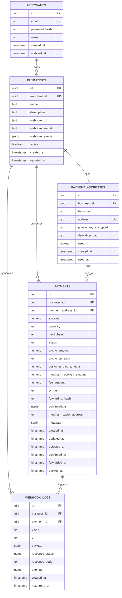

# CoinPayPortal Database Schema

## Overview

CoinPayPortal uses Supabase (PostgreSQL) as its primary database. The schema is designed to support multi-tenant merchant operations with multiple businesses per merchant, secure payment processing, and comprehensive audit logging.

## Entity Relationship Diagram



## Table Definitions

### merchants

Stores merchant account information.

```sql
CREATE TABLE merchants (
    id UUID PRIMARY KEY DEFAULT gen_random_uuid(),
    email TEXT UNIQUE NOT NULL,
    password_hash TEXT NOT NULL,
    name TEXT,
    created_at TIMESTAMP WITH TIME ZONE DEFAULT NOW(),
    updated_at TIMESTAMP WITH TIME ZONE DEFAULT NOW()
);

CREATE INDEX idx_merchants_email ON merchants(email);
```

**Columns:**
- `id`: Unique identifier for the merchant
- `email`: Merchant's email address (unique, used for login)
- `password_hash`: Bcrypt hashed password
- `name`: Merchant's display name
- `created_at`: Account creation timestamp
- `updated_at`: Last update timestamp

**Row Level Security (RLS):**
```sql
ALTER TABLE merchants ENABLE ROW LEVEL SECURITY;

CREATE POLICY "Merchants can view own data"
    ON merchants FOR SELECT
    USING (auth.uid() = id);

CREATE POLICY "Merchants can update own data"
    ON merchants FOR UPDATE
    USING (auth.uid() = id);
```

---

### businesses

Stores business entities owned by merchants. Each merchant can have multiple businesses.

```sql
CREATE TABLE businesses (
    id UUID PRIMARY KEY DEFAULT gen_random_uuid(),
    merchant_id UUID NOT NULL REFERENCES merchants(id) ON DELETE CASCADE,
    name TEXT NOT NULL,
    description TEXT,
    webhook_url TEXT,
    webhook_secret TEXT,
    webhook_events JSONB DEFAULT '["payment.confirmed", "payment.forwarded"]'::jsonb,
    active BOOLEAN DEFAULT true,
    created_at TIMESTAMP WITH TIME ZONE DEFAULT NOW(),
    updated_at TIMESTAMP WITH TIME ZONE DEFAULT NOW()
);

CREATE INDEX idx_businesses_merchant_id ON businesses(merchant_id);
CREATE INDEX idx_businesses_active ON businesses(active);
```

**Columns:**
- `id`: Unique identifier for the business
- `merchant_id`: Foreign key to merchants table
- `name`: Business name
- `description`: Business description
- `webhook_url`: URL to receive webhook notifications
- `webhook_secret`: Secret for signing webhook payloads
- `webhook_events`: Array of events to trigger webhooks for
- `active`: Whether the business is active
- `created_at`: Business creation timestamp
- `updated_at`: Last update timestamp

**Row Level Security (RLS):**
```sql
ALTER TABLE businesses ENABLE ROW LEVEL SECURITY;

CREATE POLICY "Merchants can view own businesses"
    ON businesses FOR SELECT
    USING (merchant_id = auth.uid());

CREATE POLICY "Merchants can create businesses"
    ON businesses FOR INSERT
    WITH CHECK (merchant_id = auth.uid());

CREATE POLICY "Merchants can update own businesses"
    ON businesses FOR UPDATE
    USING (merchant_id = auth.uid());

CREATE POLICY "Merchants can delete own businesses"
    ON businesses FOR DELETE
    USING (merchant_id = auth.uid());
```

---

### payment_addresses

Stores generated cryptocurrency addresses for receiving payments. Each address is used once.

```sql
CREATE TABLE payment_addresses (
    id UUID PRIMARY KEY DEFAULT gen_random_uuid(),
    business_id UUID NOT NULL REFERENCES businesses(id) ON DELETE CASCADE,
    blockchain TEXT NOT NULL CHECK (blockchain IN (
        'btc', 'bch', 'eth', 'matic', 'sol',
        'usdc_eth', 'usdc_matic', 'usdc_sol'
    )),
    address TEXT UNIQUE NOT NULL,
    private_key_encrypted TEXT NOT NULL,
    derivation_path TEXT NOT NULL,
    used BOOLEAN DEFAULT false,
    created_at TIMESTAMP WITH TIME ZONE DEFAULT NOW(),
    used_at TIMESTAMP WITH TIME ZONE
);

CREATE INDEX idx_payment_addresses_business_id ON payment_addresses(business_id);
CREATE INDEX idx_payment_addresses_blockchain ON payment_addresses(blockchain);
CREATE INDEX idx_payment_addresses_used ON payment_addresses(used);
CREATE UNIQUE INDEX idx_payment_addresses_address ON payment_addresses(address);
```

**Columns:**
- `id`: Unique identifier for the address
- `business_id`: Foreign key to businesses table
- `blockchain`: Blockchain network identifier
- `address`: The cryptocurrency address
- `private_key_encrypted`: AES-256 encrypted private key
- `derivation_path`: HD wallet derivation path (e.g., m/44'/60'/0'/0/0)
- `used`: Whether this address has been used for a payment
- `created_at`: Address generation timestamp
- `used_at`: When the address was first used

**Security Note:** Private keys are encrypted using AES-256 with a key stored in environment variables. Never expose private keys in API responses.

---

### payments

Stores payment transaction records and their lifecycle.

```sql
CREATE TABLE payments (
    id UUID PRIMARY KEY DEFAULT gen_random_uuid(),
    business_id UUID NOT NULL REFERENCES businesses(id) ON DELETE CASCADE,
    payment_address_id UUID NOT NULL REFERENCES payment_addresses(id),
    amount NUMERIC(20, 2) NOT NULL,
    currency TEXT NOT NULL DEFAULT 'USD',
    blockchain TEXT NOT NULL CHECK (blockchain IN (
        'btc', 'bch', 'eth', 'matic', 'sol',
        'usdc_eth', 'usdc_matic', 'usdc_sol'
    )),
    status TEXT NOT NULL DEFAULT 'pending' CHECK (status IN (
        'pending', 'detected', 'confirmed', 'forwarding', 'forwarded', 'failed', 'expired'
    )),
    crypto_amount NUMERIC(30, 18),
    crypto_currency TEXT,
    customer_paid_amount NUMERIC(30, 18),
    merchant_received_amount NUMERIC(30, 18),
    fee_amount NUMERIC(30, 18),
    tx_hash TEXT,
    forward_tx_hash TEXT,
    confirmations INTEGER DEFAULT 0,
    merchant_wallet_address TEXT NOT NULL,
    metadata JSONB DEFAULT '{}'::jsonb,
    created_at TIMESTAMP WITH TIME ZONE DEFAULT NOW(),
    updated_at TIMESTAMP WITH TIME ZONE DEFAULT NOW(),
    detected_at TIMESTAMP WITH TIME ZONE,
    confirmed_at TIMESTAMP WITH TIME ZONE,
    forwarded_at TIMESTAMP WITH TIME ZONE,
    expires_at TIMESTAMP WITH TIME ZONE DEFAULT (NOW() + INTERVAL '1 hour')
);

CREATE INDEX idx_payments_business_id ON payments(business_id);
CREATE INDEX idx_payments_status ON payments(status);
CREATE INDEX idx_payments_blockchain ON payments(blockchain);
CREATE INDEX idx_payments_created_at ON payments(created_at DESC);
CREATE INDEX idx_payments_tx_hash ON payments(tx_hash);
CREATE INDEX idx_payments_expires_at ON payments(expires_at);
```

**Columns:**
- `id`: Unique identifier for the payment
- `business_id`: Foreign key to businesses table
- `payment_address_id`: Foreign key to payment_addresses table
- `amount`: Requested payment amount in fiat
- `currency`: Fiat currency (USD, EUR, etc.)
- `blockchain`: Blockchain network for payment
- `status`: Current payment status
- `crypto_amount`: Calculated crypto amount to receive
- `crypto_currency`: Cryptocurrency symbol (BTC, ETH, etc.)
- `customer_paid_amount`: Actual amount customer sent
- `merchant_received_amount`: Amount forwarded to merchant (after 2% fee)
- `fee_amount`: Platform fee amount (2%)
- `tx_hash`: Transaction hash of customer payment
- `forward_tx_hash`: Transaction hash of forwarding to merchant
- `confirmations`: Number of blockchain confirmations
- `merchant_wallet_address`: Destination wallet for forwarding
- `metadata`: Additional data (order ID, customer info, etc.)
- `created_at`: Payment request creation timestamp
- `updated_at`: Last update timestamp
- `detected_at`: When payment was first detected on blockchain
- `confirmed_at`: When payment reached required confirmations
- `forwarded_at`: When payment was forwarded to merchant
- `expires_at`: Payment request expiration time (default 1 hour)

**Payment Status Flow:**
1. `pending` → Payment created, waiting for customer to send funds
2. `detected` → Payment detected on blockchain, waiting for confirmations
3. `confirmed` → Payment has sufficient confirmations
4. `forwarding` → Forwarding transaction initiated
5. `forwarded` → Successfully forwarded to merchant wallet
6. `failed` → Payment or forwarding failed
7. `expired` → Payment request expired without payment

---

### webhook_logs

Stores webhook delivery attempts and responses for audit and retry purposes.

```sql
CREATE TABLE webhook_logs (
    id UUID PRIMARY KEY DEFAULT gen_random_uuid(),
    business_id UUID NOT NULL REFERENCES businesses(id) ON DELETE CASCADE,
    payment_id UUID NOT NULL REFERENCES payments(id) ON DELETE CASCADE,
    event TEXT NOT NULL,
    url TEXT NOT NULL,
    payload JSONB NOT NULL,
    response_status INTEGER,
    response_body TEXT,
    attempt INTEGER DEFAULT 1,
    created_at TIMESTAMP WITH TIME ZONE DEFAULT NOW(),
    next_retry_at TIMESTAMP WITH TIME ZONE
);

CREATE INDEX idx_webhook_logs_business_id ON webhook_logs(business_id);
CREATE INDEX idx_webhook_logs_payment_id ON webhook_logs(payment_id);
CREATE INDEX idx_webhook_logs_created_at ON webhook_logs(created_at DESC);
CREATE INDEX idx_webhook_logs_next_retry ON webhook_logs(next_retry_at) WHERE next_retry_at IS NOT NULL;
```

**Columns:**
- `id`: Unique identifier for the log entry
- `business_id`: Foreign key to businesses table
- `payment_id`: Foreign key to payments table
- `event`: Event type (payment.confirmed, payment.forwarded, etc.)
- `url`: Webhook URL that was called
- `payload`: JSON payload sent to webhook
- `response_status`: HTTP response status code
- `response_body`: Response body from webhook endpoint
- `attempt`: Attempt number (for retries)
- `created_at`: Log entry creation timestamp
- `next_retry_at`: When to retry if delivery failed

**Retry Logic:**
- Retry on 5xx errors or network failures
- Exponential backoff: 1min, 5min, 15min, 1hr, 6hr
- Maximum 5 attempts

---

## Database Functions

### Update Updated_at Timestamp

Automatically update the `updated_at` column on row updates:

```sql
CREATE OR REPLACE FUNCTION update_updated_at_column()
RETURNS TRIGGER AS $$
BEGIN
    NEW.updated_at = NOW();
    RETURN NEW;
END;
$$ language 'plpgsql';

CREATE TRIGGER update_merchants_updated_at BEFORE UPDATE ON merchants
    FOR EACH ROW EXECUTE FUNCTION update_updated_at_column();

CREATE TRIGGER update_businesses_updated_at BEFORE UPDATE ON businesses
    FOR EACH ROW EXECUTE FUNCTION update_updated_at_column();

CREATE TRIGGER update_payments_updated_at BEFORE UPDATE ON payments
    FOR EACH ROW EXECUTE FUNCTION update_updated_at_column();
```

### Expire Old Payments

Function to mark expired payments:

```sql
CREATE OR REPLACE FUNCTION expire_old_payments()
RETURNS void AS $$
BEGIN
    UPDATE payments
    SET status = 'expired'
    WHERE status = 'pending'
    AND expires_at < NOW();
END;
$$ LANGUAGE plpgsql;
```

Run via cron job every 5 minutes.

---

## Indexes Strategy

### Performance Indexes
- Foreign key columns for JOIN operations
- Status columns for filtering
- Timestamp columns for sorting and range queries
- Unique constraints on addresses and emails

### Composite Indexes (if needed)
```sql
CREATE INDEX idx_payments_business_status ON payments(business_id, status);
CREATE INDEX idx_payments_business_created ON payments(business_id, created_at DESC);
```

---

## Data Retention Policy

### Active Data
- Keep all payment records indefinitely for accounting
- Keep webhook logs for 90 days
- Archive old logs to cold storage

### Cleanup Jobs
```sql
-- Delete webhook logs older than 90 days
DELETE FROM webhook_logs
WHERE created_at < NOW() - INTERVAL '90 days';

-- Archive completed payments older than 1 year
-- (Move to archive table or external storage)
```

---

## Backup Strategy

1. **Automated Backups**: Supabase provides automatic daily backups
2. **Point-in-Time Recovery**: Available for last 7 days
3. **Manual Backups**: Before major schema changes
4. **Encryption**: All backups encrypted at rest

---

## Migration Strategy

Use Supabase migrations for schema changes:

```bash
# Create new migration
supabase migration new add_new_feature

# Apply migrations
supabase db push

# Rollback if needed
supabase db reset
```

---

## Security Considerations

### Encryption
- Private keys encrypted with AES-256
- Webhook secrets hashed
- Passwords hashed with bcrypt (cost factor 12)

### Row Level Security (RLS)
- Enabled on all tables
- Merchants can only access their own data
- Service role bypasses RLS for system operations

### Audit Logging
- All payment state changes logged
- Webhook delivery attempts tracked
- Failed authentication attempts monitored

---

## Sample Queries

### Get Business Payment Statistics
```sql
SELECT
    b.id,
    b.name,
    COUNT(p.id) as total_payments,
    SUM(CASE WHEN p.status = 'forwarded' THEN p.amount ELSE 0 END) as total_volume,
    COUNT(CASE WHEN p.status = 'pending' THEN 1 END) as pending_count
FROM businesses b
LEFT JOIN payments p ON b.id = p.business_id
WHERE b.merchant_id = $1
GROUP BY b.id, b.name;
```

### Get Recent Payments for Business
```sql
SELECT
    p.id,
    p.amount,
    p.currency,
    p.crypto_amount,
    p.crypto_currency,
    p.status,
    p.created_at,
    pa.address
FROM payments p
JOIN payment_addresses pa ON p.payment_address_id = pa.id
WHERE p.business_id = $1
ORDER BY p.created_at DESC
LIMIT 20;
```

### Get Webhook Delivery Success Rate
```sql
SELECT
    b.name,
    COUNT(*) as total_attempts,
    COUNT(CASE WHEN wl.response_status BETWEEN 200 AND 299 THEN 1 END) as successful,
    ROUND(
        COUNT(CASE WHEN wl.response_status BETWEEN 200 AND 299 THEN 1 END)::numeric /
        COUNT(*)::numeric * 100,
        2
    ) as success_rate
FROM webhook_logs wl
JOIN businesses b ON wl.business_id = b.id
WHERE wl.created_at > NOW() - INTERVAL '7 days'
GROUP BY b.id, b.name;
```

---

## Database Setup Script

Complete setup script available in `/scripts/setup-database.sql`

```bash
# Run setup
psql $DATABASE_URL -f scripts/setup-database.sql

# Or via Supabase CLI
supabase db reset