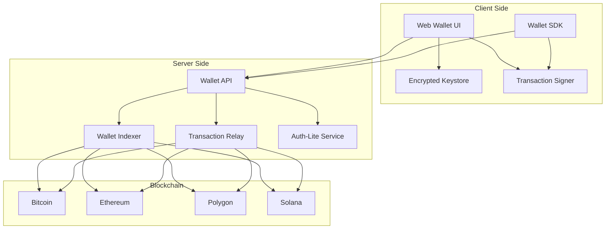
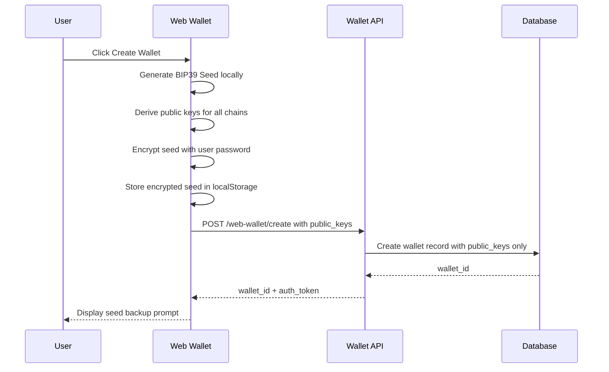
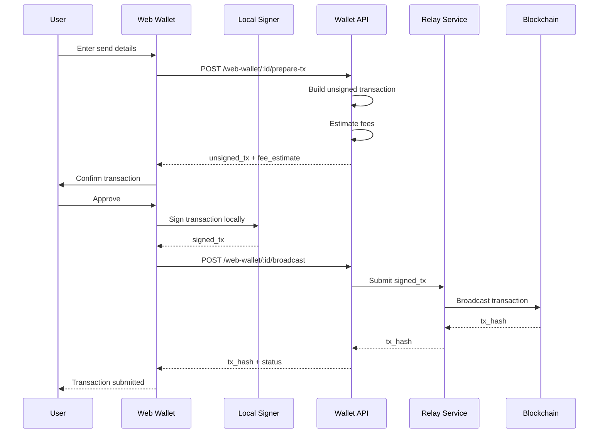
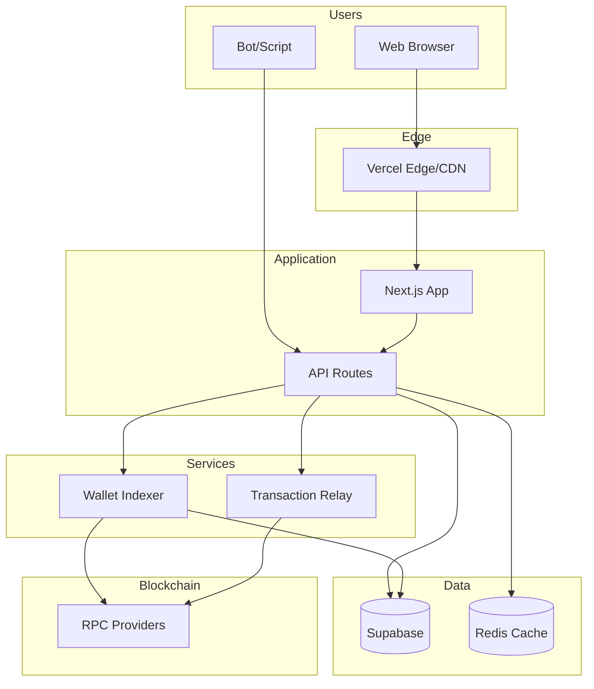

# CoinPayPortal Wallet Mode - Architecture

## 1. High-Level Architecture

### Current CoinPayPortal Architecture
```
┌─────────────────────────────────────────────────────────────────┐
│                        CoinPayPortal                            │
├─────────────────────────────────────────────────────────────────┤
│  Frontend (Next.js)                                             │
│  ├── Landing Page                                               │
│  ├── Merchant Dashboard                                         │
│  └── Payment Pages                                              │
├─────────────────────────────────────────────────────────────────┤
│  API Layer (Next.js API Routes)                                 │
│  ├── /api/auth/*        - Merchant authentication               │
│  ├── /api/businesses/*  - Business management                   │
│  ├── /api/payments/*    - Payment processing                    │
│  └── /api/webhooks/*    - Webhook management                    │
├─────────────────────────────────────────────────────────────────┤
│  Services                                                       │
│  ├── Wallet Generation  - HD wallet derivation                  │
│  ├── Payment Monitor    - Blockchain monitoring                 │
│  ├── Forwarding         - Payment forwarding                    │
│  └── Webhooks           - Notification delivery                 │
├─────────────────────────────────────────────────────────────────┤
│  Database (Supabase/PostgreSQL)                                 │
│  └── merchants, businesses, payments, payment_addresses, etc.   │
└─────────────────────────────────────────────────────────────────┘
```

### Extended Architecture with Wallet Mode
```
┌─────────────────────────────────────────────────────────────────┐
│                        CoinPayPortal                            │
├─────────────────────────────────────────────────────────────────┤
│  Frontend (Next.js)                                             │
│  ├── Landing Page                                               │
│  ├── Merchant Dashboard                                         │
│  ├── Payment Pages                                              │
│  └── [NEW] Web Wallet UI (/web-wallet/*)                        │
├─────────────────────────────────────────────────────────────────┤
│  API Layer (Next.js API Routes)                                 │
│  ├── /api/auth/*               - Merchant authentication        │
│  ├── /api/businesses/*         - Business management            │
│  ├── /api/payments/*           - Payment processing             │
│  ├── /api/webhooks/*           - Webhook management             │
│  ├── [NEW] /api/web-wallet/*   - Wallet operations              │
│  └── [NEW] /api/relay/*        - Transaction relay              │
├─────────────────────────────────────────────────────────────────┤
│  Services                                                       │
│  ├── Wallet Generation     - HD wallet derivation               │
│  ├── Payment Monitor       - Blockchain monitoring              │
│  ├── Forwarding            - Payment forwarding                 │
│  ├── Webhooks              - Notification delivery              │
│  ├── [NEW] Wallet Indexer  - Persistent address monitoring      │
│  ├── [NEW] Relay Service   - Transaction broadcasting           │
│  └── [NEW] Auth-Lite       - Signature-based authentication     │
├─────────────────────────────────────────────────────────────────┤
│  Database (Supabase/PostgreSQL)                                 │
│  ├── merchants, businesses, payments, payment_addresses         │
│  ├── [NEW] wallets         - Wallet metadata                    │
│  ├── [NEW] wallet_addresses - Derived addresses                 │
│  └── [NEW] wallet_transactions - Transaction history            │
└─────────────────────────────────────────────────────────────────┘
```

---

## 2. Module Structure

### New Directory Structure
```
apps/
  gateway/           # Existing - unchanged
  dashboard/         # Existing - unchanged
  web-wallet/        # NEW - Web wallet UI

src/
  app/
    web-wallet/      # NEW - Wallet pages
      page.tsx       # Wallet dashboard
      create/        # Create wallet flow
      import/        # Import wallet flow
      send/          # Send transaction
      receive/       # Receive addresses
      history/       # Transaction history
      settings/      # Wallet settings
      
  lib/
    wallet-core/     # NEW - Core wallet logic
      identity.ts    # Wallet identity management
      derivation.ts  # Key derivation
      signing.ts     # Client-side signing helpers
      
    indexer/         # NEW - Blockchain indexer
      service.ts     # Indexer service
      registry.ts    # Address registry
      
    relay/           # NEW - Transaction relay
      service.ts     # Relay service
      fee-estimator.ts
      
    auth-lite/       # NEW - Signature-based auth
      challenge.ts   # Challenge generation
      verify.ts      # Signature verification

packages/
  sdk/               # Existing SDK
  wallet-sdk/        # NEW - Wallet SDK for bots
```

---

## 3. Component Architecture

### 3.1 Wallet Core



### 3.2 Data Flow - Wallet Creation



### 3.3 Data Flow - Send Transaction



---

## 4. Service Responsibilities

### 4.1 Wallet API Service
**Location**: `src/app/api/web-wallet/*`

**Responsibilities**:
- Wallet registration (public keys only)
- Address derivation requests
- Balance queries
- Transaction history
- Transaction preparation
- Transaction broadcasting

**Does NOT**:
- Store private keys
- Sign transactions
- Access seed phrases

### 4.2 Auth-Lite Service
**Location**: `src/lib/auth-lite/`

**Responsibilities**:
- Generate authentication challenges
- Verify wallet signatures
- Issue short-lived auth tokens
- Rate limiting per wallet

**Authentication Flow**:
```
1. Client requests challenge: GET /web-wallet/auth/challenge?wallet_id=xxx
2. Server returns: { challenge: "random_nonce", expires_at: "..." }
3. Client signs challenge with wallet private key
4. Client submits: POST /web-wallet/auth/verify { wallet_id, signature }
5. Server verifies signature against stored public key
6. Server returns: { auth_token: "jwt...", expires_at: "..." }
```

### 4.3 Wallet Indexer Service
**Location**: `src/lib/indexer/`

**Responsibilities**:
- Monitor registered wallet addresses
- Track incoming/outgoing transactions
- Update balance cache
- Detect confirmation status
- Trigger notifications

**Extension of Existing Monitor**:
```typescript
// Current: Payment-specific monitoring
interface PaymentMonitor {
  watchPaymentAddress(address: string, paymentId: string): void;
  stopWatching(paymentId: string): void;
}

// Extended: Persistent wallet monitoring
interface WalletIndexer extends PaymentMonitor {
  registerWalletAddress(walletId: string, address: string, chain: string): void;
  unregisterWalletAddress(walletId: string, address: string): void;
  getAddressTransactions(address: string, limit: number): Transaction[];
  getAddressBalance(address: string): Balance;
}
```

### 4.4 Relay Service
**Location**: `src/lib/relay/`

**Responsibilities**:
- Receive signed transactions
- Validate transaction format
- Broadcast to blockchain
- Track transaction status
- Handle retries on failure

**Does NOT**:
- Modify transactions
- Sign transactions
- Hold funds

---

## 5. Integration Points

### 5.1 Reusing Existing Infrastructure

| Existing Component | Reuse in Wallet Mode |
|-------------------|---------------------|
| `src/lib/blockchain/providers.ts` | RPC connections for all chains |
| `src/lib/blockchain/wallets.ts` | BIP39/BIP44 derivation logic |
| `src/lib/crypto/encryption.ts` | Encryption utilities |
| `src/lib/rates/tatum.ts` | Exchange rate fetching |
| `src/lib/payments/monitor.ts` | Base monitoring logic |
| `src/lib/webhooks/service.ts` | Notification patterns |

### 5.2 New Components

| New Component | Purpose |
|--------------|---------|
| `src/lib/wallet-core/` | Wallet identity and derivation |
| `src/lib/auth-lite/` | Signature-based authentication |
| `src/lib/indexer/` | Persistent address monitoring |
| `src/lib/relay/` | Transaction broadcasting |
| `packages/wallet-sdk/` | Bot SDK |

---

## 6. Technology Stack

### Frontend (Web Wallet)
- **Framework**: Next.js 14+ (App Router)
- **State Management**: React Context + hooks
- **Styling**: TailwindCSS
- **Crypto Libraries**:
  - `@scure/bip39` - Mnemonic generation
  - `@scure/bip32` - HD key derivation
  - `@noble/curves` - Elliptic curve operations
  - `ethers.js` - Ethereum signing
  - `@solana/web3.js` - Solana signing
  - `bitcoinjs-lib` - Bitcoin signing

### Backend (API)
- **Framework**: Next.js API Routes
- **Database**: Supabase (PostgreSQL)
- **Caching**: Redis (optional, for rate limiting)
- **Queue**: Supabase Realtime or external queue

### SDK
- **Language**: TypeScript
- **Target**: Node.js 18+, Browser (ESM)
- **Dependencies**: Minimal, same crypto libs as frontend

---

## 7. Scalability Considerations

### Database
- Wallet addresses indexed for fast lookup
- Transaction history partitioned by date
- Balance cache with TTL

### API
- Stateless design for horizontal scaling
- Rate limiting per wallet_id
- Connection pooling for RPC providers

### Indexer
- Queue-based processing for high volume
- Multiple RPC provider fallbacks
- Batch balance queries where possible

---

## 8. Deployment Architecture



---

## 9. Error Handling Strategy

### Client-Side Errors
- Invalid seed phrase → Clear error message
- Signing failure → Retry with user confirmation
- Network timeout → Automatic retry with backoff

### Server-Side Errors
- RPC failure → Fallback to secondary provider
- Database error → Return 503 with retry-after
- Rate limit → Return 429 with reset time

### Blockchain Errors
- Insufficient funds → Clear error with balance info
- Nonce conflict → Auto-increment and retry
- Gas estimation failure → Use safe defaults
