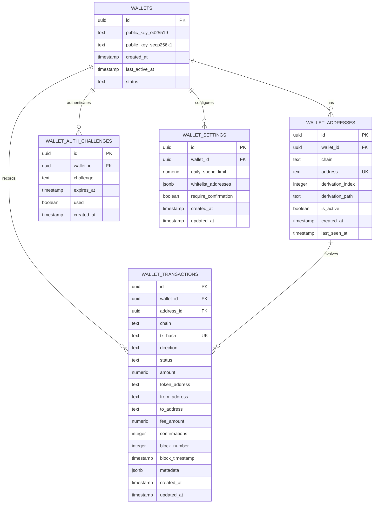

# CoinPayPortal Wallet Mode - Database Schema

## 1. Overview

This document defines the new database tables required for Wallet Mode. These tables are **additive** - they do not modify existing tables.

### Design Principles
1. **No private keys stored** - Only public keys and encrypted metadata
2. **Minimal PII** - No email, no names, no identifying information
3. **Efficient indexing** - Optimized for address lookups and balance queries
4. **Audit trail** - All state changes logged

---

## 2. Entity Relationship Diagram



---

## 3. Table Definitions

### 3.1 wallets

Stores wallet identity information. **No private keys.**

```sql
CREATE TABLE wallets (
    id UUID PRIMARY KEY DEFAULT gen_random_uuid(),
    
    -- Public keys for signature verification
    -- ed25519 for Solana, secp256k1 for BTC/ETH
    public_key_ed25519 TEXT,
    public_key_secp256k1 TEXT,
    
    -- Wallet status
    status TEXT NOT NULL DEFAULT 'active' CHECK (status IN (
        'active',      -- Normal operation
        'suspended',   -- Temporarily disabled
        'archived'     -- Soft deleted
    )),
    
    -- Timestamps
    created_at TIMESTAMP WITH TIME ZONE DEFAULT NOW(),
    last_active_at TIMESTAMP WITH TIME ZONE DEFAULT NOW(),
    
    -- Constraints
    CONSTRAINT wallet_has_public_key CHECK (
        public_key_ed25519 IS NOT NULL OR public_key_secp256k1 IS NOT NULL
    )
);

-- Indexes
CREATE INDEX idx_wallets_status ON wallets(status);
CREATE INDEX idx_wallets_created_at ON wallets(created_at DESC);
CREATE INDEX idx_wallets_last_active ON wallets(last_active_at DESC);
CREATE INDEX idx_wallets_public_key_ed25519 ON wallets(public_key_ed25519) WHERE public_key_ed25519 IS NOT NULL;
CREATE INDEX idx_wallets_public_key_secp256k1 ON wallets(public_key_secp256k1) WHERE public_key_secp256k1 IS NOT NULL;
```

**Columns:**
| Column | Type | Description |
|--------|------|-------------|
| `id` | UUID | Unique wallet identifier |
| `public_key_ed25519` | TEXT | Ed25519 public key for Solana |
| `public_key_secp256k1` | TEXT | Secp256k1 public key for BTC/ETH |
| `status` | TEXT | Wallet status: active/suspended/archived |
| `created_at` | TIMESTAMP | Wallet creation time |
| `last_active_at` | TIMESTAMP | Last API activity |

---

### 3.2 wallet_addresses

Stores derived addresses for each wallet.

```sql
CREATE TABLE wallet_addresses (
    id UUID PRIMARY KEY DEFAULT gen_random_uuid(),
    wallet_id UUID NOT NULL REFERENCES wallets(id) ON DELETE CASCADE,
    
    -- Address details
    chain TEXT NOT NULL CHECK (chain IN (
        'BTC', 'BCH', 'ETH', 'POL', 'SOL',
        'USDC_ETH', 'USDC_POL', 'USDC_SOL'
    )),
    address TEXT NOT NULL,
    
    -- Derivation info
    derivation_index INTEGER NOT NULL DEFAULT 0,
    derivation_path TEXT NOT NULL,
    
    -- Status
    is_active BOOLEAN DEFAULT true,
    
    -- Cached balance (updated by indexer)
    cached_balance NUMERIC(30, 18) DEFAULT 0,
    cached_balance_updated_at TIMESTAMP WITH TIME ZONE,
    
    -- Timestamps
    created_at TIMESTAMP WITH TIME ZONE DEFAULT NOW(),
    last_seen_at TIMESTAMP WITH TIME ZONE,
    
    -- Constraints
    CONSTRAINT unique_wallet_chain_index UNIQUE (wallet_id, chain, derivation_index)
);

-- Indexes
CREATE UNIQUE INDEX idx_wallet_addresses_address ON wallet_addresses(address);
CREATE INDEX idx_wallet_addresses_wallet_id ON wallet_addresses(wallet_id);
CREATE INDEX idx_wallet_addresses_chain ON wallet_addresses(chain);
CREATE INDEX idx_wallet_addresses_active ON wallet_addresses(is_active) WHERE is_active = true;
CREATE INDEX idx_wallet_addresses_wallet_chain ON wallet_addresses(wallet_id, chain);
```

**Columns:**
| Column | Type | Description |
|--------|------|-------------|
| `id` | UUID | Unique address identifier |
| `wallet_id` | UUID | Parent wallet reference |
| `chain` | TEXT | Blockchain identifier |
| `address` | TEXT | Blockchain address |
| `derivation_index` | INTEGER | BIP44 address index |
| `derivation_path` | TEXT | Full derivation path |
| `is_active` | BOOLEAN | Whether address is monitored |
| `cached_balance` | NUMERIC | Cached balance from indexer |
| `cached_balance_updated_at` | TIMESTAMP | When balance was last updated |
| `created_at` | TIMESTAMP | Address creation time |
| `last_seen_at` | TIMESTAMP | Last transaction activity |

---

### 3.3 wallet_transactions

Stores transaction history for wallet addresses.

```sql
CREATE TABLE wallet_transactions (
    id UUID PRIMARY KEY DEFAULT gen_random_uuid(),
    wallet_id UUID NOT NULL REFERENCES wallets(id) ON DELETE CASCADE,
    address_id UUID REFERENCES wallet_addresses(id) ON DELETE SET NULL,
    
    -- Transaction details
    chain TEXT NOT NULL CHECK (chain IN (
        'BTC', 'BCH', 'ETH', 'POL', 'SOL',
        'USDC_ETH', 'USDC_POL', 'USDC_SOL'
    )),
    tx_hash TEXT NOT NULL,
    
    -- Direction and status
    direction TEXT NOT NULL CHECK (direction IN ('incoming', 'outgoing')),
    status TEXT NOT NULL DEFAULT 'pending' CHECK (status IN (
        'pending',     -- Broadcast but not confirmed
        'confirming',  -- Has some confirmations
        'confirmed',   -- Fully confirmed
        'failed'       -- Transaction failed
    )),
    
    -- Amounts
    amount NUMERIC(30, 18) NOT NULL,
    token_address TEXT,  -- NULL for native tokens, contract address for tokens
    
    -- Addresses
    from_address TEXT NOT NULL,
    to_address TEXT NOT NULL,
    
    -- Fee info
    fee_amount NUMERIC(30, 18),
    fee_currency TEXT,
    
    -- Blockchain info
    confirmations INTEGER DEFAULT 0,
    block_number BIGINT,
    block_timestamp TIMESTAMP WITH TIME ZONE,
    
    -- Additional data
    metadata JSONB DEFAULT '{}'::jsonb,
    
    -- Timestamps
    created_at TIMESTAMP WITH TIME ZONE DEFAULT NOW(),
    updated_at TIMESTAMP WITH TIME ZONE DEFAULT NOW(),
    
    -- Constraints
    CONSTRAINT unique_chain_tx_hash UNIQUE (chain, tx_hash)
);

-- Indexes
CREATE INDEX idx_wallet_transactions_wallet_id ON wallet_transactions(wallet_id);
CREATE INDEX idx_wallet_transactions_address_id ON wallet_transactions(address_id);
CREATE INDEX idx_wallet_transactions_chain ON wallet_transactions(chain);
CREATE INDEX idx_wallet_transactions_status ON wallet_transactions(status);
CREATE INDEX idx_wallet_transactions_direction ON wallet_transactions(direction);
CREATE INDEX idx_wallet_transactions_created_at ON wallet_transactions(created_at DESC);
CREATE INDEX idx_wallet_transactions_tx_hash ON wallet_transactions(tx_hash);
CREATE INDEX idx_wallet_transactions_from ON wallet_transactions(from_address);
CREATE INDEX idx_wallet_transactions_to ON wallet_transactions(to_address);
CREATE INDEX idx_wallet_transactions_wallet_chain ON wallet_transactions(wallet_id, chain, created_at DESC);
```

**Columns:**
| Column | Type | Description |
|--------|------|-------------|
| `id` | UUID | Unique transaction record ID |
| `wallet_id` | UUID | Parent wallet reference |
| `address_id` | UUID | Related address if known |
| `chain` | TEXT | Blockchain identifier |
| `tx_hash` | TEXT | Transaction hash |
| `direction` | TEXT | incoming or outgoing |
| `status` | TEXT | Transaction status |
| `amount` | NUMERIC | Transaction amount |
| `token_address` | TEXT | Token contract, NULL for native |
| `from_address` | TEXT | Sender address |
| `to_address` | TEXT | Recipient address |
| `fee_amount` | NUMERIC | Transaction fee |
| `fee_currency` | TEXT | Fee currency |
| `confirmations` | INTEGER | Number of confirmations |
| `block_number` | BIGINT | Block number |
| `block_timestamp` | TIMESTAMP | Block timestamp |
| `metadata` | JSONB | Additional transaction data |
| `created_at` | TIMESTAMP | Record creation time |
| `updated_at` | TIMESTAMP | Last update time |

---

### 3.4 wallet_auth_challenges

Stores authentication challenges for signature-based auth.

```sql
CREATE TABLE wallet_auth_challenges (
    id UUID PRIMARY KEY DEFAULT gen_random_uuid(),
    wallet_id UUID NOT NULL REFERENCES wallets(id) ON DELETE CASCADE,
    
    -- Challenge data
    challenge TEXT NOT NULL,
    
    -- Expiration
    expires_at TIMESTAMP WITH TIME ZONE NOT NULL,
    used BOOLEAN DEFAULT false,
    
    -- Timestamps
    created_at TIMESTAMP WITH TIME ZONE DEFAULT NOW(),
    
    -- Constraints
    CONSTRAINT challenge_not_expired CHECK (expires_at > created_at)
);

-- Indexes
CREATE INDEX idx_wallet_auth_challenges_wallet_id ON wallet_auth_challenges(wallet_id);
CREATE INDEX idx_wallet_auth_challenges_expires ON wallet_auth_challenges(expires_at);
CREATE INDEX idx_wallet_auth_challenges_unused ON wallet_auth_challenges(wallet_id, used) WHERE used = false;
CREATE INDEX idx_wallet_auth_challenges_cleanup ON wallet_auth_challenges(created_at) WHERE used = true;
```

**Columns:**
| Column | Type | Description |
|--------|------|-------------|
| `id` | UUID | Unique challenge identifier |
| `wallet_id` | UUID | Wallet requesting auth |
| `challenge` | TEXT | Random challenge string |
| `expires_at` | TIMESTAMP | Challenge expiration time |
| `used` | BOOLEAN | Whether challenge was used |
| `created_at` | TIMESTAMP | Challenge creation time |

---

### 3.5 wallet_settings

Stores optional wallet security settings.

```sql
CREATE TABLE wallet_settings (
    id UUID PRIMARY KEY DEFAULT gen_random_uuid(),
    wallet_id UUID NOT NULL REFERENCES wallets(id) ON DELETE CASCADE,
    
    -- Spend limits (optional)
    daily_spend_limit NUMERIC(30, 18),  -- NULL = no limit
    
    -- Whitelist mode (optional)
    whitelist_addresses JSONB DEFAULT '[]'::jsonb,  -- Empty = no whitelist
    whitelist_enabled BOOLEAN DEFAULT false,
    
    -- Confirmation requirements
    require_confirmation BOOLEAN DEFAULT false,
    confirmation_delay_seconds INTEGER DEFAULT 0,
    
    -- Timestamps
    created_at TIMESTAMP WITH TIME ZONE DEFAULT NOW(),
    updated_at TIMESTAMP WITH TIME ZONE DEFAULT NOW(),
    
    -- Constraints
    CONSTRAINT unique_wallet_settings UNIQUE (wallet_id)
);

-- Indexes
CREATE INDEX idx_wallet_settings_wallet_id ON wallet_settings(wallet_id);
```

**Columns:**
| Column | Type | Description |
|--------|------|-------------|
| `id` | UUID | Unique settings identifier |
| `wallet_id` | UUID | Parent wallet reference |
| `daily_spend_limit` | NUMERIC | Optional daily spend cap |
| `whitelist_addresses` | JSONB | Array of allowed destinations |
| `whitelist_enabled` | BOOLEAN | Whether whitelist is enforced |
| `require_confirmation` | BOOLEAN | Require delay before send |
| `confirmation_delay_seconds` | INTEGER | Delay duration |
| `created_at` | TIMESTAMP | Settings creation time |
| `updated_at` | TIMESTAMP | Last update time |

---

### 3.6 wallet_nonces

Tracks nonces for replay protection.

```sql
CREATE TABLE wallet_nonces (
    id UUID PRIMARY KEY DEFAULT gen_random_uuid(),
    wallet_id UUID NOT NULL REFERENCES wallets(id) ON DELETE CASCADE,
    chain TEXT NOT NULL,
    
    -- Nonce tracking
    last_nonce BIGINT NOT NULL DEFAULT 0,
    pending_nonces JSONB DEFAULT '[]'::jsonb,  -- Array of pending nonce values
    
    -- Timestamps
    updated_at TIMESTAMP WITH TIME ZONE DEFAULT NOW(),
    
    -- Constraints
    CONSTRAINT unique_wallet_chain_nonce UNIQUE (wallet_id, chain)
);

-- Indexes
CREATE INDEX idx_wallet_nonces_wallet_chain ON wallet_nonces(wallet_id, chain);
```

---

## 4. Database Functions

### 4.1 Update Timestamps

```sql
-- Reuse existing function or create if not exists
CREATE OR REPLACE FUNCTION update_updated_at_column()
RETURNS TRIGGER AS $$
BEGIN
    NEW.updated_at = NOW();
    RETURN NEW;
END;
$$ language 'plpgsql';

-- Apply to wallet tables
CREATE TRIGGER update_wallet_transactions_updated_at 
    BEFORE UPDATE ON wallet_transactions
    FOR EACH ROW EXECUTE FUNCTION update_updated_at_column();

CREATE TRIGGER update_wallet_settings_updated_at 
    BEFORE UPDATE ON wallet_settings
    FOR EACH ROW EXECUTE FUNCTION update_updated_at_column();

CREATE TRIGGER update_wallet_nonces_updated_at 
    BEFORE UPDATE ON wallet_nonces
    FOR EACH ROW EXECUTE FUNCTION update_updated_at_column();
```

### 4.2 Update Wallet Last Active

```sql
CREATE OR REPLACE FUNCTION update_wallet_last_active()
RETURNS TRIGGER AS $$
BEGIN
    UPDATE wallets 
    SET last_active_at = NOW() 
    WHERE id = NEW.wallet_id;
    RETURN NEW;
END;
$$ language 'plpgsql';

-- Trigger on address creation
CREATE TRIGGER wallet_address_activity
    AFTER INSERT ON wallet_addresses
    FOR EACH ROW EXECUTE FUNCTION update_wallet_last_active();

-- Trigger on transaction creation
CREATE TRIGGER wallet_transaction_activity
    AFTER INSERT ON wallet_transactions
    FOR EACH ROW EXECUTE FUNCTION update_wallet_last_active();
```

### 4.3 Cleanup Expired Challenges

```sql
CREATE OR REPLACE FUNCTION cleanup_expired_challenges()
RETURNS void AS $$
BEGIN
    DELETE FROM wallet_auth_challenges
    WHERE expires_at < NOW() - INTERVAL '1 hour';
END;
$$ LANGUAGE plpgsql;

-- Run via cron job every hour
```

### 4.4 Get Wallet Balance Summary

```sql
CREATE OR REPLACE FUNCTION get_wallet_balance_summary(p_wallet_id UUID)
RETURNS TABLE (
    chain TEXT,
    address TEXT,
    balance NUMERIC,
    last_updated TIMESTAMP WITH TIME ZONE
) AS $$
BEGIN
    RETURN QUERY
    SELECT 
        wa.chain,
        wa.address,
        wa.cached_balance as balance,
        wa.cached_balance_updated_at as last_updated
    FROM wallet_addresses wa
    WHERE wa.wallet_id = p_wallet_id
    AND wa.is_active = true
    ORDER BY wa.chain, wa.derivation_index;
END;
$$ LANGUAGE plpgsql;
```

---

## 5. Row Level Security (RLS)

### 5.1 Wallet Tables RLS

Since wallets are anonymous and authenticated via signatures, RLS is handled differently than merchant tables.

```sql
-- Enable RLS on all wallet tables
ALTER TABLE wallets ENABLE ROW LEVEL SECURITY;
ALTER TABLE wallet_addresses ENABLE ROW LEVEL SECURITY;
ALTER TABLE wallet_transactions ENABLE ROW LEVEL SECURITY;
ALTER TABLE wallet_auth_challenges ENABLE ROW LEVEL SECURITY;
ALTER TABLE wallet_settings ENABLE ROW LEVEL SECURITY;
ALTER TABLE wallet_nonces ENABLE ROW LEVEL SECURITY;

-- Service role can access all (for API routes)
CREATE POLICY "Service role full access on wallets"
    ON wallets FOR ALL
    USING (auth.role() = 'service_role');

CREATE POLICY "Service role full access on wallet_addresses"
    ON wallet_addresses FOR ALL
    USING (auth.role() = 'service_role');

CREATE POLICY "Service role full access on wallet_transactions"
    ON wallet_transactions FOR ALL
    USING (auth.role() = 'service_role');

CREATE POLICY "Service role full access on wallet_auth_challenges"
    ON wallet_auth_challenges FOR ALL
    USING (auth.role() = 'service_role');

CREATE POLICY "Service role full access on wallet_settings"
    ON wallet_settings FOR ALL
    USING (auth.role() = 'service_role');

CREATE POLICY "Service role full access on wallet_nonces"
    ON wallet_nonces FOR ALL
    USING (auth.role() = 'service_role');
```

**Note**: Wallet authentication is handled at the API layer via signature verification, not via Supabase Auth. All wallet API routes use the service role and verify wallet ownership via signed requests.

---

## 6. Sample Queries

### 6.1 Get Wallet with All Addresses

```sql
SELECT 
    w.id as wallet_id,
    w.status,
    w.created_at,
    json_agg(
        json_build_object(
            'chain', wa.chain,
            'address', wa.address,
            'balance', wa.cached_balance,
            'derivation_index', wa.derivation_index
        )
    ) as addresses
FROM wallets w
LEFT JOIN wallet_addresses wa ON w.id = wa.wallet_id AND wa.is_active = true
WHERE w.id = $1
GROUP BY w.id;
```

### 6.2 Get Transaction History

```sql
SELECT 
    wt.tx_hash,
    wt.chain,
    wt.direction,
    wt.status,
    wt.amount,
    wt.from_address,
    wt.to_address,
    wt.fee_amount,
    wt.confirmations,
    wt.block_timestamp,
    wt.created_at
FROM wallet_transactions wt
WHERE wt.wallet_id = $1
ORDER BY wt.created_at DESC
LIMIT $2 OFFSET $3;
```

### 6.3 Get Pending Transactions

```sql
SELECT 
    wt.*
FROM wallet_transactions wt
WHERE wt.wallet_id = $1
AND wt.status IN ('pending', 'confirming')
ORDER BY wt.created_at DESC;
```

### 6.4 Check Daily Spend

```sql
SELECT 
    COALESCE(SUM(wt.amount), 0) as daily_spend
FROM wallet_transactions wt
WHERE wt.wallet_id = $1
AND wt.direction = 'outgoing'
AND wt.status IN ('pending', 'confirming', 'confirmed')
AND wt.created_at > NOW() - INTERVAL '24 hours';
```

---

## 7. Migration Script

```sql
-- Migration: Create wallet mode tables
-- Version: 001_create_wallet_tables

BEGIN;

-- Create wallets table
CREATE TABLE IF NOT EXISTS wallets (
    id UUID PRIMARY KEY DEFAULT gen_random_uuid(),
    public_key_ed25519 TEXT,
    public_key_secp256k1 TEXT,
    status TEXT NOT NULL DEFAULT 'active' CHECK (status IN ('active', 'suspended', 'archived')),
    created_at TIMESTAMP WITH TIME ZONE DEFAULT NOW(),
    last_active_at TIMESTAMP WITH TIME ZONE DEFAULT NOW(),
    CONSTRAINT wallet_has_public_key CHECK (
        public_key_ed25519 IS NOT NULL OR public_key_secp256k1 IS NOT NULL
    )
);

-- Create wallet_addresses table
CREATE TABLE IF NOT EXISTS wallet_addresses (
    id UUID PRIMARY KEY DEFAULT gen_random_uuid(),
    wallet_id UUID NOT NULL REFERENCES wallets(id) ON DELETE CASCADE,
    chain TEXT NOT NULL CHECK (chain IN ('BTC', 'BCH', 'ETH', 'POL', 'SOL', 'USDC_ETH', 'USDC_POL', 'USDC_SOL')),
    address TEXT NOT NULL,
    derivation_index INTEGER NOT NULL DEFAULT 0,
    derivation_path TEXT NOT NULL,
    is_active BOOLEAN DEFAULT true,
    cached_balance NUMERIC(30, 18) DEFAULT 0,
    cached_balance_updated_at TIMESTAMP WITH TIME ZONE,
    created_at TIMESTAMP WITH TIME ZONE DEFAULT NOW(),
    last_seen_at TIMESTAMP WITH TIME ZONE,
    CONSTRAINT unique_wallet_chain_index UNIQUE (wallet_id, chain, derivation_index)
);

-- Create wallet_transactions table
CREATE TABLE IF NOT EXISTS wallet_transactions (
    id UUID PRIMARY KEY DEFAULT gen_random_uuid(),
    wallet_id UUID NOT NULL REFERENCES wallets(id) ON DELETE CASCADE,
    address_id UUID REFERENCES wallet_addresses(id) ON DELETE SET NULL,
    chain TEXT NOT NULL CHECK (chain IN ('BTC', 'BCH', 'ETH', 'POL', 'SOL', 'USDC_ETH', 'USDC_POL', 'USDC_SOL')),
    tx_hash TEXT NOT NULL,
    direction TEXT NOT NULL CHECK (direction IN ('incoming', 'outgoing')),
    status TEXT NOT NULL DEFAULT 'pending' CHECK (status IN ('pending', 'confirming', 'confirmed', 'failed')),
    amount NUMERIC(30, 18) NOT NULL,
    token_address TEXT,
    from_address TEXT NOT NULL,
    to_address TEXT NOT NULL,
    fee_amount NUMERIC(30, 18),
    fee_currency TEXT,
    confirmations INTEGER DEFAULT 0,
    block_number BIGINT,
    block_timestamp TIMESTAMP WITH TIME ZONE,
    metadata JSONB DEFAULT '{}'::jsonb,
    created_at TIMESTAMP WITH TIME ZONE DEFAULT NOW(),
    updated_at TIMESTAMP WITH TIME ZONE DEFAULT NOW(),
    CONSTRAINT unique_chain_tx_hash UNIQUE (chain, tx_hash)
);

-- Create wallet_auth_challenges table
CREATE TABLE IF NOT EXISTS wallet_auth_challenges (
    id UUID PRIMARY KEY DEFAULT gen_random_uuid(),
    wallet_id UUID NOT NULL REFERENCES wallets(id) ON DELETE CASCADE,
    challenge TEXT NOT NULL,
    expires_at TIMESTAMP WITH TIME ZONE NOT NULL,
    used BOOLEAN DEFAULT false,
    created_at TIMESTAMP WITH TIME ZONE DEFAULT NOW(),
    CONSTRAINT challenge_not_expired CHECK (expires_at > created_at)
);

-- Create wallet_settings table
CREATE TABLE IF NOT EXISTS wallet_settings (
    id UUID PRIMARY KEY DEFAULT gen_random_uuid(),
    wallet_id UUID NOT NULL REFERENCES wallets(id) ON DELETE CASCADE,
    daily_spend_limit NUMERIC(30, 18),
    whitelist_addresses JSONB DEFAULT '[]'::jsonb,
    whitelist_enabled BOOLEAN DEFAULT false,
    require_confirmation BOOLEAN DEFAULT false,
    confirmation_delay_seconds INTEGER DEFAULT 0,
    created_at TIMESTAMP WITH TIME ZONE DEFAULT NOW(),
    updated_at TIMESTAMP WITH TIME ZONE DEFAULT NOW(),
    CONSTRAINT unique_wallet_settings UNIQUE (wallet_id)
);

-- Create wallet_nonces table
CREATE TABLE IF NOT EXISTS wallet_nonces (
    id UUID PRIMARY KEY DEFAULT gen_random_uuid(),
    wallet_id UUID NOT NULL REFERENCES wallets(id) ON DELETE CASCADE,
    chain TEXT NOT NULL,
    last_nonce BIGINT NOT NULL DEFAULT 0,
    pending_nonces JSONB DEFAULT '[]'::jsonb,
    updated_at TIMESTAMP WITH TIME ZONE DEFAULT NOW(),
    CONSTRAINT unique_wallet_chain_nonce UNIQUE (wallet_id, chain)
);

-- Create all indexes
CREATE INDEX IF NOT EXISTS idx_wallets_status ON wallets(status);
CREATE INDEX IF NOT EXISTS idx_wallets_created_at ON wallets(created_at DESC);
CREATE INDEX IF NOT EXISTS idx_wallets_last_active ON wallets(last_active_at DESC);
CREATE INDEX IF NOT EXISTS idx_wallets_public_key_ed25519 ON wallets(public_key_ed25519) WHERE public_key_ed25519 IS NOT NULL;
CREATE INDEX IF NOT EXISTS idx_wallets_public_key_secp256k1 ON wallets(public_key_secp256k1) WHERE public_key_secp256k1 IS NOT NULL;

CREATE UNIQUE INDEX IF NOT EXISTS idx_wallet_addresses_address ON wallet_addresses(address);
CREATE INDEX IF NOT EXISTS idx_wallet_addresses_wallet_id ON wallet_addresses(wallet_id);
CREATE INDEX IF NOT EXISTS idx_wallet_addresses_chain ON wallet_addresses(chain);
CREATE INDEX IF NOT EXISTS idx_wallet_addresses_active ON wallet_addresses(is_active) WHERE is_active = true;
CREATE INDEX IF NOT EXISTS idx_wallet_addresses_wallet_chain ON wallet_addresses(wallet_id, chain);

CREATE INDEX IF NOT EXISTS idx_wallet_transactions_wallet_id ON wallet_transactions(wallet_id);
CREATE INDEX IF NOT EXISTS idx_wallet_transactions_address_id ON wallet_transactions(address_id);
CREATE INDEX IF NOT EXISTS idx_wallet_transactions_chain ON wallet_transactions(chain);
CREATE INDEX IF NOT EXISTS idx_wallet_transactions_status ON wallet_transactions(status);
CREATE INDEX IF NOT EXISTS idx_wallet_transactions_direction ON wallet_transactions(direction);
CREATE INDEX IF NOT EXISTS idx_wallet_transactions_created_at ON wallet_transactions(created_at DESC);
CREATE INDEX IF NOT EXISTS idx_wallet_transactions_tx_hash ON wallet_transactions(tx_hash);
CREATE INDEX IF NOT EXISTS idx_wallet_transactions_from ON wallet_transactions(from_address);
CREATE INDEX IF NOT EXISTS idx_wallet_transactions_to ON wallet_transactions(to_address);
CREATE INDEX IF NOT EXISTS idx_wallet_transactions_wallet_chain ON wallet_transactions(wallet_id, chain, created_at DESC);

CREATE INDEX IF NOT EXISTS idx_wallet_auth_challenges_wallet_id ON wallet_auth_challenges(wallet_id);
CREATE INDEX IF NOT EXISTS idx_wallet_auth_challenges_expires ON wallet_auth_challenges(expires_at);
CREATE INDEX IF NOT EXISTS idx_wallet_auth_challenges_unused ON wallet_auth_challenges(wallet_id, used) WHERE used = false;
CREATE INDEX IF NOT EXISTS idx_wallet_auth_challenges_cleanup ON wallet_auth_challenges(created_at) WHERE used = true;

CREATE INDEX IF NOT EXISTS idx_wallet_settings_wallet_id ON wallet_settings(wallet_id);
CREATE INDEX IF NOT EXISTS idx_wallet_nonces_wallet_chain ON wallet_nonces(wallet_id, chain);

COMMIT;
```

---

## 8. Data Retention

### Retention Policies

| Table | Retention | Notes |
|-------|-----------|-------|
| `wallets` | Indefinite | Core identity |
| `wallet_addresses` | Indefinite | Required for indexing |
| `wallet_transactions` | 2 years | Archive older transactions |
| `wallet_auth_challenges` | 24 hours | Auto-cleanup expired |
| `wallet_settings` | Indefinite | User preferences |
| `wallet_nonces` | Indefinite | Required for replay protection |

### Cleanup Jobs

```sql
-- Run daily: Clean up old auth challenges
DELETE FROM wallet_auth_challenges 
WHERE expires_at < NOW() - INTERVAL '24 hours';

-- Run monthly: Archive old transactions (move to archive table)
-- INSERT INTO wallet_transactions_archive SELECT * FROM wallet_transactions WHERE created_at < NOW() - INTERVAL '2 years';
-- DELETE FROM wallet_transactions WHERE created_at < NOW() - INTERVAL '2 years';
```
