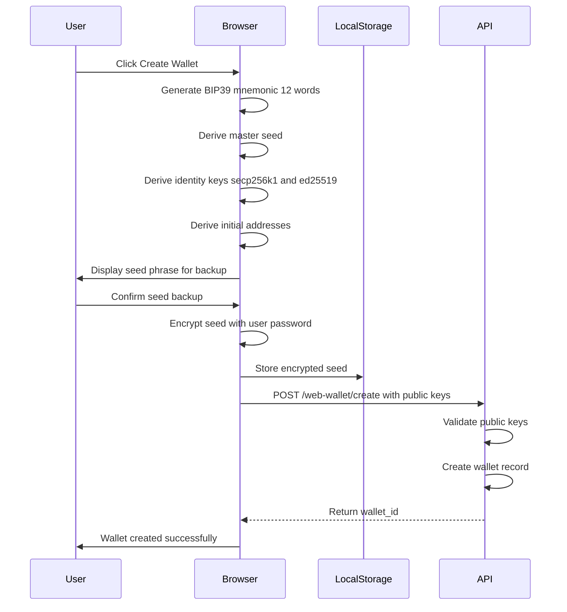
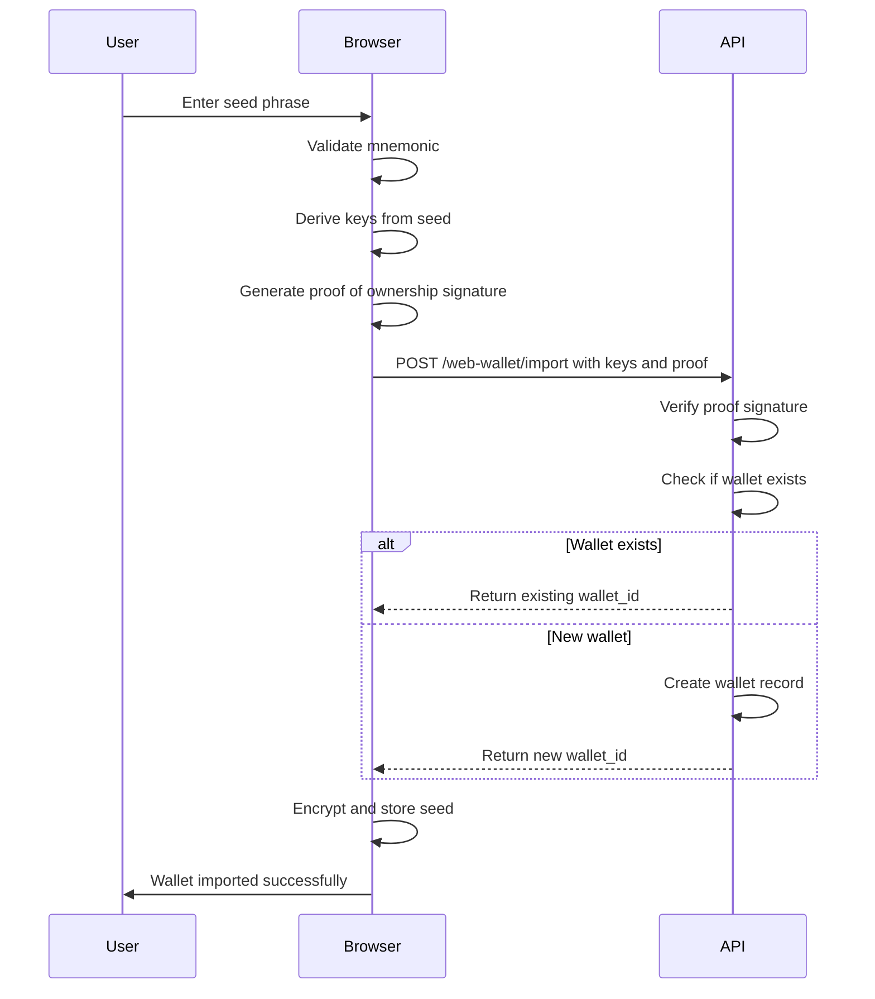

# CoinPayPortal Wallet Mode - Identity & Authentication

## 1. Overview

Wallet Mode uses a **seed-based identity** model with **signature-based authentication**. There are no usernames, passwords, or email addresses.

### Core Principles

1. **Seed = Identity**: The BIP39 seed phrase is the sole identifier
2. **Public Key Registration**: Only public keys are stored on server
3. **Signature Authentication**: All requests authenticated via cryptographic signatures
4. **No PII**: No personally identifiable information collected or stored

---

## 2. Identity Model

### 2.1 Wallet Identity Structure

```
Wallet Identity
├── wallet_id (UUID) - Server-assigned identifier
├── public_key_secp256k1 - For BTC/ETH/POL signatures
├── public_key_ed25519 - For SOL signatures
└── derived_addresses[] - Blockchain addresses
```

### 2.2 Key Derivation Hierarchy

```
BIP39 Seed (12 or 24 words)
│
├── Master Key (BIP32)
│   │
│   ├── m/44'/0'/0'/0/n  → Bitcoin addresses
│   ├── m/44'/145'/0'/0/n → Bitcoin Cash addresses
│   ├── m/44'/60'/0'/0/n  → Ethereum/Polygon addresses
│   └── m/44'/501'/n'/0'  → Solana addresses
│
└── Identity Keys (for authentication)
    ├── secp256k1: m/44'/60'/0'/0/0 (same as first ETH address)
    └── ed25519: m/44'/501'/0'/0' (same as first SOL address)
```

### 2.3 Identity Key Selection

For authentication, we use the **first derived key** of each curve type:

| Curve | Derivation Path | Used For |
|-------|-----------------|----------|
| secp256k1 | m/44'/60'/0'/0/0 | BTC, BCH, ETH, POL auth |
| ed25519 | m/44'/501'/0'/0' | SOL auth |

This means the first Ethereum address and first Solana address double as identity keys.

---

## 3. Wallet Creation Flow

### 3.1 Client-Side Steps



### 3.2 Seed Generation (Client-Side)

```typescript
import { generateMnemonic, mnemonicToSeedSync } from '@scure/bip39';
import { wordlist } from '@scure/bip39/wordlists/english';
import { HDKey } from '@scure/bip32';

// Generate 12-word mnemonic (128 bits of entropy)
const mnemonic = generateMnemonic(wordlist, 128);

// Convert to seed
const seed = mnemonicToSeedSync(mnemonic);

// Create HD key
const hdKey = HDKey.fromMasterSeed(seed);

// Derive identity keys
const ethKey = hdKey.derive("m/44'/60'/0'/0/0");
const solKey = hdKey.derive("m/44'/501'/0'/0'");

// Extract public keys
const secp256k1PublicKey = ethKey.publicKey; // 33 bytes compressed
const ed25519PublicKey = solKey.publicKey;   // 32 bytes
```

### 3.3 Server Registration

```typescript
// API: POST /web-wallet/create
interface CreateWalletRequest {
  public_key_secp256k1: string;  // Hex encoded
  public_key_ed25519: string;    // Base58 encoded
  initial_addresses?: {
    chain: string;
    address: string;
    derivation_path: string;
  }[];
}

// Server validates and stores
async function createWallet(req: CreateWalletRequest) {
  // Validate public key formats
  validateSecp256k1PublicKey(req.public_key_secp256k1);
  validateEd25519PublicKey(req.public_key_ed25519);
  
  // Check for existing wallet with same keys
  const existing = await findWalletByPublicKey(req.public_key_secp256k1);
  if (existing) {
    return { wallet_id: existing.id, existing: true };
  }
  
  // Create new wallet
  const wallet = await db.wallets.insert({
    public_key_secp256k1: req.public_key_secp256k1,
    public_key_ed25519: req.public_key_ed25519,
    status: 'active'
  });
  
  // Register initial addresses
  if (req.initial_addresses) {
    for (const addr of req.initial_addresses) {
      await registerAddress(wallet.id, addr);
    }
  }
  
  return { wallet_id: wallet.id, existing: false };
}
```

---

## 4. Authentication Methods

Wallet Mode supports two authentication methods:

1. **Per-Request Signature**: Sign each request (more secure, stateless)
2. **Challenge-Response Token**: Get a short-lived JWT (more convenient)

### 4.1 Per-Request Signature Authentication

Every authenticated request includes a signature in the Authorization header.

**Header Format:**
```
Authorization: Wallet <wallet_id>:<signature>:<timestamp>
```

**Signature Construction:**
```typescript
// Client-side
function createAuthHeader(
  walletId: string, 
  privateKey: Uint8Array, 
  method: string, 
  path: string, 
  body?: string
): string {
  const timestamp = Math.floor(Date.now() / 1000);
  
  // Create message to sign
  const message = `${method}:${path}:${timestamp}:${body || ''}`;
  const messageHash = sha256(message);
  
  // Sign with secp256k1
  const signature = secp256k1.sign(messageHash, privateKey);
  const signatureHex = signature.toCompactHex();
  
  return `Wallet ${walletId}:${signatureHex}:${timestamp}`;
}

// Usage
const authHeader = createAuthHeader(
  walletId,
  privateKey,
  'GET',
  '/api/web-wallet/abc123/balances',
  null
);

fetch('/api/web-wallet/abc123/balances', {
  headers: {
    'Authorization': authHeader
  }
});
```

**Server Verification:**
```typescript
// Server-side
async function verifyWalletAuth(req: Request): Promise<WalletAuth> {
  const authHeader = req.headers.get('Authorization');
  if (!authHeader?.startsWith('Wallet ')) {
    throw new AuthError('Invalid authorization header');
  }
  
  const [_, credentials] = authHeader.split(' ');
  const [walletId, signature, timestampStr] = credentials.split(':');
  
  // Validate timestamp (5 minute window)
  const timestamp = parseInt(timestampStr, 10);
  const now = Math.floor(Date.now() / 1000);
  if (Math.abs(now - timestamp) > 300) {
    throw new AuthError('Request timestamp expired');
  }
  
  // Get wallet public key
  const wallet = await db.wallets.findById(walletId);
  if (!wallet) {
    throw new AuthError('Wallet not found');
  }
  
  // Reconstruct message
  const body = await req.text();
  const message = `${req.method}:${req.url}:${timestamp}:${body}`;
  const messageHash = sha256(message);
  
  // Verify signature
  const isValid = secp256k1.verify(
    signature,
    messageHash,
    wallet.public_key_secp256k1
  );
  
  if (!isValid) {
    throw new AuthError('Invalid signature');
  }
  
  return { walletId, wallet };
}
```

### 4.2 Challenge-Response Token Authentication

For convenience, clients can obtain a short-lived JWT token.

**Step 1: Request Challenge**
```typescript
// GET /api/web-wallet/auth/challenge?wallet_id=abc123
const response = await fetch(`/api/web-wallet/auth/challenge?wallet_id=${walletId}`);
const { challenge, challenge_id, expires_at } = await response.json();

// challenge = "coinpayportal:auth:1705320000:randomstring"
```

**Step 2: Sign Challenge**
```typescript
// Client signs the challenge
const messageHash = sha256(challenge);
const signature = secp256k1.sign(messageHash, privateKey);
```

**Step 3: Verify and Get Token**
```typescript
// POST /api/web-wallet/auth/verify
const response = await fetch('/api/web-wallet/auth/verify', {
  method: 'POST',
  headers: { 'Content-Type': 'application/json' },
  body: JSON.stringify({
    wallet_id: walletId,
    challenge_id: challengeId,
    signature: signature.toCompactHex(),
    public_key_type: 'secp256k1'
  })
});

const { auth_token, expires_at } = await response.json();
```

**Step 4: Use Token**
```typescript
// Use JWT token for subsequent requests
fetch('/api/web-wallet/abc123/balances', {
  headers: {
    'Authorization': `Bearer ${auth_token}`
  }
});
```

**Token Structure:**
```json
{
  "sub": "wallet_id",
  "iat": 1705320000,
  "exp": 1705323600,
  "iss": "coinpayportal.com",
  "aud": "wallet-api",
  "type": "wallet"
}
```

---

## 5. Wallet Import Flow

### 5.1 Import Existing Seed



### 5.2 Proof of Ownership

To prevent unauthorized wallet registration, import requires a proof of ownership signature.

```typescript
// Client-side
function createProofOfOwnership(privateKey: Uint8Array): ProofOfOwnership {
  const timestamp = Date.now();
  const message = `CoinPayPortal wallet import: ${timestamp}`;
  const messageHash = sha256(message);
  const signature = secp256k1.sign(messageHash, privateKey);
  
  return {
    message,
    signature: signature.toCompactHex()
  };
}

// Server-side verification
function verifyProofOfOwnership(
  proof: ProofOfOwnership,
  publicKey: string
): boolean {
  // Check timestamp is recent (within 5 minutes)
  const match = proof.message.match(/CoinPayPortal wallet import: (\d+)/);
  if (!match) return false;
  
  const timestamp = parseInt(match[1], 10);
  const now = Date.now();
  if (now - timestamp > 5 * 60 * 1000) return false;
  
  // Verify signature
  const messageHash = sha256(proof.message);
  return secp256k1.verify(proof.signature, messageHash, publicKey);
}
```

---

## 6. Session Management

### 6.1 Browser Sessions

**Local Storage Structure:**
```typescript
interface WalletSession {
  wallet_id: string;
  encrypted_seed: string;        // AES-256-GCM encrypted
  encryption_salt: string;       // For key derivation
  public_key_secp256k1: string;
  public_key_ed25519: string;
  created_at: number;
  last_accessed: number;
}
```

**Encryption:**
```typescript
async function encryptSeed(seed: string, password: string): Promise<EncryptedData> {
  // Derive key from password
  const salt = crypto.getRandomValues(new Uint8Array(16));
  const keyMaterial = await crypto.subtle.importKey(
    'raw',
    new TextEncoder().encode(password),
    'PBKDF2',
    false,
    ['deriveBits', 'deriveKey']
  );
  
  const key = await crypto.subtle.deriveKey(
    {
      name: 'PBKDF2',
      salt,
      iterations: 100000,
      hash: 'SHA-256'
    },
    keyMaterial,
    { name: 'AES-GCM', length: 256 },
    false,
    ['encrypt', 'decrypt']
  );
  
  // Encrypt seed
  const iv = crypto.getRandomValues(new Uint8Array(12));
  const encrypted = await crypto.subtle.encrypt(
    { name: 'AES-GCM', iv },
    key,
    new TextEncoder().encode(seed)
  );
  
  return {
    ciphertext: bufferToHex(encrypted),
    iv: bufferToHex(iv),
    salt: bufferToHex(salt)
  };
}
```

### 6.2 Session Timeout

- **Idle Timeout**: 15 minutes of inactivity
- **Absolute Timeout**: 24 hours maximum session
- **Lock on Tab Close**: Optional setting

```typescript
// Auto-lock after inactivity
let lastActivity = Date.now();

document.addEventListener('mousemove', () => {
  lastActivity = Date.now();
});

setInterval(() => {
  if (Date.now() - lastActivity > 15 * 60 * 1000) {
    lockWallet();
  }
}, 60000);

function lockWallet() {
  // Clear decrypted seed from memory
  clearSensitiveData();
  // Redirect to unlock screen
  router.push('/web-wallet/unlock');
}
```

---

## 7. Multi-Device Support

### 7.1 Same Seed, Multiple Devices

Since the seed is the identity, users can use the same wallet on multiple devices by importing the seed.

**Considerations:**
- Each device maintains its own encrypted local storage
- Server tracks all registered addresses
- No device-to-device sync needed (stateless)

### 7.2 Address Discovery

When importing on a new device, the client should scan for used addresses:

```typescript
async function discoverAddresses(hdKey: HDKey, chain: string): Promise<Address[]> {
  const addresses: Address[] = [];
  let gap = 0;
  let index = 0;
  const GAP_LIMIT = 20;
  
  while (gap < GAP_LIMIT) {
    const address = deriveAddress(hdKey, chain, index);
    const hasHistory = await checkAddressHistory(address, chain);
    
    if (hasHistory) {
      addresses.push({ address, index, chain });
      gap = 0;
    } else {
      gap++;
    }
    index++;
  }
  
  return addresses;
}
```

---

## 8. Security Considerations

### 8.1 Replay Attack Prevention

- Timestamp included in signature
- 5-minute validity window
- Server tracks recent timestamps per wallet

```typescript
// Server-side replay prevention
const recentTimestamps = new Map<string, Set<number>>();

function checkReplay(walletId: string, timestamp: number): boolean {
  const timestamps = recentTimestamps.get(walletId) || new Set();
  
  if (timestamps.has(timestamp)) {
    return false; // Replay detected
  }
  
  timestamps.add(timestamp);
  recentTimestamps.set(walletId, timestamps);
  
  // Clean old timestamps
  const cutoff = Math.floor(Date.now() / 1000) - 300;
  for (const ts of timestamps) {
    if (ts < cutoff) timestamps.delete(ts);
  }
  
  return true;
}
```

### 8.2 Man-in-the-Middle Prevention

- All communication over HTTPS
- Request body included in signature
- Path included in signature

### 8.3 Brute Force Prevention

- Rate limiting on auth endpoints
- Exponential backoff on failures
- Challenge expiration (5 minutes)

```typescript
// Rate limiting configuration
const authRateLimits = {
  challenge: {
    windowMs: 60 * 1000,  // 1 minute
    max: 10               // 10 challenges per minute
  },
  verify: {
    windowMs: 15 * 60 * 1000,  // 15 minutes
    max: 5                      // 5 attempts per 15 minutes
  }
};
```

### 8.4 Key Exposure Prevention

- Private keys never leave client
- Seed encrypted at rest
- Memory cleared after use

```typescript
// Secure memory handling
function clearSensitiveData() {
  // Overwrite sensitive variables
  if (decryptedSeed) {
    decryptedSeed.fill(0);
    decryptedSeed = null;
  }
  if (privateKey) {
    privateKey.fill(0);
    privateKey = null;
  }
}

// Use try-finally for sensitive operations
async function signTransaction(tx: Transaction): Promise<string> {
  let privateKey: Uint8Array | null = null;
  try {
    privateKey = await decryptPrivateKey();
    return sign(tx, privateKey);
  } finally {
    if (privateKey) {
      privateKey.fill(0);
    }
  }
}
```

---

## 9. Recovery Scenarios

### 9.1 Lost Password (Local Encryption)

If user forgets their local encryption password:
1. Cannot recover encrypted seed from local storage
2. Must re-import using original seed phrase
3. All server data (addresses, history) preserved

### 9.2 Lost Seed Phrase

If user loses seed phrase:
1. **Cannot recover wallet** - this is by design
2. Funds are permanently inaccessible
3. Server cannot help (no private keys stored)

**Mitigation:**
- Strong seed backup UX
- Periodic backup reminders
- Optional encrypted cloud backup (future feature)

### 9.3 Compromised Seed

If seed is compromised:
1. Create new wallet immediately
2. Transfer all funds to new wallet
3. Old wallet cannot be "revoked" (blockchain limitation)

---

## 10. Bot Authentication

Bots use the same authentication mechanism but with different key storage.

### 10.1 Bot Key Storage

```typescript
// Environment variable
const WALLET_SEED = process.env.WALLET_SEED;

// Or encrypted file
const encryptedSeed = fs.readFileSync('.wallet-seed.enc');
const seed = decrypt(encryptedSeed, process.env.WALLET_PASSWORD);
```

### 10.2 Bot SDK Authentication

```typescript
import { Wallet } from '@coinpayportal/wallet-sdk';

// Initialize with seed
const wallet = Wallet.fromSeed(process.env.WALLET_SEED);

// SDK handles authentication automatically
const balance = await wallet.getBalance('ETH');
const tx = await wallet.send({
  chain: 'ETH',
  to: '0x...',
  amount: '1.0'
});
```

The SDK internally:
1. Derives keys from seed
2. Signs each request
3. Manages nonces
4. Handles retries
