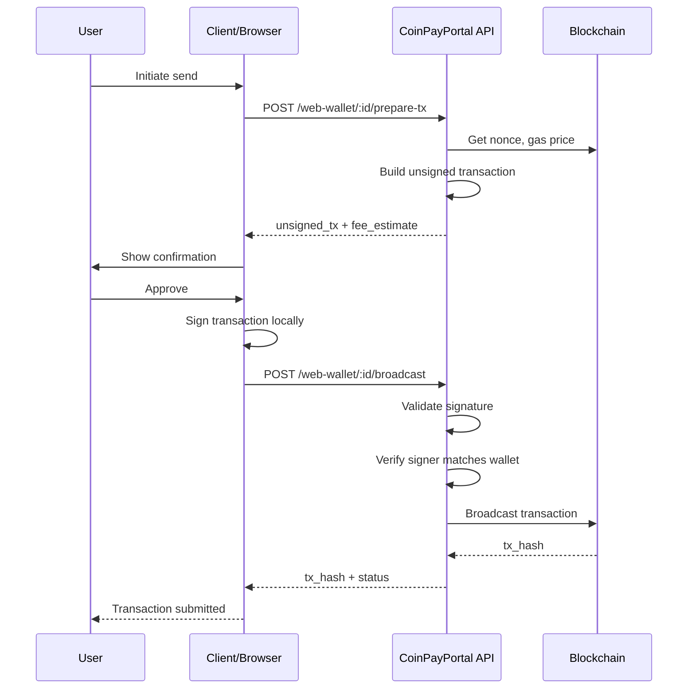

# CoinPayPortal Wallet Mode - Signing Protocol

## 1. Overview

This document describes the client-side transaction signing protocol. All signing happens on the client (browser or bot) - the server never has access to private keys.

### Signing Flow Summary

```
1. Client requests unsigned transaction from server
2. Server builds transaction with current nonce, gas, etc.
3. Client signs transaction locally
4. Client submits signed transaction to server
5. Server validates and broadcasts to blockchain
```

---

## 2. Transaction Signing Flow

### 2.1 Complete Flow Diagram



---

## 3. Chain-Specific Signing

### 3.1 Ethereum/Polygon Signing

**Transaction Types:**
- Legacy (Type 0)
- EIP-2930 (Type 1) - Access list
- EIP-1559 (Type 2) - Priority fee (recommended)

**EIP-1559 Transaction Structure:**
```typescript
interface EIP1559Transaction {
  type: 2;
  chainId: number;
  nonce: number;
  maxPriorityFeePerGas: bigint;
  maxFeePerGas: bigint;
  gasLimit: bigint;
  to: string;
  value: bigint;
  data: string;
  accessList: AccessListItem[];
}
```

**Signing Implementation:**
```typescript
import { ethers } from 'ethers';

async function signEthereumTransaction(
  unsignedTx: EIP1559Transaction,
  privateKey: Uint8Array
): Promise<string> {
  // Create wallet from private key
  const wallet = new ethers.Wallet(
    '0x' + Buffer.from(privateKey).toString('hex')
  );
  
  // Sign transaction
  const signedTx = await wallet.signTransaction({
    type: unsignedTx.type,
    chainId: unsignedTx.chainId,
    nonce: unsignedTx.nonce,
    maxPriorityFeePerGas: unsignedTx.maxPriorityFeePerGas,
    maxFeePerGas: unsignedTx.maxFeePerGas,
    gasLimit: unsignedTx.gasLimit,
    to: unsignedTx.to,
    value: unsignedTx.value,
    data: unsignedTx.data,
    accessList: unsignedTx.accessList
  });
  
  return signedTx;
}
```

**Token Transfer (ERC-20):**
```typescript
import { ethers } from 'ethers';

function buildERC20TransferData(to: string, amount: bigint): string {
  const iface = new ethers.Interface([
    'function transfer(address to, uint256 amount)'
  ]);
  return iface.encodeFunctionData('transfer', [to, amount]);
}

async function signTokenTransfer(
  tokenAddress: string,
  to: string,
  amount: bigint,
  unsignedTx: EIP1559Transaction,
  privateKey: Uint8Array
): Promise<string> {
  const data = buildERC20TransferData(to, amount);
  
  return signEthereumTransaction({
    ...unsignedTx,
    to: tokenAddress,
    value: 0n,
    data
  }, privateKey);
}
```

### 3.2 Bitcoin Signing

**Transaction Structure:**
```typescript
interface BitcoinTransaction {
  version: number;
  inputs: BitcoinInput[];
  outputs: BitcoinOutput[];
  locktime: number;
}

interface BitcoinInput {
  txid: string;
  vout: number;
  scriptSig?: string;
  sequence: number;
  witnessUtxo?: {
    script: string;
    value: number;
  };
}

interface BitcoinOutput {
  address: string;
  value: number;  // satoshis
}
```

**Signing Implementation:**
```typescript
import * as bitcoin from 'bitcoinjs-lib';
import { ECPairFactory } from 'ecpair';
import * as ecc from 'tiny-secp256k1';

const ECPair = ECPairFactory(ecc);

async function signBitcoinTransaction(
  unsignedTx: BitcoinTransaction,
  privateKey: Uint8Array,
  utxos: UTXO[]
): Promise<string> {
  const network = bitcoin.networks.bitcoin;
  const keyPair = ECPair.fromPrivateKey(Buffer.from(privateKey));
  
  const psbt = new bitcoin.Psbt({ network });
  
  // Add inputs
  for (const input of unsignedTx.inputs) {
    const utxo = utxos.find(u => u.txid === input.txid && u.vout === input.vout);
    if (!utxo) throw new Error('UTXO not found');
    
    psbt.addInput({
      hash: input.txid,
      index: input.vout,
      witnessUtxo: {
        script: Buffer.from(utxo.scriptPubKey, 'hex'),
        value: utxo.value
      }
    });
  }
  
  // Add outputs
  for (const output of unsignedTx.outputs) {
    psbt.addOutput({
      address: output.address,
      value: output.value
    });
  }
  
  // Sign all inputs
  for (let i = 0; i < unsignedTx.inputs.length; i++) {
    psbt.signInput(i, keyPair);
  }
  
  // Finalize and extract
  psbt.finalizeAllInputs();
  return psbt.extractTransaction().toHex();
}
```

### 3.3 Solana Signing

**Transaction Structure:**
```typescript
interface SolanaTransaction {
  recentBlockhash: string;
  feePayer: string;
  instructions: SolanaInstruction[];
}

interface SolanaInstruction {
  programId: string;
  keys: {
    pubkey: string;
    isSigner: boolean;
    isWritable: boolean;
  }[];
  data: string;  // Base64 encoded
}
```

**Signing Implementation:**
```typescript
import {
  Transaction,
  SystemProgram,
  PublicKey,
  Keypair,
  LAMPORTS_PER_SOL
} from '@solana/web3.js';

async function signSolanaTransaction(
  unsignedTx: SolanaTransaction,
  privateKey: Uint8Array
): Promise<string> {
  const keypair = Keypair.fromSecretKey(privateKey);
  
  const transaction = new Transaction();
  transaction.recentBlockhash = unsignedTx.recentBlockhash;
  transaction.feePayer = new PublicKey(unsignedTx.feePayer);
  
  // Add instructions
  for (const ix of unsignedTx.instructions) {
    transaction.add({
      programId: new PublicKey(ix.programId),
      keys: ix.keys.map(k => ({
        pubkey: new PublicKey(k.pubkey),
        isSigner: k.isSigner,
        isWritable: k.isWritable
      })),
      data: Buffer.from(ix.data, 'base64')
    });
  }
  
  // Sign
  transaction.sign(keypair);
  
  // Serialize
  return transaction.serialize().toString('base64');
}
```

**SPL Token Transfer:**
```typescript
import {
  createTransferInstruction,
  getAssociatedTokenAddress,
  TOKEN_PROGRAM_ID
} from '@solana/spl-token';

async function signSPLTokenTransfer(
  mint: string,
  from: string,
  to: string,
  amount: bigint,
  recentBlockhash: string,
  privateKey: Uint8Array
): Promise<string> {
  const keypair = Keypair.fromSecretKey(privateKey);
  
  const fromATA = await getAssociatedTokenAddress(
    new PublicKey(mint),
    new PublicKey(from)
  );
  
  const toATA = await getAssociatedTokenAddress(
    new PublicKey(mint),
    new PublicKey(to)
  );
  
  const transaction = new Transaction();
  transaction.recentBlockhash = recentBlockhash;
  transaction.feePayer = new PublicKey(from);
  
  transaction.add(
    createTransferInstruction(
      fromATA,
      toATA,
      new PublicKey(from),
      amount
    )
  );
  
  transaction.sign(keypair);
  return transaction.serialize().toString('base64');
}
```

---

## 4. Server-Side Validation

### 4.1 Signature Verification

Before broadcasting, the server validates:

1. **Signature is valid** - Transaction is properly signed
2. **Signer matches wallet** - Signer address belongs to the wallet
3. **Transaction matches prepared** - No tampering with prepared transaction

```typescript
// Server-side validation
async function validateSignedTransaction(
  walletId: string,
  prepareId: string,
  signedTx: string,
  chain: string
): Promise<ValidationResult> {
  // Get prepared transaction
  const prepared = await getPreparedTransaction(prepareId);
  if (!prepared || prepared.wallet_id !== walletId) {
    return { valid: false, error: 'Invalid prepare_id' };
  }
  
  // Check expiration
  if (new Date() > prepared.expires_at) {
    return { valid: false, error: 'Prepared transaction expired' };
  }
  
  // Extract signer from signed transaction
  const signer = extractSigner(signedTx, chain);
  
  // Verify signer belongs to wallet
  const walletAddresses = await getWalletAddresses(walletId, chain);
  if (!walletAddresses.includes(signer)) {
    return { valid: false, error: 'Signer not in wallet' };
  }
  
  // Verify transaction details match
  const txDetails = decodeTransaction(signedTx, chain);
  if (!transactionsMatch(prepared.unsigned_tx, txDetails)) {
    return { valid: false, error: 'Transaction modified' };
  }
  
  return { valid: true };
}
```

### 4.2 Extract Signer by Chain

```typescript
// Ethereum - extract signer from signed transaction
function extractEthereumSigner(signedTx: string): string {
  const tx = ethers.Transaction.from(signedTx);
  return tx.from!;
}

// Bitcoin - extract signer from PSBT
function extractBitcoinSigner(signedTx: string): string[] {
  const tx = bitcoin.Transaction.fromHex(signedTx);
  // Extract from witness/scriptSig
  // Returns array of addresses that signed inputs
  return extractSignerAddresses(tx);
}

// Solana - extract signer from transaction
function extractSolanaSigner(signedTx: string): string {
  const tx = Transaction.from(Buffer.from(signedTx, 'base64'));
  return tx.feePayer!.toBase58();
}
```

---

## 5. Nonce Management

### 5.1 Ethereum Nonce

```typescript
// Server-side nonce management
class NonceManager {
  private pendingNonces: Map<string, number> = new Map();
  
  async getNextNonce(address: string, chain: string): Promise<number> {
    const provider = getProvider(chain);
    
    // Get on-chain nonce
    const onChainNonce = await provider.getTransactionCount(address, 'pending');
    
    // Get our tracked pending nonce
    const key = `${chain}:${address}`;
    const pendingNonce = this.pendingNonces.get(key) || 0;
    
    // Use the higher of the two
    const nonce = Math.max(onChainNonce, pendingNonce);
    
    // Track this nonce as pending
    this.pendingNonces.set(key, nonce + 1);
    
    return nonce;
  }
  
  async confirmNonce(address: string, chain: string, nonce: number): void {
    // Called when transaction is confirmed
    const key = `${chain}:${address}`;
    const pending = this.pendingNonces.get(key) || 0;
    if (nonce >= pending) {
      this.pendingNonces.delete(key);
    }
  }
  
  async resetNonce(address: string, chain: string): void {
    // Called on nonce conflict
    const key = `${chain}:${address}`;
    this.pendingNonces.delete(key);
  }
}
```

### 5.2 Solana Blockhash

```typescript
// Solana uses recent blockhash instead of nonce
async function getRecentBlockhash(): Promise<{
  blockhash: string;
  lastValidBlockHeight: number;
}> {
  const connection = getSolanaConnection();
  return connection.getLatestBlockhash('finalized');
}

// Blockhash expires after ~60 seconds
// Must re-prepare transaction if expired
```

### 5.3 Bitcoin UTXO Selection

```typescript
// Bitcoin uses UTXOs, not nonces
async function selectUTXOs(
  address: string,
  amount: number,
  feeRate: number
): Promise<{ utxos: UTXO[]; fee: number }> {
  const allUtxos = await getAddressUTXOs(address);
  
  // Sort by value descending
  allUtxos.sort((a, b) => b.value - a.value);
  
  const selected: UTXO[] = [];
  let total = 0;
  let estimatedFee = 0;
  
  for (const utxo of allUtxos) {
    selected.push(utxo);
    total += utxo.value;
    
    // Estimate fee based on input/output count
    estimatedFee = estimateFee(selected.length, 2, feeRate);
    
    if (total >= amount + estimatedFee) {
      break;
    }
  }
  
  if (total < amount + estimatedFee) {
    throw new Error('Insufficient funds');
  }
  
  return { utxos: selected, fee: estimatedFee };
}
```

---

## 6. Fee Estimation

### 6.1 Ethereum Gas Estimation

```typescript
interface GasEstimate {
  gasLimit: bigint;
  maxFeePerGas: bigint;
  maxPriorityFeePerGas: bigint;
  estimatedFee: bigint;
}

async function estimateEthereumGas(
  from: string,
  to: string,
  value: bigint,
  data: string,
  priority: 'low' | 'medium' | 'high'
): Promise<GasEstimate> {
  const provider = getProvider('ETH');
  
  // Estimate gas limit
  const gasLimit = await provider.estimateGas({
    from,
    to,
    value,
    data
  });
  
  // Get current fee data
  const feeData = await provider.getFeeData();
  
  // Adjust based on priority
  const priorityMultiplier = {
    low: 0.8,
    medium: 1.0,
    high: 1.5
  };
  
  const multiplier = priorityMultiplier[priority];
  
  const maxPriorityFeePerGas = BigInt(
    Math.floor(Number(feeData.maxPriorityFeePerGas!) * multiplier)
  );
  
  const maxFeePerGas = BigInt(
    Math.floor(Number(feeData.maxFeePerGas!) * multiplier)
  );
  
  const estimatedFee = gasLimit * maxFeePerGas;
  
  return {
    gasLimit,
    maxFeePerGas,
    maxPriorityFeePerGas,
    estimatedFee
  };
}
```

### 6.2 Bitcoin Fee Estimation

```typescript
interface BitcoinFeeEstimate {
  feeRate: number;  // sat/vB
  estimatedFee: number;  // satoshis
  estimatedSize: number;  // vBytes
}

async function estimateBitcoinFee(
  inputCount: number,
  outputCount: number,
  priority: 'low' | 'medium' | 'high'
): Promise<BitcoinFeeEstimate> {
  // Get fee rates from mempool
  const feeRates = await getFeeRates();
  
  const priorityBlocks = {
    low: 6,      // ~1 hour
    medium: 3,   // ~30 minutes
    high: 1      // Next block
  };
  
  const feeRate = feeRates[priorityBlocks[priority]];
  
  // Estimate transaction size
  // P2WPKH: ~68 vB per input, ~31 vB per output, ~10 vB overhead
  const estimatedSize = 10 + (inputCount * 68) + (outputCount * 31);
  
  const estimatedFee = Math.ceil(estimatedSize * feeRate);
  
  return {
    feeRate,
    estimatedFee,
    estimatedSize
  };
}
```

### 6.3 Solana Fee Estimation

```typescript
interface SolanaFeeEstimate {
  baseFee: number;  // lamports
  priorityFee: number;  // lamports
  totalFee: number;  // lamports
}

async function estimateSolanaFee(
  transaction: Transaction,
  priority: 'low' | 'medium' | 'high'
): Promise<SolanaFeeEstimate> {
  const connection = getSolanaConnection();
  
  // Base fee is fixed at 5000 lamports per signature
  const baseFee = 5000 * transaction.signatures.length;
  
  // Priority fee based on compute units
  const priorityFees = {
    low: 0,
    medium: 10000,
    high: 100000
  };
  
  const priorityFee = priorityFees[priority];
  
  return {
    baseFee,
    priorityFee,
    totalFee: baseFee + priorityFee
  };
}
```

---

## 7. Transaction Broadcasting

### 7.1 Broadcast Flow

```typescript
async function broadcastTransaction(
  signedTx: string,
  chain: string
): Promise<BroadcastResult> {
  const provider = getProvider(chain);
  
  try {
    let txHash: string;
    
    switch (chain) {
      case 'ETH':
      case 'POL':
        const ethResponse = await provider.broadcastTransaction(signedTx);
        txHash = ethResponse.hash;
        break;
        
      case 'BTC':
      case 'BCH':
        txHash = await broadcastBitcoinTx(signedTx, chain);
        break;
        
      case 'SOL':
        const solConnection = getSolanaConnection();
        txHash = await solConnection.sendRawTransaction(
          Buffer.from(signedTx, 'base64')
        );
        break;
        
      default:
        throw new Error(`Unsupported chain: ${chain}`);
    }
    
    return {
      success: true,
      txHash,
      status: 'pending'
    };
    
  } catch (error) {
    return {
      success: false,
      error: parseBlockchainError(error, chain)
    };
  }
}
```

### 7.2 Error Handling

```typescript
function parseBlockchainError(error: any, chain: string): TransactionError {
  // Ethereum errors
  if (chain === 'ETH' || chain === 'POL') {
    if (error.code === 'NONCE_EXPIRED') {
      return { code: 'NONCE_TOO_LOW', message: 'Nonce already used', retry: true };
    }
    if (error.code === 'INSUFFICIENT_FUNDS') {
      return { code: 'INSUFFICIENT_FUNDS', message: 'Not enough ETH for gas', retry: false };
    }
    if (error.code === 'REPLACEMENT_UNDERPRICED') {
      return { code: 'GAS_TOO_LOW', message: 'Gas price too low to replace', retry: true };
    }
  }
  
  // Bitcoin errors
  if (chain === 'BTC' || chain === 'BCH') {
    if (error.message?.includes('insufficient fee')) {
      return { code: 'FEE_TOO_LOW', message: 'Transaction fee too low', retry: true };
    }
    if (error.message?.includes('txn-mempool-conflict')) {
      return { code: 'DOUBLE_SPEND', message: 'UTXO already spent', retry: false };
    }
  }
  
  // Solana errors
  if (chain === 'SOL') {
    if (error.message?.includes('Blockhash not found')) {
      return { code: 'BLOCKHASH_EXPIRED', message: 'Blockhash expired', retry: true };
    }
    if (error.message?.includes('insufficient lamports')) {
      return { code: 'INSUFFICIENT_FUNDS', message: 'Not enough SOL', retry: false };
    }
  }
  
  return { code: 'UNKNOWN', message: error.message, retry: false };
}
```

---

## 8. Client-Side Signing Library

### 8.1 Unified Signing Interface

```typescript
// Client-side signing library
class TransactionSigner {
  private hdKey: HDKey;
  
  constructor(mnemonic: string) {
    const seed = mnemonicToSeedSync(mnemonic);
    this.hdKey = HDKey.fromMasterSeed(seed);
  }
  
  async sign(
    unsignedTx: UnsignedTransaction,
    chain: string,
    derivationIndex: number
  ): Promise<string> {
    const privateKey = this.derivePrivateKey(chain, derivationIndex);
    
    try {
      switch (chain) {
        case 'ETH':
        case 'POL':
          return await signEthereumTransaction(unsignedTx, privateKey);
        case 'BTC':
        case 'BCH':
          return await signBitcoinTransaction(unsignedTx, privateKey);
        case 'SOL':
          return await signSolanaTransaction(unsignedTx, privateKey);
        default:
          throw new Error(`Unsupported chain: ${chain}`);
      }
    } finally {
      // Clear private key from memory
      privateKey.fill(0);
    }
  }
  
  private derivePrivateKey(chain: string, index: number): Uint8Array {
    const path = getDerivationPath(chain, index);
    const child = this.hdKey.derive(path);
    if (!child.privateKey) throw new Error('Failed to derive key');
    return new Uint8Array(child.privateKey);
  }
  
  destroy(): void {
    // Clear HD key from memory
    // Note: JavaScript doesn't guarantee memory clearing
    this.hdKey = null as any;
  }
}
```

### 8.2 Usage Example

```typescript
// Browser usage
async function sendTransaction(
  walletId: string,
  to: string,
  amount: string,
  chain: string,
  password: string
) {
  // Decrypt seed
  const seed = await decryptSeed(password);
  const signer = new TransactionSigner(seed);
  
  try {
    // Prepare transaction
    const { unsigned_tx, prepare_id } = await api.prepareTransaction({
      wallet_id: walletId,
      chain,
      to,
      amount
    });
    
    // Sign locally
    const signedTx = await signer.sign(unsigned_tx, chain, 0);
    
    // Broadcast
    const result = await api.broadcastTransaction({
      wallet_id: walletId,
      prepare_id,
      signed_tx: signedTx,
      chain
    });
    
    return result;
    
  } finally {
    signer.destroy();
    seed.fill(0);
  }
}
```

---

## 9. Security Considerations

### 9.1 Signing Security Checklist

- [ ] Private keys never leave client
- [ ] Keys cleared from memory after use
- [ ] Transaction details verified before signing
- [ ] User confirmation required
- [ ] Prepared transaction has expiration
- [ ] Server validates signer matches wallet

### 9.2 Common Attack Vectors

| Attack | Mitigation |
|--------|------------|
| Man-in-the-middle | HTTPS, verify transaction details |
| Replay attack | Nonce management, chain ID |
| Address substitution | User verifies recipient |
| Fee manipulation | User confirms fee before signing |
| Malicious transaction | Display decoded transaction details |
