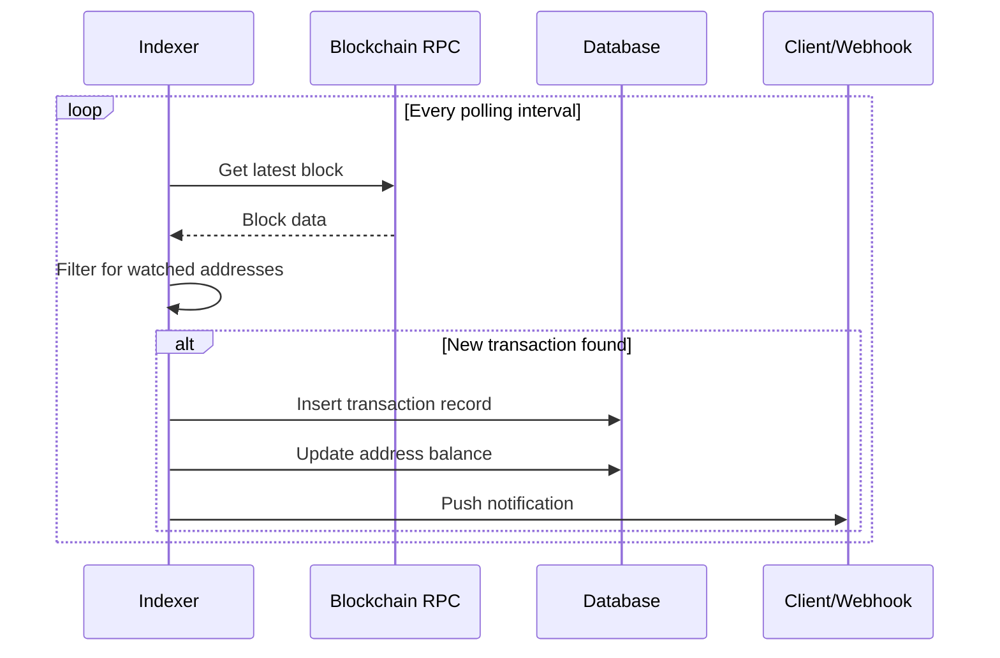

# CoinPayPortal Wallet Mode - Blockchain Indexer

## 1. Overview

The Wallet Indexer extends CoinPayPortal's existing payment monitoring infrastructure to provide persistent address monitoring for wallet addresses.

### Key Differences from Payment Monitor

| Feature | Payment Monitor | Wallet Indexer |
|---------|-----------------|----------------|
| Duration | Temporary (until payment completes) | Persistent (always on) |
| Addresses | One-time payment addresses | Reusable wallet addresses |
| History | Single transaction | Full transaction history |
| Balance | Not tracked | Continuously updated |

---

## 2. Architecture

### 2.1 Indexer Components

```
┌─────────────────────────────────────────────────────────────┐
│                     Wallet Indexer                          │
├─────────────────────────────────────────────────────────────┤
│                                                             │
│  ┌─────────────┐  ┌─────────────┐  ┌─────────────┐         │
│  │   Address   │  │  Balance    │  │ Transaction │         │
│  │  Registry   │  │   Tracker   │  │   Scanner   │         │
│  └──────┬──────┘  └──────┬──────┘  └──────┬──────┘         │
│         │                │                │                 │
│         └────────────────┼────────────────┘                 │
│                          │                                  │
│                    ┌─────┴─────┐                            │
│                    │   Event   │                            │
│                    │  Emitter  │                            │
│                    └─────┬─────┘                            │
│                          │                                  │
└──────────────────────────┼──────────────────────────────────┘
                           │
           ┌───────────────┼───────────────┐
           │               │               │
           ▼               ▼               ▼
    ┌───────────┐   ┌───────────┐   ┌───────────┐
    │  Database │   │  Webhook  │   │  Realtime │
    │  Updates  │   │  Delivery │   │   Push    │
    └───────────┘   └───────────┘   └───────────┘
```

### 2.2 Data Flow



---

## 3. Address Registry

### 3.1 Registration

```typescript
interface AddressRegistration {
  wallet_id: string;
  chain: string;
  address: string;
  derivation_path: string;
}

class AddressRegistry {
  private watchedAddresses: Map<string, Set<string>> = new Map();
  
  async register(registration: AddressRegistration): Promise<void> {
    const { chain, address, wallet_id } = registration;
    
    // Add to in-memory registry
    const chainAddresses = this.watchedAddresses.get(chain) || new Set();
    chainAddresses.add(address);
    this.watchedAddresses.set(chain, chainAddresses);
    
    // Persist to database
    await db.wallet_addresses.upsert({
      wallet_id,
      chain,
      address,
      derivation_path: registration.derivation_path,
      is_active: true
    });
    
    // Trigger initial balance fetch
    await this.fetchInitialBalance(address, chain);
  }
  
  async unregister(wallet_id: string, address: string): Promise<void> {
    // Mark as inactive in database
    await db.wallet_addresses.update({
      wallet_id,
      address
    }, {
      is_active: false
    });
    
    // Note: Don't remove from in-memory set immediately
    // Let cleanup job handle it
  }
  
  isWatched(chain: string, address: string): boolean {
    const chainAddresses = this.watchedAddresses.get(chain);
    return chainAddresses?.has(address) || false;
  }
  
  getWatchedAddresses(chain: string): string[] {
    const chainAddresses = this.watchedAddresses.get(chain);
    return chainAddresses ? Array.from(chainAddresses) : [];
  }
}
```

### 3.2 Startup Loading

```typescript
async function loadWatchedAddresses(): Promise<void> {
  const registry = getAddressRegistry();
  
  // Load all active addresses from database
  const addresses = await db.wallet_addresses.findMany({
    where: { is_active: true }
  });
  
  for (const addr of addresses) {
    await registry.register({
      wallet_id: addr.wallet_id,
      chain: addr.chain,
      address: addr.address,
      derivation_path: addr.derivation_path
    });
  }
  
  console.log(`Loaded ${addresses.length} watched addresses`);
}
```

---

## 4. Balance Tracking

### 4.1 Balance Fetcher

```typescript
interface BalanceResult {
  address: string;
  chain: string;
  balance: string;
  tokenBalances?: TokenBalance[];
  timestamp: Date;
}

interface TokenBalance {
  tokenAddress: string;
  symbol: string;
  balance: string;
  decimals: number;
}

class BalanceTracker {
  private balanceCache: Map<string, BalanceResult> = new Map();
  private readonly CACHE_TTL = 30000; // 30 seconds
  
  async getBalance(
    address: string, 
    chain: string, 
    forceRefresh: boolean = false
  ): Promise<BalanceResult> {
    const cacheKey = `${chain}:${address}`;
    const cached = this.balanceCache.get(cacheKey);
    
    if (!forceRefresh && cached && this.isCacheValid(cached)) {
      return cached;
    }
    
    const balance = await this.fetchBalance(address, chain);
    this.balanceCache.set(cacheKey, balance);
    
    // Update database
    await this.updateDatabaseBalance(address, chain, balance);
    
    return balance;
  }
  
  private async fetchBalance(address: string, chain: string): Promise<BalanceResult> {
    switch (chain) {
      case 'ETH':
      case 'POL':
        return this.fetchEVMBalance(address, chain);
      case 'BTC':
      case 'BCH':
        return this.fetchBitcoinBalance(address, chain);
      case 'SOL':
        return this.fetchSolanaBalance(address);
      default:
        throw new Error(`Unsupported chain: ${chain}`);
    }
  }
  
  private async fetchEVMBalance(address: string, chain: string): Promise<BalanceResult> {
    const provider = getProvider(chain);
    
    // Native balance
    const balance = await provider.getBalance(address);
    
    // USDC balance
    const usdcAddress = getUSDCAddress(chain);
    const usdcContract = new ethers.Contract(usdcAddress, ERC20_ABI, provider);
    const usdcBalance = await usdcContract.balanceOf(address);
    
    return {
      address,
      chain,
      balance: ethers.formatEther(balance),
      tokenBalances: [{
        tokenAddress: usdcAddress,
        symbol: 'USDC',
        balance: ethers.formatUnits(usdcBalance, 6),
        decimals: 6
      }],
      timestamp: new Date()
    };
  }
  
  private async fetchBitcoinBalance(address: string, chain: string): Promise<BalanceResult> {
    const utxos = await getAddressUTXOs(address, chain);
    const balance = utxos.reduce((sum, utxo) => sum + utxo.value, 0);
    
    return {
      address,
      chain,
      balance: (balance / 100000000).toString(), // Convert satoshis to BTC
      timestamp: new Date()
    };
  }
  
  private async fetchSolanaBalance(address: string): Promise<BalanceResult> {
    const connection = getSolanaConnection();
    const pubkey = new PublicKey(address);
    
    // Native SOL balance
    const balance = await connection.getBalance(pubkey);
    
    // USDC balance
    const usdcMint = new PublicKey(USDC_MINT_SOL);
    const tokenAccounts = await connection.getTokenAccountsByOwner(pubkey, {
      mint: usdcMint
    });
    
    let usdcBalance = '0';
    if (tokenAccounts.value.length > 0) {
      const accountInfo = await connection.getTokenAccountBalance(
        tokenAccounts.value[0].pubkey
      );
      usdcBalance = accountInfo.value.uiAmountString || '0';
    }
    
    return {
      address,
      chain: 'SOL',
      balance: (balance / LAMPORTS_PER_SOL).toString(),
      tokenBalances: [{
        tokenAddress: USDC_MINT_SOL,
        symbol: 'USDC',
        balance: usdcBalance,
        decimals: 6
      }],
      timestamp: new Date()
    };
  }
  
  private async updateDatabaseBalance(
    address: string, 
    chain: string, 
    balance: BalanceResult
  ): Promise<void> {
    await db.wallet_addresses.update({
      address,
      chain
    }, {
      cached_balance: balance.balance,
      cached_balance_updated_at: balance.timestamp
    });
  }
}
```

### 4.2 Batch Balance Updates

```typescript
// Efficient batch balance fetching
async function batchUpdateBalances(chain: string): Promise<void> {
  const registry = getAddressRegistry();
  const tracker = getBalanceTracker();
  
  const addresses = registry.getWatchedAddresses(chain);
  
  // Batch in groups of 100
  const BATCH_SIZE = 100;
  for (let i = 0; i < addresses.length; i += BATCH_SIZE) {
    const batch = addresses.slice(i, i + BATCH_SIZE);
    
    await Promise.all(
      batch.map(addr => tracker.getBalance(addr, chain, true))
    );
    
    // Rate limiting
    await sleep(1000);
  }
}
```

---

## 5. Transaction Scanner

### 5.1 Block Scanner

```typescript
interface ScannedTransaction {
  txHash: string;
  chain: string;
  blockNumber: number;
  blockTimestamp: Date;
  from: string;
  to: string;
  value: string;
  tokenAddress?: string;
  status: 'pending' | 'confirmed';
}

class TransactionScanner {
  private lastScannedBlock: Map<string, number> = new Map();
  
  async scanNewBlocks(chain: string): Promise<ScannedTransaction[]> {
    const provider = getProvider(chain);
    const registry = getAddressRegistry();
    
    const currentBlock = await provider.getBlockNumber();
    const lastBlock = this.lastScannedBlock.get(chain) || currentBlock - 1;
    
    const transactions: ScannedTransaction[] = [];
    
    for (let blockNum = lastBlock + 1; blockNum <= currentBlock; blockNum++) {
      const block = await provider.getBlock(blockNum, true);
      if (!block) continue;
      
      for (const tx of block.transactions) {
        // Check if transaction involves watched address
        const txData = typeof tx === 'string' ? await provider.getTransaction(tx) : tx;
        if (!txData) continue;
        
        const from = txData.from?.toLowerCase();
        const to = txData.to?.toLowerCase();
        
        if (registry.isWatched(chain, from) || registry.isWatched(chain, to)) {
          transactions.push({
            txHash: txData.hash,
            chain,
            blockNumber: blockNum,
            blockTimestamp: new Date(block.timestamp * 1000),
            from: from || '',
            to: to || '',
            value: txData.value.toString(),
            status: 'confirmed'
          });
        }
      }
    }
    
    this.lastScannedBlock.set(chain, currentBlock);
    return transactions;
  }
}
```

### 5.2 Mempool Monitoring (Pending Transactions)

```typescript
class MempoolMonitor {
  private pendingTxs: Map<string, ScannedTransaction> = new Map();
  
  async startMonitoring(chain: string): Promise<void> {
    if (chain === 'ETH' || chain === 'POL') {
      await this.monitorEVMMempool(chain);
    }
    // Bitcoin and Solana have different mempool access patterns
  }
  
  private async monitorEVMMempool(chain: string): Promise<void> {
    const provider = getProvider(chain);
    const registry = getAddressRegistry();
    
    provider.on('pending', async (txHash: string) => {
      try {
        const tx = await provider.getTransaction(txHash);
        if (!tx) return;
        
        const from = tx.from?.toLowerCase();
        const to = tx.to?.toLowerCase();
        
        if (registry.isWatched(chain, from) || registry.isWatched(chain, to)) {
          const pendingTx: ScannedTransaction = {
            txHash,
            chain,
            blockNumber: 0,
            blockTimestamp: new Date(),
            from: from || '',
            to: to || '',
            value: tx.value.toString(),
            status: 'pending'
          };
          
          this.pendingTxs.set(txHash, pendingTx);
          await this.emitTransaction(pendingTx);
        }
      } catch (error) {
        // Transaction may have been mined already
      }
    });
  }
  
  async confirmTransaction(txHash: string, blockNumber: number): Promise<void> {
    const pending = this.pendingTxs.get(txHash);
    if (pending) {
      pending.status = 'confirmed';
      pending.blockNumber = blockNumber;
      this.pendingTxs.delete(txHash);
    }
  }
}
```

---

## 6. Confirmation Tracking

### 6.1 Confirmation Requirements

```typescript
const CONFIRMATION_REQUIREMENTS: Record<string, number> = {
  BTC: 3,
  BCH: 6,
  ETH: 12,
  POL: 128,
  SOL: 32
};

class ConfirmationTracker {
  async trackTransaction(
    txHash: string, 
    chain: string
  ): Promise<void> {
    const required = CONFIRMATION_REQUIREMENTS[chain];
    let confirmations = 0;
    
    while (confirmations < required) {
      confirmations = await this.getConfirmations(txHash, chain);
      
      // Update database
      await db.wallet_transactions.update({
        tx_hash: txHash,
        chain
      }, {
        confirmations,
        status: confirmations >= required ? 'confirmed' : 'confirming'
      });
      
      if (confirmations >= required) {
        await this.emitConfirmed(txHash, chain);
        break;
      }
      
      await sleep(getBlockTime(chain) * 1000);
    }
  }
  
  private async getConfirmations(txHash: string, chain: string): Promise<number> {
    const provider = getProvider(chain);
    
    switch (chain) {
      case 'ETH':
      case 'POL': {
        const receipt = await provider.getTransactionReceipt(txHash);
        if (!receipt) return 0;
        const currentBlock = await provider.getBlockNumber();
        return currentBlock - receipt.blockNumber + 1;
      }
      
      case 'BTC':
      case 'BCH': {
        const tx = await getBitcoinTransaction(txHash, chain);
        return tx?.confirmations || 0;
      }
      
      case 'SOL': {
        const connection = getSolanaConnection();
        const status = await connection.getSignatureStatus(txHash);
        return status?.value?.confirmations || 0;
      }
      
      default:
        return 0;
    }
  }
}
```

---

## 7. Event System

### 7.1 Event Types

```typescript
type IndexerEvent = 
  | { type: 'transaction.detected'; data: TransactionEvent }
  | { type: 'transaction.confirmed'; data: TransactionEvent }
  | { type: 'balance.changed'; data: BalanceEvent };

interface TransactionEvent {
  wallet_id: string;
  address: string;
  chain: string;
  tx_hash: string;
  direction: 'incoming' | 'outgoing';
  amount: string;
  confirmations: number;
}

interface BalanceEvent {
  wallet_id: string;
  address: string;
  chain: string;
  old_balance: string;
  new_balance: string;
}
```

### 7.2 Event Emitter

```typescript
class IndexerEventEmitter {
  private subscribers: Map<string, Set<EventHandler>> = new Map();
  
  subscribe(walletId: string, handler: EventHandler): () => void {
    const handlers = this.subscribers.get(walletId) || new Set();
    handlers.add(handler);
    this.subscribers.set(walletId, handlers);
    
    // Return unsubscribe function
    return () => {
      handlers.delete(handler);
    };
  }
  
  async emit(walletId: string, event: IndexerEvent): Promise<void> {
    // Notify subscribers
    const handlers = this.subscribers.get(walletId);
    if (handlers) {
      for (const handler of handlers) {
        try {
          await handler(event);
        } catch (error) {
          console.error('Event handler error:', error);
        }
      }
    }
    
    // Send webhook if configured
    await this.sendWebhook(walletId, event);
    
    // Push to realtime channel
    await this.pushRealtime(walletId, event);
  }
  
  private async sendWebhook(walletId: string, event: IndexerEvent): Promise<void> {
    const webhook = await db.wallet_webhooks.findFirst({
      where: { wallet_id: walletId }
    });
    
    if (!webhook) return;
    
    await deliverWebhook(webhook.url, {
      event: event.type,
      wallet_id: walletId,
      data: event.data,
      timestamp: new Date().toISOString()
    }, webhook.secret);
  }
  
  private async pushRealtime(walletId: string, event: IndexerEvent): Promise<void> {
    const supabase = getSupabaseClient();
    
    await supabase
      .channel(`wallet:${walletId}`)
      .send({
        type: 'broadcast',
        event: event.type,
        payload: event.data
      });
  }
}
```

---

## 8. Polling Strategy

### 8.1 Chain-Specific Polling

```typescript
const POLLING_INTERVALS: Record<string, number> = {
  BTC: 60000,   // 1 minute (10 min block time)
  BCH: 60000,   // 1 minute
  ETH: 12000,   // 12 seconds (12 sec block time)
  POL: 2000,    // 2 seconds (2 sec block time)
  SOL: 400      // 400ms (400ms slot time)
};

class IndexerScheduler {
  private intervals: Map<string, NodeJS.Timeout> = new Map();
  
  start(): void {
    for (const [chain, interval] of Object.entries(POLLING_INTERVALS)) {
      this.startChainIndexer(chain, interval);
    }
  }
  
  private startChainIndexer(chain: string, interval: number): void {
    const scanner = getTransactionScanner();
    const tracker = getBalanceTracker();
    
    const poll = async () => {
      try {
        // Scan for new transactions
        const transactions = await scanner.scanNewBlocks(chain);
        
        for (const tx of transactions) {
          await this.processTransaction(tx);
        }
        
      } catch (error) {
        console.error(`Indexer error for ${chain}:`, error);
      }
    };
    
    // Initial poll
    poll();
    
    // Schedule recurring polls
    const intervalId = setInterval(poll, interval);
    this.intervals.set(chain, intervalId);
  }
  
  private async processTransaction(tx: ScannedTransaction): Promise<void> {
    const registry = getAddressRegistry();
    
    // Determine direction and wallet
    let walletId: string | null = null;
    let direction: 'incoming' | 'outgoing';
    let address: string;
    
    const fromWallet = await registry.getWalletByAddress(tx.from);
    const toWallet = await registry.getWalletByAddress(tx.to);
    
    if (fromWallet) {
      walletId = fromWallet.wallet_id;
      direction = 'outgoing';
      address = tx.from;
    } else if (toWallet) {
      walletId = toWallet.wallet_id;
      direction = 'incoming';
      address = tx.to;
    } else {
      return; // Not our transaction
    }
    
    // Insert transaction record
    await db.wallet_transactions.upsert({
      wallet_id: walletId,
      chain: tx.chain,
      tx_hash: tx.txHash,
      direction,
      status: tx.status,
      amount: tx.value,
      from_address: tx.from,
      to_address: tx.to,
      block_number: tx.blockNumber,
      block_timestamp: tx.blockTimestamp
    });
    
    // Emit event
    const emitter = getEventEmitter();
    await emitter.emit(walletId, {
      type: 'transaction.detected',
      data: {
        wallet_id: walletId,
        address,
        chain: tx.chain,
        tx_hash: tx.txHash,
        direction,
        amount: tx.value,
        confirmations: 0
      }
    });
    
    // Start confirmation tracking
    const confirmationTracker = getConfirmationTracker();
    confirmationTracker.trackTransaction(tx.txHash, tx.chain);
  }
  
  stop(): void {
    for (const intervalId of this.intervals.values()) {
      clearInterval(intervalId);
    }
    this.intervals.clear();
  }
}
```

---

## 9. RPC Provider Management

### 9.1 Provider Failover

```typescript
class RPCProviderManager {
  private providers: Map<string, Provider[]> = new Map();
  private currentIndex: Map<string, number> = new Map();
  
  constructor() {
    this.initializeProviders();
  }
  
  private initializeProviders(): void {
    // Ethereum providers
    this.providers.set('ETH', [
      new ethers.JsonRpcProvider(process.env.ETH_RPC_PRIMARY),
      new ethers.JsonRpcProvider(process.env.ETH_RPC_SECONDARY),
      new ethers.JsonRpcProvider(process.env.ETH_RPC_FALLBACK)
    ]);
    
    // Similar for other chains...
  }
  
  getProvider(chain: string): Provider {
    const providers = this.providers.get(chain);
    if (!providers || providers.length === 0) {
      throw new Error(`No providers for chain: ${chain}`);
    }
    
    const index = this.currentIndex.get(chain) || 0;
    return providers[index];
  }
  
  async executeWithFailover<T>(
    chain: string,
    operation: (provider: Provider) => Promise<T>
  ): Promise<T> {
    const providers = this.providers.get(chain) || [];
    let lastError: Error | null = null;
    
    for (let i = 0; i < providers.length; i++) {
      const index = (this.currentIndex.get(chain) || 0 + i) % providers.length;
      const provider = providers[index];
      
      try {
        const result = await operation(provider);
        // Success - update current index
        this.currentIndex.set(chain, index);
        return result;
      } catch (error) {
        lastError = error as Error;
        console.warn(`Provider ${index} failed for ${chain}:`, error);
      }
    }
    
    throw lastError || new Error('All providers failed');
  }
}
```

---

## 10. Reusing Existing Infrastructure

### 10.1 Integration with Payment Monitor

```typescript
// Extend existing PaymentMonitor
import { PaymentMonitor } from '@/lib/payments/monitor';

class WalletIndexer extends PaymentMonitor {
  private addressRegistry: AddressRegistry;
  private balanceTracker: BalanceTracker;
  
  constructor() {
    super();
    this.addressRegistry = new AddressRegistry();
    this.balanceTracker = new BalanceTracker();
  }
  
  // Override to add wallet-specific logic
  protected async onTransactionDetected(tx: Transaction): Promise<void> {
    // Call parent implementation for payment processing
    await super.onTransactionDetected(tx);
    
    // Add wallet-specific processing
    if (this.addressRegistry.isWatched(tx.chain, tx.to)) {
      await this.processWalletTransaction(tx);
    }
  }
  
  // New method for wallet transactions
  private async processWalletTransaction(tx: Transaction): Promise<void> {
    // Update balance
    await this.balanceTracker.getBalance(tx.to, tx.chain, true);
    
    // Record transaction
    await this.recordTransaction(tx);
    
    // Emit event
    await this.emitWalletEvent(tx);
  }
}
```

### 10.2 Shared RPC Connections

```typescript
// Reuse existing provider configuration
import { getBlockchainProvider } from '@/lib/blockchain/providers';

// The wallet indexer uses the same RPC connections
// as the payment monitor, avoiding duplicate connections
```
