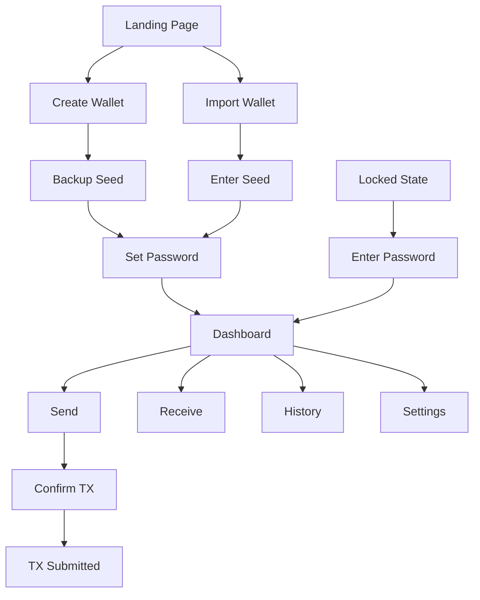

# CoinPayPortal Wallet Mode - UI Specification

## 1. Overview

The Web Wallet UI provides a browser-based interface for human users to manage their anonymous wallets. Built with Next.js and TailwindCSS, it integrates seamlessly with the existing CoinPayPortal dashboard.

### Design Principles

1. **Privacy First**: No tracking, no analytics, no cookies
2. **Security Visible**: Clear indicators of security status
3. **Simple UX**: Minimal steps for common operations
4. **Responsive**: Works on desktop and mobile
5. **Accessible**: WCAG 2.1 AA compliant

---

## 2. Information Architecture

### 2.1 Page Structure

```
/web-wallet
├── /                     # Wallet dashboard (if logged in) or landing
├── /create               # Create new wallet
├── /import               # Import existing wallet
├── /unlock               # Unlock locked wallet
├── /send                 # Send transaction
├── /receive              # Receive addresses
├── /history              # Transaction history
├── /settings             # Wallet settings
│   ├── /security         # Security settings
│   ├── /backup           # Backup seed
│   └── /export           # Export keys
└── /tx/[hash]            # Transaction details
```

### 2.2 Navigation Flow



---

## 3. Page Specifications

### 3.1 Landing Page (`/web-wallet`)

**Purpose**: Entry point for wallet users

**States**:
- No wallet: Show create/import options
- Wallet exists but locked: Redirect to unlock
- Wallet unlocked: Redirect to dashboard

**Layout**:
```
┌─────────────────────────────────────────────────────────────┐
│  [Logo]                                    [Gateway Mode]   │
├─────────────────────────────────────────────────────────────┤
│                                                             │
│              Anonymous Multi-Chain Wallet                   │
│                                                             │
│     No KYC • Non-Custodial • Your Keys, Your Crypto        │
│                                                             │
│     ┌─────────────────┐    ┌─────────────────┐             │
│     │  Create Wallet  │    │  Import Wallet  │             │
│     └─────────────────┘    └─────────────────┘             │
│                                                             │
│     Supported Chains:                                       │
│     [BTC] [ETH] [POL] [SOL] [BCH] [USDC]                   │
│                                                             │
└─────────────────────────────────────────────────────────────┘
```

---

### 3.2 Create Wallet (`/web-wallet/create`)

**Purpose**: Generate new wallet with seed phrase

**Flow**:
1. Generate seed phrase
2. Display seed for backup
3. Verify backup (select random words)
4. Set encryption password
5. Complete

**Step 1 - Generate Seed**:
```
┌─────────────────────────────────────────────────────────────┐
│  Create New Wallet                              Step 1 of 4 │
├─────────────────────────────────────────────────────────────┤
│                                                             │
│  Your Recovery Phrase                                       │
│  ┌─────────────────────────────────────────────────────┐   │
│  │  1. apple    2. banana   3. cherry   4. date        │   │
│  │  5. elder    6. fig      7. grape    8. honey       │   │
│  │  9. iris    10. jade    11. kiwi    12. lemon       │   │
│  └─────────────────────────────────────────────────────┘   │
│                                                             │
│  ⚠️ Write these words down and store them safely.          │
│     Anyone with these words can access your funds.          │
│                                                             │
│  [ ] I have written down my recovery phrase                 │
│                                                             │
│                              [Continue →]                   │
└─────────────────────────────────────────────────────────────┘
```

**Step 2 - Verify Backup**:
```
┌─────────────────────────────────────────────────────────────┐
│  Verify Recovery Phrase                         Step 2 of 4 │
├─────────────────────────────────────────────────────────────┤
│                                                             │
│  Select word #3:                                            │
│  ┌─────────┐ ┌─────────┐ ┌─────────┐ ┌─────────┐          │
│  │  apple  │ │ cherry  │ │  grape  │ │  lemon  │          │
│  └─────────┘ └─────────┘ └─────────┘ └─────────┘          │
│                                                             │
│  Select word #7:                                            │
│  ┌─────────┐ ┌─────────┐ ┌─────────┐ ┌─────────┐          │
│  │  banana │ │   fig   │ │  grape  │ │  honey  │          │
│  └─────────┘ └─────────┘ └─────────┘ └─────────┘          │
│                                                             │
│  [← Back]                            [Continue →]           │
└─────────────────────────────────────────────────────────────┘
```

**Step 3 - Set Password**:
```
┌─────────────────────────────────────────────────────────────┐
│  Set Password                                   Step 3 of 4 │
├─────────────────────────────────────────────────────────────┤
│                                                             │
│  Create a password to encrypt your wallet locally.          │
│                                                             │
│  Password:                                                  │
│  ┌─────────────────────────────────────────────────────┐   │
│  │ ••••••••••••                              [👁]      │   │
│  └─────────────────────────────────────────────────────┘   │
│  ✓ At least 12 characters                                  │
│  ✓ Contains uppercase and lowercase                        │
│  ✓ Contains number                                         │
│  ✗ Contains special character                              │
│                                                             │
│  Confirm Password:                                          │
│  ┌─────────────────────────────────────────────────────┐   │
│  │                                           [👁]      │   │
│  └─────────────────────────────────────────────────────┘   │
│                                                             │
│  [← Back]                            [Create Wallet →]      │
└─────────────────────────────────────────────────────────────┘
```

---

### 3.3 Dashboard (`/web-wallet`)

**Purpose**: Main wallet overview

**Layout**:
```
┌─────────────────────────────────────────────────────────────┐
│  [Logo]  Wallet                    [Settings] [Lock 🔒]    │
├─────────────────────────────────────────────────────────────┤
│                                                             │
│  Total Balance                                              │
│  $12,345.67                                                 │
│                                                             │
│  ┌──────────────────────┐  ┌──────────────────────┐        │
│  │      [Send →]        │  │     [Receive ←]      │        │
│  └──────────────────────┘  └──────────────────────┘        │
│                                                             │
├─────────────────────────────────────────────────────────────┤
│  Assets                                                     │
│  ┌─────────────────────────────────────────────────────┐   │
│  │ [ETH]  Ethereum           1.5 ETH      $3,285.00   │   │
│  │ [BTC]  Bitcoin           0.05 BTC      $2,162.50   │   │
│  │ [POL]  Polygon         500.0 POL        $450.00   │   │
│  │ [SOL]  Solana           25.0 SOL      $2,468.75   │   │
│  │ [USDC] USD Coin      4,000.00 USDC    $4,000.00   │   │
│  └─────────────────────────────────────────────────────┘   │
│                                                             │
├─────────────────────────────────────────────────────────────┤
│  Recent Transactions                        [View All →]    │
│  ┌─────────────────────────────────────────────────────┐   │
│  │ ↓ Received 0.5 ETH          Jan 15    +$1,095.00   │   │
│  │ ↑ Sent 100 USDC             Jan 14      -$100.00   │   │
│  │ ↓ Received 0.01 BTC         Jan 13      +$432.50   │   │
│  └─────────────────────────────────────────────────────┘   │
│                                                             │
└─────────────────────────────────────────────────────────────┘
```

---

### 3.4 Send Page (`/web-wallet/send`)

**Purpose**: Send cryptocurrency

**Step 1 - Enter Details**:
```
┌─────────────────────────────────────────────────────────────┐
│  Send                                                       │
├─────────────────────────────────────────────────────────────┤
│                                                             │
│  From:                                                      │
│  ┌─────────────────────────────────────────────────────┐   │
│  │ [ETH ▼]  Ethereum                                   │   │
│  │          Balance: 1.5 ETH ($3,285.00)               │   │
│  └─────────────────────────────────────────────────────┘   │
│                                                             │
│  To:                                                        │
│  ┌─────────────────────────────────────────────────────┐   │
│  │ 0x742d35Cc6634C0532925a3b844Bc9e7595f...           │   │
│  └─────────────────────────────────────────────────────┘   │
│  ✓ Valid Ethereum address                                  │
│                                                             │
│  Amount:                                                    │
│  ┌─────────────────────────────────────────────────────┐   │
│  │ 0.5                                    ETH [Max]    │   │
│  └─────────────────────────────────────────────────────┘   │
│  ≈ $1,095.00 USD                                           │
│                                                             │
│  Network Fee:                                               │
│  ○ Slow (~5 min)     0.001 ETH    $2.19                   │
│  ● Medium (~2 min)   0.002 ETH    $4.38                   │
│  ○ Fast (~30 sec)    0.004 ETH    $8.76                   │
│                                                             │
│                              [Review Transaction →]         │
└─────────────────────────────────────────────────────────────┘
```

**Step 2 - Confirm**:
```
┌─────────────────────────────────────────────────────────────┐
│  Confirm Transaction                                        │
├─────────────────────────────────────────────────────────────┤
│                                                             │
│  ┌─────────────────────────────────────────────────────┐   │
│  │  Sending                                            │   │
│  │  0.5 ETH                                            │   │
│  │  ≈ $1,095.00                                        │   │
│  │                                                     │   │
│  │  To                                                 │   │
│  │  0x742d35Cc6634C0532925a3b844Bc9e7595f...          │   │
│  │                                                     │   │
│  │  Network Fee                                        │   │
│  │  0.002 ETH ($4.38)                                  │   │
│  │                                                     │   │
│  │  ─────────────────────────────────────────────     │   │
│  │  Total                                              │   │
│  │  0.502 ETH ($1,099.38)                              │   │
│  └─────────────────────────────────────────────────────┘   │
│                                                             │
│  Enter password to sign:                                    │
│  ┌─────────────────────────────────────────────────────┐   │
│  │ ••••••••••••                                        │   │
│  └─────────────────────────────────────────────────────┘   │
│                                                             │
│  [← Back]                            [Confirm & Send →]     │
└─────────────────────────────────────────────────────────────┘
```

---

### 3.5 Receive Page (`/web-wallet/receive`)

**Purpose**: Display receive addresses and QR codes

**Layout**:
```
┌─────────────────────────────────────────────────────────────┐
│  Receive                                                    │
├─────────────────────────────────────────────────────────────┤
│                                                             │
│  Select Asset:                                              │
│  ┌─────────────────────────────────────────────────────┐   │
│  │ [ETH ▼]  Ethereum                                   │   │
│  └─────────────────────────────────────────────────────┘   │
│                                                             │
│              ┌─────────────────────┐                       │
│              │                     │                       │
│              │     [QR CODE]       │                       │
│              │                     │                       │
│              └─────────────────────┘                       │
│                                                             │
│  Your Ethereum Address:                                     │
│  ┌─────────────────────────────────────────────────────┐   │
│  │ 0x742d35Cc6634C0532925a3b844Bc9e7595f...  [Copy]   │   │
│  └─────────────────────────────────────────────────────┘   │
│                                                             │
│  ⚠️ Only send ETH or ERC-20 tokens to this address.        │
│     Sending other assets may result in permanent loss.      │
│                                                             │
│  [Generate New Address]                                     │
│                                                             │
└─────────────────────────────────────────────────────────────┘
```

---

### 3.6 Transaction History (`/web-wallet/history`)

**Purpose**: View all transactions

**Layout**:
```
┌─────────────────────────────────────────────────────────────┐
│  Transaction History                                        │
├─────────────────────────────────────────────────────────────┤
│                                                             │
│  Filter: [All ▼]  [All Chains ▼]  [Date Range ▼]          │
│                                                             │
│  ┌─────────────────────────────────────────────────────┐   │
│  │ ↓ Received                              Jan 15, 2024│   │
│  │   0.5 ETH ($1,095.00)                              │   │
│  │   From: 0xabc...123                                │   │
│  │   ✓ Confirmed (35 confirmations)                   │   │
│  ├─────────────────────────────────────────────────────┤   │
│  │ ↑ Sent                                  Jan 14, 2024│   │
│  │   100 USDC ($100.00)                               │   │
│  │   To: 0xdef...456                                  │   │
│  │   ✓ Confirmed (128 confirmations)                  │   │
│  ├─────────────────────────────────────────────────────┤   │
│  │ ↓ Received                              Jan 13, 2024│   │
│  │   0.01 BTC ($432.50)                               │   │
│  │   From: 1ABC...xyz                                 │   │
│  │   ✓ Confirmed (6 confirmations)                    │   │
│  └─────────────────────────────────────────────────────┘   │
│                                                             │
│  [Load More]                                                │
│                                                             │
└─────────────────────────────────────────────────────────────┘
```

---

### 3.7 Settings Page (`/web-wallet/settings`)

**Purpose**: Wallet configuration and security

**Layout**:
```
┌─────────────────────────────────────────────────────────────┐
│  Settings                                                   │
├─────────────────────────────────────────────────────────────┤
│                                                             │
│  Security                                                   │
│  ┌─────────────────────────────────────────────────────┐   │
│  │ Auto-lock after inactivity          [15 min ▼]     │   │
│  │ Require password for transactions   [On/Off]       │   │
│  │ Change Password                     [→]            │   │
│  └─────────────────────────────────────────────────────┘   │
│                                                             │
│  Spending Limits (Optional)                                 │
│  ┌─────────────────────────────────────────────────────┐   │
│  │ Daily spend limit                   [$______ ]     │   │
│  │ Whitelist mode                      [Off ▼]        │   │
│  │ Manage whitelist                    [→]            │   │
│  └─────────────────────────────────────────────────────┘   │
│                                                             │
│  Backup & Recovery                                          │
│  ┌─────────────────────────────────────────────────────┐   │
│  │ View Recovery Phrase                [→]            │   │
│  │ Export Private Keys                 [→]            │   │
│  └─────────────────────────────────────────────────────┘   │
│                                                             │
│  Danger Zone                                                │
│  ┌─────────────────────────────────────────────────────┐   │
│  │ [Delete Wallet from this Device]                   │   │
│  └─────────────────────────────────────────────────────┘   │
│                                                             │
└─────────────────────────────────────────────────────────────┘
```

---

## 4. Component Library

### 4.1 Core Components

| Component | Description |
|-----------|-------------|
| `WalletHeader` | Top navigation with logo, settings, lock |
| `BalanceCard` | Displays total or asset balance |
| `AssetList` | List of assets with balances |
| `TransactionList` | List of transactions |
| `TransactionItem` | Single transaction row |
| `AddressDisplay` | Address with copy button |
| `QRCode` | QR code generator |
| `ChainSelector` | Dropdown for chain selection |
| `AmountInput` | Amount input with USD conversion |
| `FeeSelector` | Fee priority selection |
| `PasswordInput` | Secure password input |
| `SeedDisplay` | Seed phrase display grid |
| `SeedInput` | Seed phrase input for import |

### 4.2 Component Examples

```tsx
// BalanceCard
<BalanceCard
  amount="12345.67"
  currency="USD"
  label="Total Balance"
/>

// AssetList
<AssetList
  assets={[
    { chain: 'ETH', amount: '1.5', usd: 3285.00 },
    { chain: 'BTC', amount: '0.05', usd: 2162.50 }
  ]}
  onSelect={(chain) => router.push(`/web-wallet/send?chain=${chain}`)}
/>

// TransactionItem
<TransactionItem
  direction="incoming"
  amount="0.5"
  chain="ETH"
  usd={1095.00}
  status="confirmed"
  confirmations={35}
  timestamp={new Date()}
  address="0x742d35Cc..."
/>
```

---

## 5. State Management

### 5.1 Wallet Context

```typescript
interface WalletState {
  // Wallet status
  isLocked: boolean;
  walletId: string | null;
  
  // Balances
  balances: Balance[];
  totalUSD: number;
  
  // Transactions
  transactions: Transaction[];
  pendingTransactions: Transaction[];
  
  // Settings
  settings: WalletSettings;
  
  // UI state
  isLoading: boolean;
  error: string | null;
}

interface WalletActions {
  unlock(password: string): Promise<void>;
  lock(): void;
  refreshBalances(): Promise<void>;
  send(params: SendParams): Promise<TransactionResult>;
  getTransactions(options?: TransactionOptions): Promise<void>;
  updateSettings(settings: Partial<WalletSettings>): Promise<void>;
}
```

### 5.2 Context Provider

```tsx
// WalletProvider.tsx
export function WalletProvider({ children }: { children: React.ReactNode }) {
  const [state, dispatch] = useReducer(walletReducer, initialState);
  
  const actions: WalletActions = {
    async unlock(password) {
      dispatch({ type: 'UNLOCK_START' });
      try {
        const seed = await decryptSeed(password);
        const wallet = Wallet.fromSeed(seed);
        dispatch({ type: 'UNLOCK_SUCCESS', wallet });
      } catch (error) {
        dispatch({ type: 'UNLOCK_ERROR', error });
      }
    },
    // ... other actions
  };
  
  return (
    <WalletContext.Provider value={{ state, actions }}>
      {children}
    </WalletContext.Provider>
  );
}
```

---

## 6. Security UX

### 6.1 Password Entry

- Show/hide toggle
- Strength indicator
- No autocomplete
- Clear on blur (optional)

### 6.2 Seed Display

- Numbered word grid
- Copy protection (no select)
- Screenshot warning
- Blur on mouse leave (optional)

### 6.3 Transaction Confirmation

- Clear amount display
- Recipient verification
- Fee breakdown
- Password required

### 6.4 Auto-Lock

- Configurable timeout
- Lock on tab close (optional)
- Lock on browser close
- Visual countdown warning

---

## 7. Responsive Design

### 7.1 Breakpoints

| Breakpoint | Width | Layout |
|------------|-------|--------|
| Mobile | < 640px | Single column |
| Tablet | 640-1024px | Two column |
| Desktop | > 1024px | Full layout |

### 7.2 Mobile Adaptations

- Bottom navigation bar
- Full-screen modals
- Swipe gestures
- Larger touch targets

---

## 8. Accessibility

### 8.1 Requirements

- Keyboard navigation
- Screen reader support
- Color contrast (4.5:1 minimum)
- Focus indicators
- Error announcements

### 8.2 ARIA Labels

```tsx
<button
  aria-label="Copy address to clipboard"
  onClick={copyAddress}
>
  <CopyIcon />
</button>

<input
  aria-label="Recipient address"
  aria-describedby="address-error"
  aria-invalid={!!error}
/>
```

---

## 9. Error States

### 9.1 Error Types

| Error | Display |
|-------|---------|
| Invalid password | Inline error, shake animation |
| Invalid address | Inline error below input |
| Insufficient funds | Modal with balance info |
| Network error | Toast with retry button |
| Transaction failed | Full-screen error with details |

### 9.2 Error Component

```tsx
<ErrorMessage
  type="inline"
  message="Invalid Ethereum address"
  icon={<AlertIcon />}
/>

<ErrorModal
  title="Transaction Failed"
  message="The transaction was rejected by the network."
  details={error.details}
  actions={[
    { label: 'Try Again', onClick: retry },
    { label: 'Cancel', onClick: close }
  ]}
/>
```

---

## 10. Loading States

### 10.1 Skeleton Screens

```tsx
// Balance loading
<BalanceCardSkeleton />

// Transaction list loading
<TransactionListSkeleton count={5} />
```

### 10.2 Progress Indicators

- Spinner for quick operations
- Progress bar for multi-step
- Skeleton for content loading
- Shimmer effect for lists
