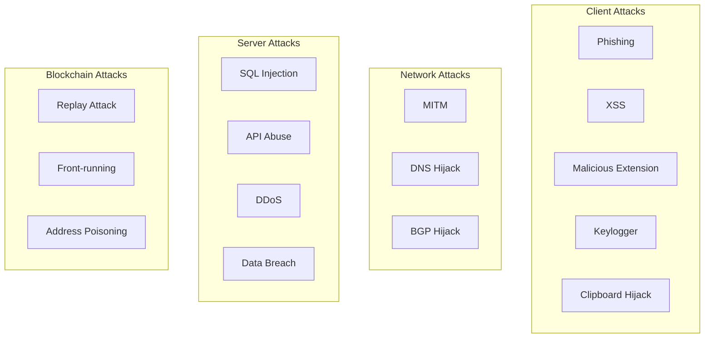

# CoinPayPortal Wallet Mode - Security Model

## 1. Overview

This document describes the security model, threat analysis, and mitigation strategies for Wallet Mode.

### Security Principles

1. **Non-Custodial**: Server never has access to private keys
2. **Defense in Depth**: Multiple layers of security
3. **Minimal Trust**: Verify everything, trust nothing
4. **Fail Secure**: Default to secure state on errors
5. **Transparency**: Open about security model and limitations

---

## 2. Threat Model

### 2.1 Assets to Protect

| Asset | Sensitivity | Location |
|-------|-------------|----------|
| Seed phrases | Critical | Client only |
| Private keys | Critical | Client only |
| Public keys | Low | Client + Server |
| Wallet addresses | Low | Client + Server |
| Transaction history | Medium | Server |
| Balance data | Medium | Server (cached) |
| Auth tokens | Medium | Client + Server |

### 2.2 Threat Actors

| Actor | Capability | Motivation |
|-------|------------|------------|
| External attacker | Network access, phishing | Financial gain |
| Malicious insider | Server access | Financial gain |
| Compromised dependency | Code execution | Supply chain attack |
| Nation state | Advanced persistent threat | Surveillance |

### 2.3 Attack Vectors



---

## 3. Security Controls

### 3.1 Client-Side Security

#### Seed Protection

```typescript
// Secure seed handling
class SecureSeedManager {
  private seed: Uint8Array | null = null;
  
  async load(password: string): Promise<void> {
    const encrypted = localStorage.getItem('encrypted_seed');
    if (!encrypted) throw new Error('No seed found');
    
    this.seed = await decrypt(encrypted, password);
  }
  
  getSeed(): Uint8Array {
    if (!this.seed) throw new Error('Seed not loaded');
    return this.seed;
  }
  
  clear(): void {
    if (this.seed) {
      // Overwrite memory
      this.seed.fill(0);
      crypto.getRandomValues(this.seed);
      this.seed.fill(0);
      this.seed = null;
    }
  }
}
```

#### XSS Prevention

```typescript
// Content Security Policy
const cspHeader = {
  'Content-Security-Policy': [
    "default-src 'self'",
    "script-src 'self'",
    "style-src 'self' 'unsafe-inline'",
    "img-src 'self' data: blob:",
    "connect-src 'self' https://api.coinpayportal.com",
    "frame-ancestors 'none'",
    "form-action 'self'"
  ].join('; ')
};

// Input sanitization
function sanitizeInput(input: string): string {
  return DOMPurify.sanitize(input, {
    ALLOWED_TAGS: [],
    ALLOWED_ATTR: []
  });
}
```

#### Clipboard Protection

```typescript
// Secure clipboard operations
async function secureClipboardWrite(text: string): Promise<void> {
  try {
    await navigator.clipboard.writeText(text);
    
    // Clear clipboard after 60 seconds
    setTimeout(async () => {
      const current = await navigator.clipboard.readText();
      if (current === text) {
        await navigator.clipboard.writeText('');
      }
    }, 60000);
  } catch (error) {
    // Fallback for older browsers
    const textarea = document.createElement('textarea');
    textarea.value = text;
    textarea.style.position = 'fixed';
    textarea.style.opacity = '0';
    document.body.appendChild(textarea);
    textarea.select();
    document.execCommand('copy');
    document.body.removeChild(textarea);
  }
}
```

### 3.2 Server-Side Security

#### Input Validation

```typescript
import { z } from 'zod';

const sendTransactionSchema = z.object({
  wallet_id: z.string().uuid(),
  chain: z.enum(['BTC', 'BCH', 'ETH', 'POL', 'SOL']),
  to: z.string(),
  amount: z.string().refine(
    (amt) => /^\d+\.?\d*$/.test(amt) && parseFloat(amt) > 0,
    'Invalid amount'
  )
});

// Validate all inputs
function validateRequest<T>(schema: z.ZodSchema<T>, data: unknown): T {
  const result = schema.safeParse(data);
  if (!result.success) {
    throw new ValidationError(result.error.issues);
  }
  return result.data;
}
```

#### Rate Limiting

```typescript
import { Ratelimit } from '@upstash/ratelimit';
import { Redis } from '@upstash/redis';

const ratelimit = new Ratelimit({
  redis: Redis.fromEnv(),
  limiter: Ratelimit.slidingWindow(10, '1 m'),
  analytics: true
});

async function checkRateLimit(identifier: string): Promise<void> {
  const { success, limit, remaining, reset } = await ratelimit.limit(identifier);
  
  if (!success) {
    throw new RateLimitError({
      limit,
      remaining,
      reset
    });
  }
}
```

#### SQL Injection Prevention

```typescript
// Always use parameterized queries via Supabase
const { data, error } = await supabase
  .from('wallet_transactions')
  .select('*')
  .eq('wallet_id', walletId)  // Parameterized
  .eq('chain', chain)          // Parameterized
  .order('created_at', { ascending: false })
  .limit(limit);

// NEVER do this:
// const query = `SELECT * FROM transactions WHERE wallet_id = '${walletId}'`;
```

### 3.3 Authentication Security

#### Signature Verification

```typescript
import { secp256k1 } from '@noble/curves/secp256k1';
import { sha256 } from '@noble/hashes/sha256';

function verifySignature(
  message: string,
  signature: string,
  publicKey: string
): boolean {
  try {
    const messageHash = sha256(new TextEncoder().encode(message));
    const sigBytes = hexToBytes(signature);
    const pubKeyBytes = hexToBytes(publicKey);
    
    return secp256k1.verify(sigBytes, messageHash, pubKeyBytes);
  } catch {
    return false;
  }
}
```

#### Replay Attack Prevention

```typescript
class ReplayProtection {
  private usedNonces: Map<string, Set<string>> = new Map();
  private readonly WINDOW_SIZE = 300; // 5 minutes
  
  async checkAndRecord(
    walletId: string,
    timestamp: number,
    nonce: string
  ): Promise<boolean> {
    const now = Math.floor(Date.now() / 1000);
    
    // Check timestamp is within window
    if (Math.abs(now - timestamp) > this.WINDOW_SIZE) {
      return false;
    }
    
    // Check nonce hasn't been used
    const walletNonces = this.usedNonces.get(walletId) || new Set();
    const nonceKey = `${timestamp}:${nonce}`;
    
    if (walletNonces.has(nonceKey)) {
      return false;
    }
    
    // Record nonce
    walletNonces.add(nonceKey);
    this.usedNonces.set(walletId, walletNonces);
    
    // Cleanup old nonces
    this.cleanup(walletId);
    
    return true;
  }
  
  private cleanup(walletId: string): void {
    const now = Math.floor(Date.now() / 1000);
    const walletNonces = this.usedNonces.get(walletId);
    if (!walletNonces) return;
    
    for (const nonceKey of walletNonces) {
      const [timestamp] = nonceKey.split(':');
      if (now - parseInt(timestamp) > this.WINDOW_SIZE * 2) {
        walletNonces.delete(nonceKey);
      }
    }
  }
}
```

### 3.4 Blockchain Security

#### Transaction Validation

```typescript
async function validateTransaction(
  walletId: string,
  signedTx: string,
  chain: string
): Promise<ValidationResult> {
  // 1. Decode transaction
  const decoded = decodeTransaction(signedTx, chain);
  
  // 2. Verify signer is wallet owner
  const walletAddresses = await getWalletAddresses(walletId, chain);
  if (!walletAddresses.includes(decoded.from)) {
    return { valid: false, error: 'Signer not in wallet' };
  }
  
  // 3. Check spend limits
  const settings = await getWalletSettings(walletId);
  if (settings.daily_spend_limit) {
    const dailySpent = await getDailySpend(walletId);
    const txValue = parseFloat(decoded.value);
    if (dailySpent + txValue > settings.daily_spend_limit) {
      return { valid: false, error: 'Daily spend limit exceeded' };
    }
  }
  
  // 4. Check whitelist
  if (settings.whitelist_enabled) {
    if (!settings.whitelist_addresses.includes(decoded.to)) {
      return { valid: false, error: 'Recipient not in whitelist' };
    }
  }
  
  return { valid: true };
}
```

#### Address Poisoning Prevention

```typescript
// Warn users about similar addresses
function checkAddressSimilarity(
  newAddress: string,
  recentAddresses: string[]
): Warning | null {
  for (const recent of recentAddresses) {
    const similarity = calculateSimilarity(newAddress, recent);
    
    // Check if addresses share prefix/suffix but differ in middle
    const samePrefix = newAddress.slice(0, 6) === recent.slice(0, 6);
    const sameSuffix = newAddress.slice(-4) === recent.slice(-4);
    const different = newAddress !== recent;
    
    if (samePrefix && sameSuffix && different) {
      return {
        type: 'address_poisoning',
        message: 'This address looks similar to a recent address. Please verify carefully.',
        similarTo: recent
      };
    }
  }
  
  return null;
}
```

---

## 4. Encryption Standards

### 4.1 Seed Encryption

| Parameter | Value |
|-----------|-------|
| Algorithm | AES-256-GCM |
| Key Derivation | PBKDF2 |
| Iterations | 100,000 |
| Salt | 16 bytes random |
| IV | 12 bytes random |

### 4.2 Implementation

```typescript
const ENCRYPTION_CONFIG = {
  algorithm: 'AES-GCM',
  keyLength: 256,
  ivLength: 12,
  saltLength: 16,
  tagLength: 128,
  iterations: 100000,
  hash: 'SHA-256'
};

async function deriveKey(
  password: string,
  salt: Uint8Array
): Promise<CryptoKey> {
  const keyMaterial = await crypto.subtle.importKey(
    'raw',
    new TextEncoder().encode(password),
    'PBKDF2',
    false,
    ['deriveBits', 'deriveKey']
  );
  
  return crypto.subtle.deriveKey(
    {
      name: 'PBKDF2',
      salt,
      iterations: ENCRYPTION_CONFIG.iterations,
      hash: ENCRYPTION_CONFIG.hash
    },
    keyMaterial,
    {
      name: ENCRYPTION_CONFIG.algorithm,
      length: ENCRYPTION_CONFIG.keyLength
    },
    false,
    ['encrypt', 'decrypt']
  );
}
```

---

## 5. Security Monitoring

### 5.1 Logging

```typescript
interface SecurityEvent {
  type: SecurityEventType;
  severity: 'low' | 'medium' | 'high' | 'critical';
  wallet_id?: string;
  ip_address: string;
  user_agent: string;
  details: Record<string, any>;
  timestamp: Date;
}

type SecurityEventType =
  | 'auth_failure'
  | 'rate_limit_exceeded'
  | 'invalid_signature'
  | 'suspicious_transaction'
  | 'whitelist_violation'
  | 'spend_limit_exceeded';

async function logSecurityEvent(event: SecurityEvent): Promise<void> {
  // Log to database
  await supabase.from('security_events').insert(event);
  
  // Alert on critical events
  if (event.severity === 'critical') {
    await sendSecurityAlert(event);
  }
}
```

### 5.2 Alerting

```typescript
const ALERT_THRESHOLDS = {
  auth_failures_per_minute: 10,
  rate_limits_per_minute: 50,
  invalid_signatures_per_hour: 20
};

async function checkAlertThresholds(): Promise<void> {
  const now = new Date();
  const oneMinuteAgo = new Date(now.getTime() - 60000);
  const oneHourAgo = new Date(now.getTime() - 3600000);
  
  // Check auth failures
  const authFailures = await countEvents('auth_failure', oneMinuteAgo);
  if (authFailures > ALERT_THRESHOLDS.auth_failures_per_minute) {
    await sendAlert('High auth failure rate detected');
  }
  
  // Check rate limits
  const rateLimits = await countEvents('rate_limit_exceeded', oneMinuteAgo);
  if (rateLimits > ALERT_THRESHOLDS.rate_limits_per_minute) {
    await sendAlert('High rate limit hit rate detected');
  }
}
```

---

## 6. Incident Response

### 6.1 Response Procedures

| Incident Type | Response |
|---------------|----------|
| Suspected key compromise | Advise user to transfer funds immediately |
| API abuse | Implement additional rate limiting |
| Data breach | Notify affected users, rotate secrets |
| DDoS attack | Enable CDN protection, scale infrastructure |

### 6.2 Communication

```typescript
// Security advisory template
interface SecurityAdvisory {
  id: string;
  severity: 'low' | 'medium' | 'high' | 'critical';
  title: string;
  description: string;
  affected_versions?: string[];
  mitigation: string;
  published_at: Date;
}
```

---

## 7. Security Checklist

### 7.1 Development

- [ ] All inputs validated with Zod schemas
- [ ] No raw SQL queries (use Supabase client)
- [ ] CSP headers configured
- [ ] CORS properly restricted
- [ ] Secrets in environment variables only
- [ ] Dependencies audited (npm audit)
- [ ] No sensitive data in logs

### 7.2 Deployment

- [ ] HTTPS enforced
- [ ] Security headers set
- [ ] Rate limiting enabled
- [ ] Monitoring configured
- [ ] Backup procedures tested
- [ ] Incident response plan documented

### 7.3 Operations

- [ ] Regular dependency updates
- [ ] Security event review
- [ ] Access log analysis
- [ ] Penetration testing (quarterly)
- [ ] Security training (annual)

---

## 8. Known Limitations

### 8.1 What We Cannot Protect Against

| Limitation | Reason | Mitigation |
|------------|--------|------------|
| Compromised device | Client-side attack | User education |
| Lost seed phrase | Non-custodial design | Backup reminders |
| Phishing attacks | Social engineering | Domain verification |
| Browser vulnerabilities | Third-party software | Keep browser updated |

### 8.2 User Responsibilities

1. **Secure seed backup**: Store offline, never share
2. **Strong password**: Use unique, complex password
3. **Verify addresses**: Always double-check recipients
4. **Keep software updated**: Browser, OS, extensions
5. **Use trusted devices**: Avoid public computers

---

## 9. Security Contacts

- **Security Issues**: security@coinpayportal.com
- **Bug Bounty**: https://coinpayportal.com/security/bounty
- **PGP Key**: https://coinpayportal.com/security/pgp

### 9.1 Responsible Disclosure

We follow responsible disclosure practices:
1. Report vulnerabilities privately
2. Allow 90 days for fix before public disclosure
3. Credit researchers who report valid issues
4. No legal action against good-faith researchers
