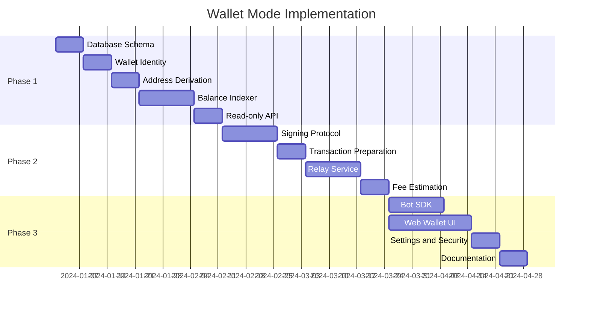

# CoinPayPortal Wallet Mode - Implementation Phases

## 1. Overview

This document outlines the phased implementation plan for Wallet Mode. The approach is **additive** - each phase builds on the previous without breaking existing functionality.

### Guiding Principles

1. **Ship incrementally**: Each phase delivers usable functionality
2. **Maintain stability**: Gateway Mode remains unaffected
3. **Test thoroughly**: Each phase includes comprehensive testing
4. **Document as we go**: Keep docs updated with implementation

---

## 2. Phase Summary



---

## 3. Phase 1: Read-Only Wallet

### 3.1 Goals

- Wallet creation and import
- Address derivation
- Balance tracking
- Transaction history

### 3.2 Deliverables

#### Database Schema
```
Tasks:
- [ ] Create wallets table
- [ ] Create wallet_addresses table
- [ ] Create wallet_transactions table
- [ ] Create wallet_auth_challenges table
- [ ] Create wallet_settings table
- [ ] Create wallet_nonces table
- [ ] Add indexes for performance
- [ ] Set up RLS policies
- [ ] Create database functions
- [ ] Write migration scripts
```

#### Wallet Identity System
```
Tasks:
- [ ] Implement BIP39 mnemonic generation
- [ ] Implement BIP32/BIP44 key derivation
- [ ] Create wallet registration endpoint
- [ ] Create wallet import endpoint
- [ ] Implement signature-based authentication
- [ ] Create auth challenge/verify endpoints
- [ ] Add rate limiting for auth endpoints
```

#### Address Management
```
Tasks:
- [ ] Implement address derivation for all chains
- [ ] Create derive address endpoint
- [ ] Create list addresses endpoint
- [ ] Implement address validation
- [ ] Add address deactivation
```

#### Balance Indexer
```
Tasks:
- [ ] Extend existing payment monitor
- [ ] Implement address registry
- [ ] Create balance fetcher for each chain
- [ ] Implement balance caching
- [ ] Set up polling scheduler
- [ ] Add balance refresh endpoint
```

#### Read-Only API
```
Tasks:
- [ ] GET /web-wallet/:id - Get wallet info
- [ ] GET /web-wallet/:id/addresses - List addresses
- [ ] GET /web-wallet/:id/balances - Get balances
- [ ] GET /web-wallet/:id/transactions - Get history
- [ ] Add authentication middleware
- [ ] Add rate limiting
- [ ] Write API tests
```

### 3.3 Testing Checklist

- [ ] Unit tests for key derivation
- [ ] Unit tests for address validation
- [ ] Integration tests for wallet creation
- [ ] Integration tests for balance fetching
- [ ] Load tests for indexer
- [ ] Security tests for authentication

### 3.4 Success Criteria

- Can create wallet from seed
- Can import existing wallet
- Balances update within 30 seconds
- Transaction history is accurate
- All chains supported (BTC, BCH, ETH, POL, SOL)

---

## 4. Phase 2: Send Transactions

### 4.1 Goals

- Transaction preparation
- Client-side signing support
- Transaction broadcasting
- Fee estimation

### 4.2 Deliverables

#### Signing Protocol
```
Tasks:
- [ ] Define unsigned transaction format per chain
- [ ] Implement transaction serialization
- [ ] Create signing helpers for client
- [ ] Implement signature verification
- [ ] Add signer extraction per chain
```

#### Transaction Preparation
```
Tasks:
- [ ] Implement nonce management (ETH/POL)
- [ ] Implement UTXO selection (BTC/BCH)
- [ ] Implement blockhash fetching (SOL)
- [ ] Create prepare-tx endpoint
- [ ] Add transaction expiration
- [ ] Implement spend limit checks
- [ ] Implement whitelist checks
```

#### Relay Service
```
Tasks:
- [ ] Create broadcast endpoint
- [ ] Implement transaction validation
- [ ] Add signature verification
- [ ] Implement broadcasting per chain
- [ ] Add retry logic for failures
- [ ] Track transaction status
- [ ] Update confirmation tracking
```

#### Fee Estimation
```
Tasks:
- [ ] Implement gas estimation (ETH/POL)
- [ ] Implement fee rate fetching (BTC/BCH)
- [ ] Implement priority fee estimation (SOL)
- [ ] Create estimate-fee endpoint
- [ ] Add fee priority options
```

### 4.3 Testing Checklist

- [ ] Unit tests for transaction building
- [ ] Unit tests for signature verification
- [ ] Integration tests for full send flow
- [ ] Testnet transaction tests
- [ ] Error handling tests
- [ ] Nonce conflict tests

### 4.4 Success Criteria

- Can prepare unsigned transactions
- Client can sign and broadcast
- Transactions confirm on chain
- Fee estimates are accurate
- Spend limits enforced

---

## 5. Phase 3: SDK and UI

### 5.1 Goals

- Bot SDK for programmatic access
- Web wallet UI for humans
- Security settings
- Complete documentation

### 5.2 Deliverables

#### Bot SDK
```
Tasks:
- [ ] Create SDK package structure
- [ ] Implement Wallet class
- [ ] Implement signing locally
- [ ] Add balance methods
- [ ] Add send methods
- [ ] Add event subscriptions
- [ ] Create CLI tool
- [ ] Write SDK documentation
- [ ] Publish to npm
```

#### Web Wallet UI
```
Tasks:
- [ ] Create wallet landing page
- [ ] Implement create wallet flow
- [ ] Implement import wallet flow
- [ ] Create unlock screen
- [ ] Build dashboard page
- [ ] Build send page
- [ ] Build receive page
- [ ] Build history page
- [ ] Build settings page
- [ ] Add responsive design
- [ ] Add accessibility features
```

#### Security Settings
```
Tasks:
- [ ] Implement daily spend limits
- [ ] Implement address whitelist
- [ ] Add confirmation delays
- [ ] Create settings API endpoints
- [ ] Build settings UI
```

#### Documentation
```
Tasks:
- [ ] Update API documentation
- [ ] Write SDK getting started guide
- [ ] Create integration examples
- [ ] Write security best practices
- [ ] Create troubleshooting guide
```

### 5.3 Testing Checklist

- [ ] SDK unit tests
- [ ] SDK integration tests
- [ ] UI component tests
- [ ] E2E tests for wallet flows
- [ ] Cross-browser testing
- [ ] Mobile responsiveness testing
- [ ] Accessibility audit

### 5.4 Success Criteria

- SDK can create, import, send
- UI works on desktop and mobile
- Security settings functional
- Documentation complete
- No critical bugs

---

## 6. Technical Dependencies

### 6.1 Reusable Components

| Component | Location | Reuse |
|-----------|----------|-------|
| Key derivation | `src/lib/blockchain/wallets.ts` | Direct |
| Encryption | `src/lib/crypto/encryption.ts` | Direct |
| RPC providers | `src/lib/blockchain/providers.ts` | Direct |
| Payment monitor | `src/lib/payments/monitor.ts` | Extend |
| Webhook service | `src/lib/webhooks/service.ts` | Pattern |

### 6.2 New Dependencies

```json
{
  "dependencies": {
    "@scure/bip39": "^1.2.0",
    "@scure/bip32": "^1.3.0",
    "@noble/curves": "^1.2.0"
  }
}
```

Note: Most crypto dependencies already exist in the project.

---

## 7. Risk Mitigation

### 7.1 Technical Risks

| Risk | Probability | Impact | Mitigation |
|------|-------------|--------|------------|
| Indexer performance | Medium | High | Batch queries, caching |
| RPC rate limits | Medium | Medium | Multiple providers |
| Nonce conflicts | Low | Medium | Proper nonce management |
| Browser compatibility | Low | Medium | Polyfills, testing |

### 7.2 Security Risks

| Risk | Probability | Impact | Mitigation |
|------|-------------|--------|------------|
| XSS vulnerability | Low | Critical | CSP, sanitization |
| Key exposure | Low | Critical | Memory clearing |
| Replay attacks | Low | High | Timestamp + nonce |
| Phishing | Medium | High | Domain verification |

---

## 8. Rollout Strategy

### 8.1 Phase 1 Rollout

1. Deploy database migrations
2. Deploy API endpoints (disabled)
3. Enable for internal testing
4. Enable for beta users
5. General availability

### 8.2 Phase 2 Rollout

1. Deploy to testnet first
2. Internal testing with real transactions
3. Beta user testing
4. Gradual rollout (10% → 50% → 100%)

### 8.3 Phase 3 Rollout

1. SDK beta release
2. UI soft launch
3. Documentation review
4. Public announcement

---

## 9. Monitoring and Metrics

### 9.1 Key Metrics

| Metric | Target | Alert Threshold |
|--------|--------|-----------------|
| Wallet creation success | > 99% | < 95% |
| Balance query latency | < 500ms | > 2s |
| Transaction broadcast success | > 99% | < 95% |
| API error rate | < 1% | > 5% |
| Indexer lag | < 30s | > 2min |

### 9.2 Dashboards

- Wallet creation funnel
- Transaction success rates
- Balance accuracy
- API performance
- Error rates by endpoint

---

## 10. Post-Launch

### 10.1 Immediate (Week 1-2)

- Monitor error rates
- Address user feedback
- Fix critical bugs
- Performance tuning

### 10.2 Short-term (Month 1-2)

- Add requested features
- Improve UX based on feedback
- Expand documentation
- Security audit

### 10.3 Long-term (Month 3+)

- Hardware wallet support
- Additional chains
- Advanced features (multi-sig, etc.)
- Mobile app consideration

---

## 11. Definition of Done

### Per Feature

- [ ] Code complete and reviewed
- [ ] Unit tests passing
- [ ] Integration tests passing
- [ ] Documentation updated
- [ ] Security review complete
- [ ] Performance acceptable
- [ ] Deployed to staging
- [ ] QA sign-off

### Per Phase

- [ ] All features complete
- [ ] E2E tests passing
- [ ] Load testing complete
- [ ] Security audit complete
- [ ] Documentation complete
- [ ] Stakeholder sign-off
- [ ] Deployed to production
- [ ] Monitoring in place
