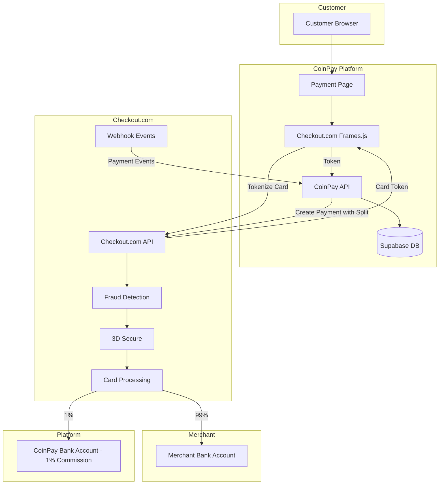
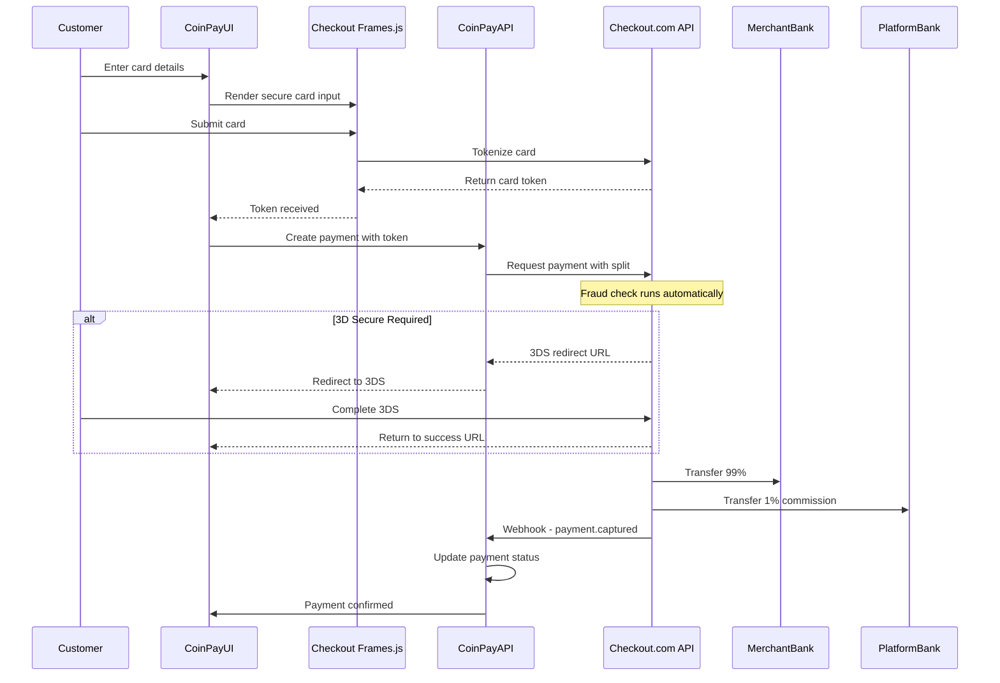

# Checkout.com Integration Implementation Plan

## Overview

This document outlines the implementation plan for integrating Checkout.com as the credit card payment provider for CoinPay, enabling merchants to accept card payments alongside cryptocurrency.

## Product to Use: Checkout.com Marketplaces

**URL**: https://www.checkout.com → Solutions → Marketplaces

### How to Sign Up

1. Go to **https://www.checkout.com**
2. Click **"Get in touch"** button
3. Fill out the contact form with:
   - Your name, job title, company name
   - Email and phone
   - Country: United States (or your location)
   - State/Province
4. When they contact you, tell them you need:
   - **"Marketplaces" solution** for a payment platform
   - Sub-merchant/seller onboarding
   - Split payments with commission (1%)
   - Automated payouts to sellers
5. Request **sandbox/test account access** to start development

### Key Features Included

| Feature | Description |
|---------|-------------|
| **Seller Onboarding** | Contextual forms + automated verification |
| **Commission Flexibility** | Fixed, variable, or compound fees per seller |
| **Split Payments** | Automatically split between platform and seller |
| **Instant Payouts** | On-demand payouts to seller bank accounts |
| **Fraud Detection** | ML-based fraud prevention included |
| **3D Secure** | SCA compliance for EU built-in |
| **Analytics** | Actionable insights dashboard |

## Why Checkout.com?

- **Easiest Integration**: Modern REST API with excellent documentation
- **Cheapest**: Interchange++ pricing (~2.2-2.5% total)
- **Fraud Detection Included**: ML-based fraud prevention at no extra cost
- **PCI Compliance Simplified**: Use Frames.js for SAQ-A level compliance
- **Marketplace Support**: Native split payments for your 1% commission
- **International**: 150+ countries, multi-currency support

---

## Architecture

### High-Level Flow



### Payment Flow Sequence



---

## Database Schema

### New Tables

```sql
-- Sub-merchant accounts registered with Checkout.com
CREATE TABLE card_merchant_accounts (
    id UUID PRIMARY KEY DEFAULT gen_random_uuid(),
    business_id UUID NOT NULL REFERENCES businesses(id) ON DELETE CASCADE,
    
    -- Checkout.com entity details
    checkout_entity_id TEXT UNIQUE, -- Checkout.com sub-entity ID
    checkout_entity_status TEXT DEFAULT 'pending', -- pending, active, suspended, rejected
    
    -- Merchant details for onboarding
    legal_name TEXT NOT NULL,
    trading_name TEXT,
    business_type TEXT, -- individual, company
    tax_id TEXT,
    
    -- Contact info
    contact_email TEXT NOT NULL,
    contact_phone TEXT,
    
    -- Address
    address_line1 TEXT,
    address_line2 TEXT,
    city TEXT,
    state TEXT,
    postal_code TEXT,
    country TEXT NOT NULL, -- ISO 3166-1 alpha-2
    
    -- Bank account for payouts
    bank_account_holder TEXT,
    bank_account_number_encrypted TEXT,
    bank_routing_number TEXT,
    bank_name TEXT,
    bank_country TEXT,
    bank_currency TEXT DEFAULT 'USD',
    
    -- Processing settings
    mcc TEXT, -- Merchant Category Code
    processing_currencies TEXT[] DEFAULT ARRAY['USD'],
    
    -- Metadata
    onboarding_data JSONB DEFAULT '{}',
    created_at TIMESTAMP WITH TIME ZONE DEFAULT NOW(),
    updated_at TIMESTAMP WITH TIME ZONE DEFAULT NOW()
);

CREATE INDEX idx_card_merchant_accounts_business ON card_merchant_accounts(business_id);
CREATE INDEX idx_card_merchant_accounts_status ON card_merchant_accounts(checkout_entity_status);

-- Card payments
CREATE TABLE card_payments (
    id UUID PRIMARY KEY DEFAULT gen_random_uuid(),
    business_id UUID NOT NULL REFERENCES businesses(id) ON DELETE CASCADE,
    card_merchant_account_id UUID NOT NULL REFERENCES card_merchant_accounts(id),
    
    -- Checkout.com payment details
    checkout_payment_id TEXT UNIQUE,
    checkout_action_id TEXT, -- For captures/refunds
    
    -- Amount details
    amount NUMERIC(20, 2) NOT NULL,
    currency TEXT NOT NULL DEFAULT 'USD',
    
    -- Fee breakdown
    platform_fee_amount NUMERIC(20, 2), -- 1% commission
    merchant_amount NUMERIC(20, 2), -- Amount merchant receives
    processing_fee_amount NUMERIC(20, 2), -- Checkout.com fees
    
    -- Status
    status TEXT NOT NULL DEFAULT 'pending' CHECK (status IN (
        'pending',      -- Payment created, awaiting card
        'processing',   -- Card submitted, processing
        'authorized',   -- Card authorized, not captured
        'captured',     -- Payment captured successfully
        'declined',     -- Card declined
        'failed',       -- Processing failed
        'refunded',     -- Fully refunded
        'partially_refunded', -- Partially refunded
        'disputed',     -- Chargeback initiated
        'canceled'      -- Canceled before capture
    )),
    
    -- 3D Secure
    three_ds_required BOOLEAN DEFAULT false,
    three_ds_status TEXT, -- Y, N, A, U, R
    three_ds_redirect_url TEXT,
    
    -- Card details (non-sensitive)
    card_last_four TEXT,
    card_brand TEXT, -- visa, mastercard, amex
    card_type TEXT, -- credit, debit, prepaid
    card_issuer_country TEXT,
    
    -- Risk/Fraud
    risk_score NUMERIC(5, 2),
    risk_flagged BOOLEAN DEFAULT false,
    
    -- Customer info
    customer_email TEXT,
    customer_name TEXT,
    billing_address JSONB,
    
    -- Metadata
    metadata JSONB DEFAULT '{}',
    description TEXT,
    reference TEXT, -- Your order ID
    
    -- Timestamps
    created_at TIMESTAMP WITH TIME ZONE DEFAULT NOW(),
    updated_at TIMESTAMP WITH TIME ZONE DEFAULT NOW(),
    authorized_at TIMESTAMP WITH TIME ZONE,
    captured_at TIMESTAMP WITH TIME ZONE,
    refunded_at TIMESTAMP WITH TIME ZONE
);

CREATE INDEX idx_card_payments_business ON card_payments(business_id);
CREATE INDEX idx_card_payments_merchant_account ON card_payments(card_merchant_account_id);
CREATE INDEX idx_card_payments_status ON card_payments(status);
CREATE INDEX idx_card_payments_checkout_id ON card_payments(checkout_payment_id);
CREATE INDEX idx_card_payments_created ON card_payments(created_at DESC);

-- Payouts to merchants
CREATE TABLE card_payouts (
    id UUID PRIMARY KEY DEFAULT gen_random_uuid(),
    business_id UUID NOT NULL REFERENCES businesses(id) ON DELETE CASCADE,
    card_merchant_account_id UUID NOT NULL REFERENCES card_merchant_accounts(id),
    
    -- Checkout.com payout details
    checkout_payout_id TEXT UNIQUE,
    
    -- Amount
    amount NUMERIC(20, 2) NOT NULL,
    currency TEXT NOT NULL DEFAULT 'USD',
    
    -- Status
    status TEXT NOT NULL DEFAULT 'pending' CHECK (status IN (
        'pending',
        'processing',
        'completed',
        'failed',
        'returned'
    )),
    
    -- Bank details snapshot
    destination_bank_last_four TEXT,
    destination_bank_name TEXT,
    
    -- Metadata
    period_start TIMESTAMP WITH TIME ZONE,
    period_end TIMESTAMP WITH TIME ZONE,
    payment_count INTEGER,
    
    -- Timestamps
    created_at TIMESTAMP WITH TIME ZONE DEFAULT NOW(),
    completed_at TIMESTAMP WITH TIME ZONE,
    failed_at TIMESTAMP WITH TIME ZONE,
    failure_reason TEXT
);

CREATE INDEX idx_card_payouts_business ON card_payouts(business_id);
CREATE INDEX idx_card_payouts_status ON card_payouts(status);
CREATE INDEX idx_card_payouts_created ON card_payouts(created_at DESC);

-- Webhook event log for card payments
CREATE TABLE card_webhook_logs (
    id UUID PRIMARY KEY DEFAULT gen_random_uuid(),
    
    -- Event details
    checkout_event_id TEXT UNIQUE NOT NULL,
    event_type TEXT NOT NULL,
    
    -- Related entities
    business_id UUID REFERENCES businesses(id),
    card_payment_id UUID REFERENCES card_payments(id),
    card_payout_id UUID REFERENCES card_payouts(id),
    
    -- Payload
    payload JSONB NOT NULL,
    
    -- Processing
    processed BOOLEAN DEFAULT false,
    processed_at TIMESTAMP WITH TIME ZONE,
    error TEXT,
    
    -- Timestamps
    created_at TIMESTAMP WITH TIME ZONE DEFAULT NOW()
);

CREATE INDEX idx_card_webhook_logs_event_id ON card_webhook_logs(checkout_event_id);
CREATE INDEX idx_card_webhook_logs_type ON card_webhook_logs(event_type);
CREATE INDEX idx_card_webhook_logs_processed ON card_webhook_logs(processed) WHERE NOT processed;
```

---

## API Endpoints

### Card Merchant Onboarding

#### POST /api/card-merchants/onboard
Create a new sub-merchant account with Checkout.com.

```typescript
// Request
{
  "business_id": "uuid",
  "legal_name": "Acme Corp",
  "trading_name": "Acme Store",
  "business_type": "company", // individual | company
  "tax_id": "12-3456789",
  "contact_email": "billing@acme.com",
  "contact_phone": "+1234567890",
  "address": {
    "line1": "123 Main St",
    "city": "San Francisco",
    "state": "CA",
    "postal_code": "94102",
    "country": "US"
  },
  "bank_account": {
    "holder_name": "Acme Corp",
    "account_number": "1234567890",
    "routing_number": "021000021",
    "bank_name": "Chase",
    "country": "US",
    "currency": "USD"
  },
  "mcc": "5411" // Merchant Category Code
}

// Response
{
  "id": "uuid",
  "business_id": "uuid",
  "checkout_entity_id": "ent_xxx",
  "status": "pending", // Will become active after Checkout.com review
  "created_at": "2024-01-01T00:00:00Z"
}
```

#### GET /api/card-merchants/[id]
Get sub-merchant account status and details.

#### PUT /api/card-merchants/[id]
Update sub-merchant account details.

---

### Card Payments

#### POST /api/card-payments/create
Create a new card payment request.

```typescript
// Request
{
  "business_id": "uuid",
  "amount": 99.99,
  "currency": "USD",
  "description": "Order #12345",
  "reference": "order_12345",
  "customer": {
    "email": "customer@example.com",
    "name": "John Doe"
  },
  "metadata": {
    "order_id": "12345"
  },
  "success_url": "https://merchant.com/success",
  "failure_url": "https://merchant.com/failure"
}

// Response
{
  "id": "uuid",
  "checkout_payment_id": "pay_xxx",
  "amount": 99.99,
  "currency": "USD",
  "status": "pending",
  "payment_url": "https://coinpay.com/pay/card/uuid", // Hosted payment page
  "created_at": "2024-01-01T00:00:00Z",
  "expires_at": "2024-01-01T01:00:00Z"
}
```

#### POST /api/card-payments/[id]/capture
Capture an authorized payment (if using auth-then-capture flow).

#### POST /api/card-payments/[id]/refund
Refund a captured payment.

```typescript
// Request
{
  "amount": 50.00, // Partial refund, or omit for full refund
  "reason": "Customer request"
}
```

#### GET /api/card-payments/[id]
Get payment status and details.

---

### Card Payouts

#### GET /api/card-payouts
List payouts for a business.

#### GET /api/card-payouts/[id]
Get payout details.

---

### Webhooks

#### POST /api/webhooks/checkout
Receive Checkout.com webhook events.

**Events to Handle:**
- `payment_approved` - Payment authorized
- `payment_captured` - Payment captured
- `payment_declined` - Payment declined
- `payment_refunded` - Payment refunded
- `payment_chargeback` - Chargeback initiated
- `payout_completed` - Payout sent to merchant
- `payout_failed` - Payout failed

---

## Frontend Components

### 1. Checkout.com Frames.js Integration

```typescript
// components/card-payment/CardPaymentForm.tsx
import { Frames, CardNumber, ExpiryDate, Cvv } from 'frames-react';

export function CardPaymentForm({ paymentId, onSuccess, onError }) {
  const handleSubmit = async () => {
    try {
      const { token } = await Frames.submitCard();
      
      // Send token to your API
      const response = await fetch(`/api/card-payments/${paymentId}/process`, {
        method: 'POST',
        body: JSON.stringify({ token }),
      });
      
      const result = await response.json();
      
      if (result.three_ds_redirect_url) {
        // Redirect for 3D Secure
        window.location.href = result.three_ds_redirect_url;
      } else if (result.status === 'captured') {
        onSuccess(result);
      }
    } catch (error) {
      onError(error);
    }
  };

  return (
    <Frames
      config={{
        publicKey: process.env.NEXT_PUBLIC_CHECKOUT_PUBLIC_KEY,
        localization: 'EN-GB',
        style: {
          base: {
            fontSize: '16px',
            color: '#333',
          },
        },
      }}
      cardTokenized={(e) => console.log('Card tokenized:', e.token)}
    >
      <CardNumber />
      <ExpiryDate />
      <Cvv />
      <button onClick={handleSubmit}>Pay Now</button>
    </Frames>
  );
}
```

### 2. Payment Method Selection

Update the existing payment creation flow to include card option:

```typescript
// In payment creation page
<PaymentMethodSelector
  methods={['crypto', 'card']}
  selected={selectedMethod}
  onSelect={setSelectedMethod}
/>

{selectedMethod === 'crypto' && <CryptoPaymentForm />}
{selectedMethod === 'card' && <CardPaymentForm />}
```

### 3. Merchant Onboarding Form

```typescript
// pages/businesses/[id]/card-setup.tsx
export function CardSetupPage() {
  return (
    <form onSubmit={handleOnboard}>
      <h2>Enable Card Payments</h2>
      
      <section>
        <h3>Business Information</h3>
        <input name="legal_name" placeholder="Legal Business Name" />
        <input name="tax_id" placeholder="Tax ID / EIN" />
        <select name="business_type">
          <option value="individual">Individual / Sole Proprietor</option>
          <option value="company">Company / Corporation</option>
        </select>
      </section>
      
      <section>
        <h3>Business Address</h3>
        <input name="address_line1" placeholder="Street Address" />
        <input name="city" placeholder="City" />
        <input name="state" placeholder="State" />
        <input name="postal_code" placeholder="ZIP Code" />
        <select name="country">
          <option value="US">United States</option>
          <option value="GB">United Kingdom</option>
          {/* More countries */}
        </select>
      </section>
      
      <section>
        <h3>Bank Account for Payouts</h3>
        <input name="bank_account_holder" placeholder="Account Holder Name" />
        <input name="bank_account_number" placeholder="Account Number" />
        <input name="bank_routing_number" placeholder="Routing Number" />
      </section>
      
      <button type="submit">Enable Card Payments</button>
    </form>
  );
}
```

---

## Checkout.com API Integration

### Service Layer

```typescript
// lib/card-payments/checkout-service.ts
import { Checkout } from 'checkout-sdk-node';

const checkout = new Checkout(process.env.CHECKOUT_SECRET_KEY);

export class CheckoutService {
  // Create sub-entity (sub-merchant)
  async createSubEntity(data: SubEntityData) {
    return checkout.accounts.create({
      reference: data.business_id,
      contact_details: {
        email: data.contact_email,
        phone: data.contact_phone,
      },
      profile: {
        legal_entity_name: data.legal_name,
        trading_name: data.trading_name,
        merchant_category_code: data.mcc,
      },
      company: {
        business_registration_number: data.tax_id,
        legal_address: {
          address_line1: data.address.line1,
          city: data.address.city,
          state: data.address.state,
          zip: data.address.postal_code,
          country: data.address.country,
        },
      },
    });
  }

  // Create payment with split (marketplace)
  async createPayment(data: PaymentData) {
    const platformFee = Math.round(data.amount * 0.01 * 100); // 1% in cents
    
    return checkout.payments.request({
      source: {
        type: 'token',
        token: data.card_token,
      },
      amount: data.amount * 100, // Convert to cents
      currency: data.currency,
      reference: data.reference,
      description: data.description,
      customer: {
        email: data.customer_email,
        name: data.customer_name,
      },
      // Split payment - marketplace feature
      marketplace: {
        sub_entity_id: data.checkout_entity_id,
      },
      processing: {
        // Platform takes 1% commission
        partner_metadata: {
          sub_entity_id: data.checkout_entity_id,
          commission: platformFee,
        },
      },
      '3ds': {
        enabled: true,
        attempt_n3d: true,
      },
      success_url: data.success_url,
      failure_url: data.failure_url,
    });
  }

  // Capture authorized payment
  async capturePayment(paymentId: string, amount?: number) {
    return checkout.payments.capture(paymentId, {
      amount: amount ? amount * 100 : undefined,
    });
  }

  // Refund payment
  async refundPayment(paymentId: string, amount?: number, reason?: string) {
    return checkout.payments.refund(paymentId, {
      amount: amount ? amount * 100 : undefined,
      reference: reason,
    });
  }

  // Get payment details
  async getPayment(paymentId: string) {
    return checkout.payments.get(paymentId);
  }

  // Verify webhook signature
  verifyWebhook(signature: string, body: string) {
    return checkout.webhooks.verify(
      process.env.CHECKOUT_WEBHOOK_SECRET,
      signature,
      body
    );
  }
}
```

---

## Environment Variables

Add to `.env`:

```bash
# Checkout.com Configuration
CHECKOUT_SECRET_KEY=sk_xxx          # Secret key for API calls
CHECKOUT_PUBLIC_KEY=pk_xxx          # Public key for Frames.js
CHECKOUT_WEBHOOK_SECRET=whsec_xxx   # Webhook signature verification
CHECKOUT_PROCESSING_CHANNEL_ID=pc_xxx  # Your processing channel

# Platform bank account for commission
PLATFORM_BANK_ACCOUNT_ID=xxx        # Where 1% commission goes
```

---

## Testing

### Sandbox Environment

Checkout.com provides a full sandbox environment:
- Sandbox API: `https://api.sandbox.checkout.com`
- Test cards: https://www.checkout.com/docs/testing/test-cards

### Test Cards

| Card Number | Result |
|-------------|--------|
| 4242424242424242 | Successful payment |
| 4000000000000002 | Declined |
| 4000000000003220 | 3D Secure required |
| 4000000000000259 | Disputed/Chargeback |

---

## Security Considerations

### PCI Compliance

Using Checkout.com Frames.js means:
- Card data never touches your servers
- You qualify for **SAQ-A** (simplest PCI compliance level)
- Checkout.com handles all sensitive data

### Webhook Security

- Always verify webhook signatures
- Use HTTPS endpoints only
- Implement idempotency (check event ID before processing)

### Data Encryption

- Bank account numbers encrypted at rest (same as crypto private keys)
- Use existing encryption service from [`src/lib/crypto/encryption.ts`](src/lib/crypto/encryption.ts)

---

## Migration Path

### Phase 1: Foundation
1. Set up Checkout.com sandbox account
2. Create database tables
3. Implement basic API routes

### Phase 2: Merchant Onboarding
4. Build sub-merchant onboarding flow
5. Implement KYC data collection
6. Test merchant approval process

### Phase 3: Payment Processing
7. Integrate Frames.js for card input
8. Implement payment creation with split
9. Handle 3D Secure flow
10. Process webhooks

### Phase 4: Payouts
11. Implement payout tracking
12. Build payout dashboard

### Phase 5: Production
13. Switch to production credentials
14. Complete PCI SAQ-A
15. Launch to merchants

---

## Cost Analysis

### Per Transaction (Example: $100 payment)

| Component | Amount |
|-----------|--------|
| Customer pays | $100.00 |
| Interchange + scheme fees | ~$2.00 (2%) |
| Checkout.com markup | ~$0.30 (0.3%) |
| **Total processing cost** | ~$2.30 |
| Your 1% commission | $1.00 |
| **Merchant receives** | ~$96.70 |

### Monthly Costs

- No monthly minimums for sandbox
- Production: Contact Checkout.com for pricing based on volume
- Estimated: $0 fixed + ~2.3% per transaction
