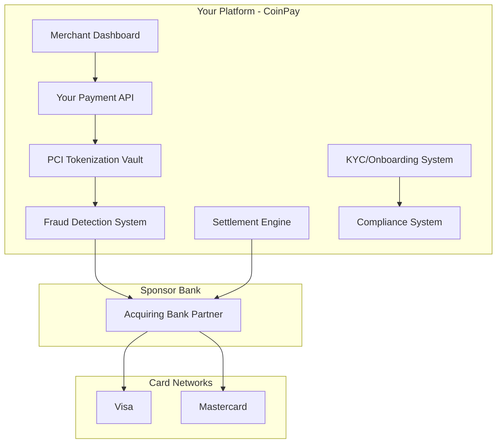
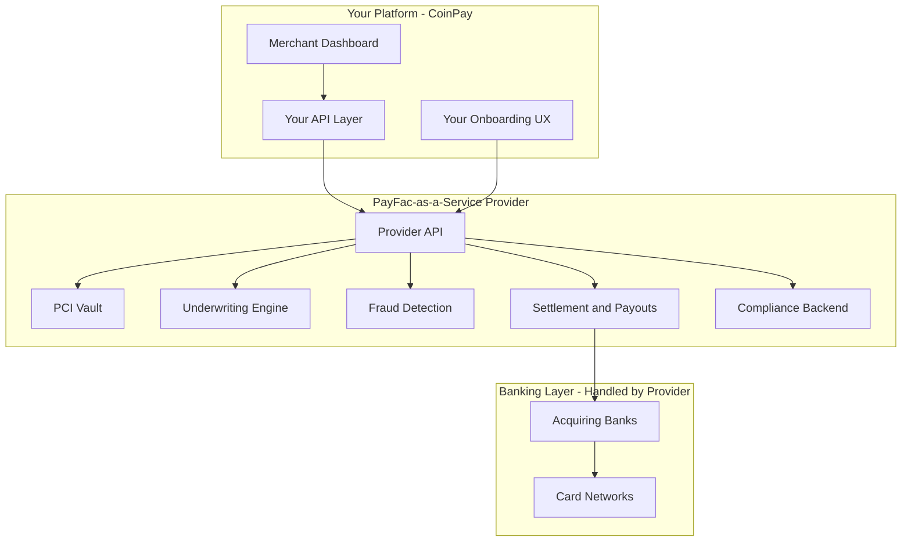
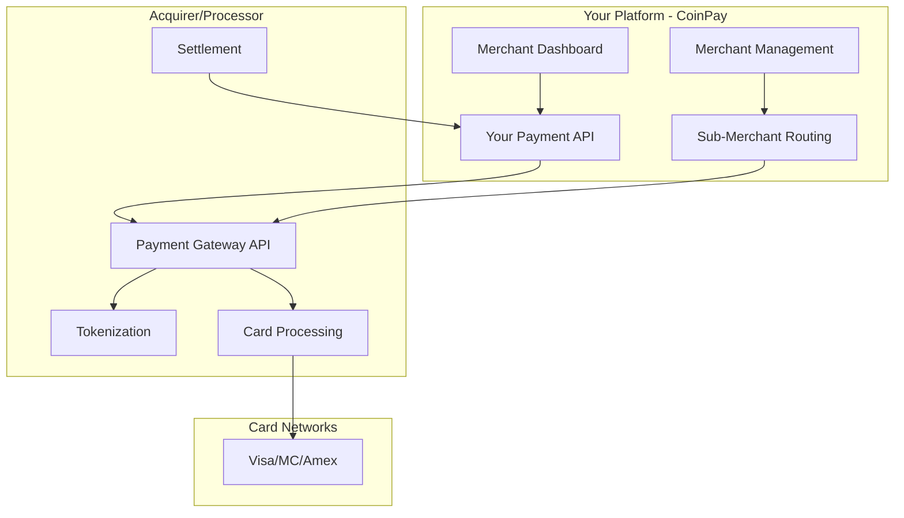
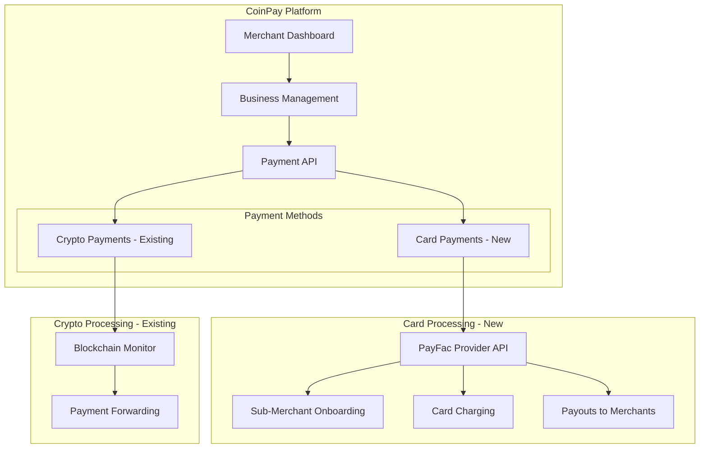

# Credit Card Processing Options Research

> **DECISION: Checkout.com** has been selected as the recommended provider based on ease of integration, cost, and included fraud detection. See implementation plan below.

## Executive Summary

This document analyzes three approaches to adding credit card support to CoinPay with full control over the merchant experience, enabling a 1% commission model with multi-business support.

**Your Requirements:**
- One account managing multiple businesses/sub-merchants
- 1% commission on all payments to house bank account
- Lower fees than Stripe
- Faster settlements
- International support (US + EU)
- Each business as their own merchant
- Better support and flexible account structures

---

## Option 1: Become a Registered Payment Facilitator (Full PayFac)

### What It Means
You register directly with Visa/Mastercard as a Payment Facilitator, partner with a sponsor bank, and handle all aspects of payment processing yourself.

### Architecture



### Requirements

| Requirement | Details |
|-------------|---------|
| **Capital** | $500K - $2M+ initial investment |
| **PCI-DSS Level 1** | Annual audit ($50K-$200K), quarterly scans, penetration testing |
| **Sponsor Bank** | Contract with acquiring bank (Wells Fargo, Worldpay, etc.) |
| **Card Network Registration** | Register as PayFac with Visa and Mastercard ($5K-$10K fees) |
| **Compliance Team** | Dedicated staff for KYC/AML, fraud, chargebacks |
| **Insurance** | Errors & Omissions, Cyber liability ($50K+/year) |
| **Reserve Requirements** | 5-10% of processing volume held in reserve |
| **Timeline** | 6-18 months to go live |

### Pros
- **Full control** over pricing, UX, and merchant experience
- **Highest margins** - you keep interchange markup minus sponsor bank fees
- **No revenue share** with third parties
- **White-label everything** - your brand only
- **Custom underwriting** - approve merchants others might reject

### Cons
- **Massive upfront investment** in time and money
- **Full liability** for fraud, chargebacks, compliance violations
- **Complex ongoing compliance** - PCI audits, card network rules
- **Sponsor bank dependency** - they can terminate you
- **Slow to market** - 6-18 months minimum

### Cost Structure
- Interchange fees: 1.5-3% (paid to card networks/issuers)
- Sponsor bank fees: 0.1-0.3%
- Your margin: Whatever you charge above that
- Example: Charge merchants 2.5%, keep ~0.7-1% after interchange

### Key Vendors for Full PayFac
- **Sponsor Banks**: Wells Fargo Merchant Services, Worldpay, Elavon, Fifth Third
- **PCI Vault Solutions**: Very Good Security (VGS), Basis Theory, Skyflow
- **Fraud Tools**: Sift, Forter, Kount (now Equifax)

---

## Option 2: PayFac-as-a-Service (Managed PayFac)

### What It Means
Partner with a company that provides the PayFac infrastructure (sponsor bank relationships, PCI compliance, card network registrations) while you control the merchant experience and set your own pricing.

### Architecture



### Top Providers Comparison

#### **Finix** (finixpayments.com)
- **Model**: Full PayFac-as-a-Service
- **Pricing**: Custom (typically 0.1-0.2% + per-transaction fee on top of interchange)
- **Features**:
  - White-label APIs
  - Sub-merchant onboarding
  - Split payments and marketplace support
  - Instant payouts available
  - International support (US, Canada, EU)
- **Minimum Volume**: ~$1M/month typically required
- **Best For**: Larger platforms wanting full control

#### **Payrix** (payrix.com)
- **Model**: PayFac-in-a-Box
- **Pricing**: Revenue share model (negotiable based on volume)
- **Features**:
  - Embedded payments platform
  - White-label merchant onboarding
  - Integrated underwriting
  - Chargeback management
  - US and international
- **Minimum Volume**: Lower than Finix, good for growing platforms
- **Best For**: SaaS platforms, marketplaces

#### **Infinicept** (infinicept.com)
- **Model**: PayFac enablement platform
- **Pricing**: Platform fee + per-merchant fee
- **Features**:
  - Bring your own sponsor bank or use theirs
  - Compliance automation
  - Risk management tools
  - Multi-currency support
- **Minimum Volume**: Flexible
- **Best For**: Companies wanting to eventually become full PayFacs

#### **Stax Connect** (staxpayments.com/connect)
- **Model**: Embedded payments for SaaS
- **Pricing**: Subscription + interchange-plus
- **Features**:
  - White-label payment pages
  - Sub-merchant management
  - Revenue sharing built-in
  - US focused
- **Minimum Volume**: Lower barrier to entry
- **Best For**: SaaS platforms, smaller marketplaces

#### **Adyen for Platforms** (adyen.com)
- **Model**: Global payment platform with marketplace support
- **Pricing**: Interchange++ (transparent pricing)
- **Features**:
  - Global coverage (150+ currencies)
  - Split payments
  - Instant onboarding for low-risk merchants
  - Strong fraud protection
- **Minimum Volume**: Enterprise-focused, high minimums
- **Best For**: Large international platforms

#### **Stripe Connect** (for comparison)
- What you're trying to avoid
- Issues: Complex onboarding, account holds, poor support for multi-business

### Pros
- **Faster to market** - weeks to months, not years
- **Lower upfront cost** - no massive capital requirements
- **Compliance handled** - provider manages PCI, card network rules
- **Still white-label** - your brand, your UX
- **Flexible pricing** - set your own merchant rates
- **Scalable** - infrastructure grows with you

### Cons
- **Revenue share** - provider takes a cut
- **Less control** - dependent on provider's capabilities
- **Approval required** - must pass provider's underwriting
- **Some limitations** - may not support all use cases

### Cost Structure (Example with Finix)
- Interchange: 1.5-3% (pass-through)
- Finix fee: 0.15% + $0.10 per transaction
- Your markup: Whatever you want
- Example: Charge 2.9% + $0.30, keep ~1% after all fees

---

## Option 3: Direct Acquirer Integration

### What It Means
Work directly with an acquiring bank/processor like Worldpay, Fiserv, or Global Payments. You get a merchant account (or master merchant account) and integrate their gateway API.

### Architecture



### Top Acquirers/Processors

#### **Worldpay (FIS)** - worldpay.com
- **Model**: Direct acquiring with gateway
- **Coverage**: Global (120+ countries)
- **Features**:
  - ISO/PayFac programs available
  - Multi-currency processing
  - Fraud tools included
  - Split funding capabilities
- **Pricing**: Interchange-plus, negotiable
- **Best For**: High-volume international merchants

#### **Fiserv (FirstData/Clover)** - fiserv.com
- **Model**: Full-stack processor
- **Coverage**: US, Canada, EU, LATAM
- **Features**:
  - Clover platform for POS
  - Gateway (Payeezy) or direct integration
  - ISV partner programs
- **Pricing**: Tiered or interchange-plus
- **Best For**: Omnichannel (online + in-person)

#### **Global Payments** - globalpayments.com
- **Model**: Acquiring + gateway
- **Coverage**: 30+ countries
- **Features**:
  - Partner/ISV programs
  - Integrated payments platform
  - Strong in healthcare, education verticals
- **Pricing**: Custom
- **Best For**: Vertical-specific platforms

#### **Elavon** (US Bank) - elavon.com
- **Model**: Traditional acquirer
- **Coverage**: US, Canada, EU
- **Features**:
  - Gateway integration
  - Virtual terminal
  - Developer APIs
- **Pricing**: Interchange-plus
- **Best For**: Traditional merchant accounts

#### **Checkout.com** - checkout.com
- **Model**: Modern acquirer with API-first approach
- **Coverage**: Global
- **Features**:
  - Excellent API/developer experience
  - Marketplace/platform support
  - Instant onboarding
  - Multi-currency
- **Pricing**: Interchange++ (transparent)
- **Best For**: Tech-forward platforms wanting acquirer-level control

### Pros
- **Lower fees** than PayFac-as-a-Service (direct interchange access)
- **Established relationships** - these are the banks behind Stripe
- **Flexible integration** - API or hosted payment pages
- **Good for high volume** - better rates at scale

### Cons
- **Complex onboarding** - traditional underwriting process
- **Sub-merchant support varies** - not all support marketplace models well
- **PCI compliance on you** - must handle or use their tokenization
- **Less modern APIs** - some have dated developer experience
- **Slower innovation** - big companies move slowly

### Cost Structure
- Interchange: 1.5-3% (pass-through)
- Acquirer fee: 0.05-0.2% + $0.05-0.15 per transaction
- Gateway fee: $0.01-0.05 per transaction (if separate)
- Your markup: Whatever you want
- Example: Charge 2.5%, keep ~0.8-1.2% after fees

---

## Comparison Matrix

| Factor | Full PayFac | PayFac-as-a-Service | Direct Acquirer |
|--------|-------------|---------------------|-----------------|
| **Time to Market** | 6-18 months | 1-3 months | 2-4 months |
| **Upfront Cost** | $500K-$2M+ | $10K-$50K | $5K-$20K |
| **Ongoing Cost** | High (compliance, staff) | Medium (revenue share) | Low-Medium |
| **Control Level** | Maximum | High | Medium |
| **PCI Burden** | Full responsibility | Provider handles | Shared/Provider |
| **Sub-Merchant Support** | Build yourself | Built-in | Varies |
| **International** | Complex | Provider-dependent | Provider-dependent |
| **Your Margin Potential** | Highest | High | High |
| **Risk/Liability** | Full | Shared | Shared |
| **Scalability** | Unlimited | Provider limits | Negotiable |

---

## Recommendation for CoinPay

Based on your requirements:
- Multi-business management ✓
- 1% commission model ✓
- International (US + EU) ✓
- Lower fees than Stripe ✓
- Faster settlements ✓
- Full control ✓

### Recommended Path: **PayFac-as-a-Service** (Option 2)

**Why:**
1. **Fastest to market** - You can launch in 1-3 months
2. **Matches your crypto model** - Similar UX/DX to your existing system
3. **Supports your commission model** - Built-in split payments
4. **International ready** - Providers like Finix/Adyen support US+EU
5. **Lower risk** - Compliance handled by provider
6. **Scalable** - Can process millions without infrastructure changes

**Recommended Providers to Evaluate:**
1. **Finix** - Best for full control and white-labeling
2. **Checkout.com** - Best API experience, global coverage
3. **Adyen for Platforms** - Best for international scale

### Alternative: **Direct Acquirer** (Option 3)

If you want lower fees and are willing to handle more complexity:
- **Checkout.com** - Modern API, marketplace support
- **Worldpay** - Global coverage, ISO programs

### Not Recommended: **Full PayFac** (Option 1)

Unless you're planning to process $100M+/year and have significant capital, the full PayFac route is overkill for your use case.

---

## Implementation Architecture for CoinPay

If you proceed with PayFac-as-a-Service, here's how it would integrate:



### Database Changes Needed

New tables for card processing:

```sql
-- Card merchant accounts (sub-merchants with PayFac provider)
CREATE TABLE card_merchant_accounts (
    id UUID PRIMARY KEY,
    business_id UUID REFERENCES businesses(id),
    provider TEXT NOT NULL, -- finix, checkout, adyen
    provider_merchant_id TEXT NOT NULL,
    status TEXT DEFAULT 'pending', -- pending, active, suspended
    onboarding_data JSONB,
    created_at TIMESTAMP DEFAULT NOW(),
    updated_at TIMESTAMP DEFAULT NOW()
);

-- Card payments
CREATE TABLE card_payments (
    id UUID PRIMARY KEY,
    business_id UUID REFERENCES businesses(id),
    card_merchant_account_id UUID REFERENCES card_merchant_accounts(id),
    amount NUMERIC(20, 2) NOT NULL,
    currency TEXT NOT NULL,
    status TEXT DEFAULT 'pending',
    provider_payment_id TEXT,
    card_last_four TEXT,
    card_brand TEXT,
    fee_amount NUMERIC(20, 2),
    merchant_received_amount NUMERIC(20, 2),
    metadata JSONB,
    created_at TIMESTAMP DEFAULT NOW(),
    updated_at TIMESTAMP DEFAULT NOW()
);

-- Card payouts to merchants
CREATE TABLE card_payouts (
    id UUID PRIMARY KEY,
    business_id UUID REFERENCES businesses(id),
    card_merchant_account_id UUID REFERENCES card_merchant_accounts(id),
    amount NUMERIC(20, 2) NOT NULL,
    currency TEXT NOT NULL,
    status TEXT DEFAULT 'pending',
    provider_payout_id TEXT,
    destination_bank_account JSONB,
    created_at TIMESTAMP DEFAULT NOW(),
    completed_at TIMESTAMP
);
```

---

## Next Steps

1. **Evaluate Providers** - Request demos/pricing from Finix, Checkout.com, and Adyen
2. **Choose Provider** - Based on pricing, features, and international support
3. **Design Integration** - Map out API integration and database schema
4. **Implement Onboarding** - Build sub-merchant onboarding flow
5. **Implement Payments** - Build card payment creation and processing
6. **Implement Payouts** - Build merchant payout system
7. **Testing** - Sandbox testing with test cards
8. **Compliance Review** - Ensure PCI-DSS SAQ-A compliance (if using hosted fields)
9. **Launch** - Go live with card payments

---

## Questions to Ask Providers

When evaluating PayFac-as-a-Service providers:

1. What are your fees (interchange markup, per-transaction, monthly)?
2. Do you support split payments/marketplace payouts?
3. What's your sub-merchant onboarding process and timeline?
4. What countries/currencies do you support?
5. What's your payout schedule (daily, weekly, instant)?
6. How do you handle chargebacks and disputes?
7. What's your API like? (Request sandbox access)
8. What PCI compliance level do I need?
9. Do you have minimum volume requirements?
10. What's your support model?
